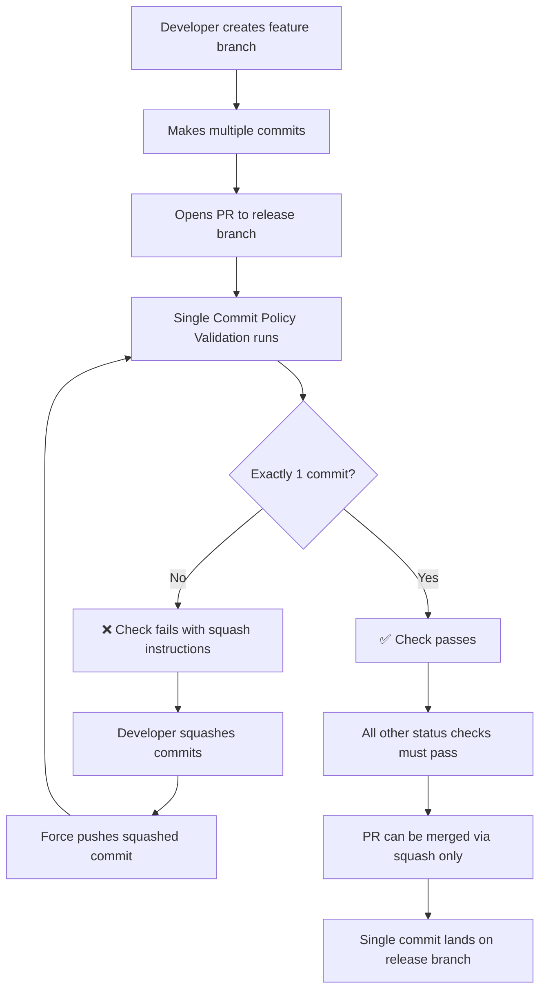

# GitHub Branch Protection Configuration

This document outlines the required GitHub branch protection settings to enforce NeuroLink's single commit per branch policy.

## Required Settings for Release Branch

### Repository Settings → Branches → Add Rule

**Branch name pattern:** `release`

### Protection Rules Configuration

#### 1. Pull Request Requirements

- ✅ **Require a pull request before merging**
- ✅ **Require approvals**: 1
- ✅ **Dismiss stale pull request approvals when new commits are pushed**
- ✅ **Require review from code owners** (if CODEOWNERS file exists)

#### 2. Status Checks

- ✅ **Require status checks to pass before merging**
- ✅ **Require branches to be up to date before merging**

**Required status checks to add:**

- `🔒 Single Commit Policy Validation`
- `🛡️ Code Quality & Security Gate`
- `build-check`
- `test (18)`
- `test (20)`

#### 3. Commit Requirements

- ✅ **Require signed commits** (optional, based on security requirements)
- ✅ **Require linear history**

#### 4. Merge Settings

- ✅ **Allow squash merging**
- ❌ **Allow merge commits** (DISABLED)
- ❌ **Allow rebase merging** (DISABLED)

#### 5. Enforcement

- ✅ **Do not allow bypassing the above settings**
- ✅ **Restrict pushes that create merge commits**

### Repository General Settings

Navigate to **Settings → General → Pull Requests**:

- ✅ **Allow squash merging**
  - **Default to pull request title and description**
- ❌ **Allow merge commits** (DISABLED)
- ❌ **Allow rebase merging** (DISABLED)
- ✅ **Always suggest updating pull request branches**
- ✅ **Automatically delete head branches**

## CLI Configuration (Alternative)

You can also configure branch protection via GitHub CLI:

```bash
# Enable branch protection with single commit enforcement
gh api repos/:owner/:repo/branches/release/protection \
  --method PUT \
  --field required_status_checks='{"strict":true,"contexts":["🔒 Single Commit Policy Validation","🛡️ Code Quality & Security Gate","build-check"]}' \
  --field enforce_admins=true \
  --field required_pull_request_reviews='{"required_approving_review_count":1,"dismiss_stale_reviews":true}' \
  --field restrictions=null \
  --field required_linear_history=true \
  --field allow_force_pushes=false \
  --field allow_deletions=false

# Configure repository merge settings
gh api repos/:owner/:repo \
  --method PATCH \
  --field allow_squash_merge=true \
  --field allow_merge_commit=false \
  --field allow_rebase_merge=false \
  --field delete_branch_on_merge=true
```

## Verification

After configuration, verify the settings by:

1. **Creating a test branch** with multiple commits
2. **Opening a pull request** to the release branch
3. **Confirming the Single Commit Policy Validation check runs** and fails
4. **Squashing commits** and confirming the check passes
5. **Attempting to merge** and confirming only squash merge is available

## Enforcement Flow



## Benefits

- **Clean commit history** on release branch
- **Enforced semantic commit messages**
- **Prevented merge commits** that clutter history
- **Automated validation** with clear error messages
- **Developer guidance** for fixing violations
- **Consistent workflow** across all contributors

## Troubleshooting

### Common Issues

**Issue**: "Required status check is not passing"
**Solution**: Ensure the workflow file is on the default branch and the check name matches exactly

**Issue**: "Cannot push to protected branch"  
**Solution**: All changes must go through pull requests - no direct pushes allowed

**Issue**: "Multiple commits detected"
**Solution**: Follow the squashing instructions provided by the validation check

**Issue**: "Linear history required"
**Solution**: Use rebase instead of merge to update your branch, then squash commits
