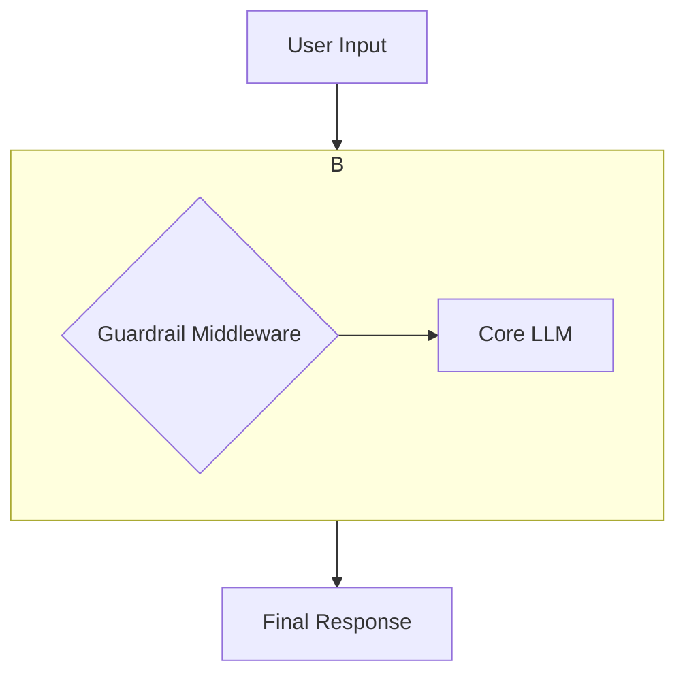

# Guardrails AI Integration with Middleware

This document outlines the modern approach to integrating Guardrails AI with the NeuroLink platform using a middleware-based architecture. This enhances the safety, reliability, and security of AI-powered applications in a modular and maintainable way.

## Overview

Guardrails AI is an open-source library that provides a framework for creating and managing guardrails for large language models (LLMs). By integrating Guardrails AI as middleware, developers can enforce specific rules and policies on the inputs and outputs of their models, ensuring that they adhere to safety guidelines and quality standards.

## Key Benefits

- **Risk Mitigation**: Protect against common AI risks such as hallucinations, toxic language, and data leakage.
- **Quality Assurance**: Ensure that model outputs are accurate, relevant, and meet predefined quality criteria.
- **Compliance**: Enforce industry-specific regulations and compliance requirements.
- **Customization**: Create custom guardrails tailored to specific use cases and business needs.
- **Modularity**: Decouple guardrail logic from the core application logic, making it easier to manage and update.

## Middleware-based Guardrail Implementation

The integration of Guardrails AI into the NeuroLink platform is achieved by wrapping the language model with a custom middleware. This allows for intercepting and modifying the requests and responses to and from the LLM.



### Using `wrapLanguageModel`

The `wrapLanguageModel` function from the AI SDK is the core of this integration. It takes a language model and one or more middlewares and returns a new language model with the enhanced capabilities.

```typescript
import { wrapLanguageModel } from "ai";
import { yourGuardrailMiddleware } from "./middleware/guardrail-middleware";

const guardedModel = wrapLanguageModel({
  model: yourOriginalModel,
  middleware: yourGuardrailMiddleware,
});

// This guardedModel can now be used in any generation call
const result = await streamText({
  model: guardedModel,
  prompt: "What cities are in the United States?",
});
```

### Creating a Custom Guardrail Middleware

A guardrail middleware can be implemented to inspect and modify the data flowing through it. Here is a basic example of a guardrail that redacts a "bad word" from the model's output.

```typescript
import type { LanguageModelV2Middleware } from "@ai-sdk/provider";

export const yourGuardrailMiddleware: LanguageModelV2Middleware = {
  wrapGenerate: async ({ doGenerate }) => {
    const { text, ...rest } = await doGenerate();

    // Filtering approach, e.g., for PII or other sensitive information:
    const cleanedText = text?.replace(/badword/g, "<REDACTED>");

    return { text: cleanedText, ...rest };
  },

  // Note: Streaming guardrails are more complex to implement,
  // as you do not have the full content of the stream until it's finished.
  // A similar logic would be applied inside a transform stream for wrapStream.
};
```

### Chaining Multiple Middlewares

One of the powerful features of this approach is the ability to chain multiple middlewares. This allows you to combine guardrails with other functionalities like logging, caching, or analytics.

The middlewares are applied in the order they are provided in the array.

```typescript
import { wrapLanguageModel } from "ai";
import { yourGuardrailMiddleware } from "./middleware/guardrail-middleware";
import { yourLoggingMiddleware } from "./middleware/logging-middleware";

const enhancedModel = wrapLanguageModel({
  model: yourOriginalModel,
  middleware: [yourLoggingMiddleware, yourGuardrailMiddleware],
});
// Execution order: yourLoggingMiddleware(yourGuardrailMiddleware(yourOriginalModel))
```

This approach provides a clean and scalable way to add safety and other enhancements to your AI models within the NeuroLink ecosystem.
