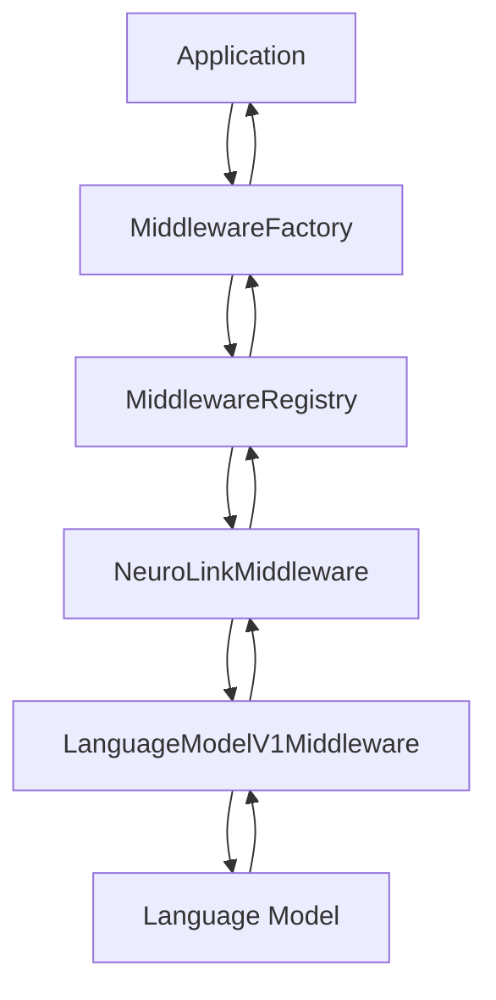

# NeuroLink Middleware System

This document provides a comprehensive guide to the middleware system in NeuroLink. The middleware system allows you to enhance, modify, or extend the behavior of language models without changing their core implementation.

## Overview

The middleware system in NeuroLink follows the interceptor pattern, allowing developers to intercept and modify the flow of data between the application and language models. This approach enables a clean separation of concerns and promotes modularity in your AI applications.

NeuroLink's middleware system is built on top of the AI SDK's `LanguageModelV1Middleware` interface, providing a standardized way to create middleware components that can be used across different AI providers.

## Architecture

The middleware architecture in NeuroLink consists of several key components:

1. **Middleware Interface**: The `LanguageModelV1Middleware` interface from the AI SDK defines the structure of middleware components.
2. **NeuroLink Middleware**: The `NeuroLinkMiddleware` interface extends the AI SDK interface with additional metadata.
3. **Middleware Registry**: The `MiddlewareRegistry` class manages the registration and retrieval of middleware components.
4. **Middleware Factory**: The `MiddlewareFactory` class handles the application of middleware to language models.



## Middleware Types and Interfaces

### LanguageModelV1Middleware

The core interface for middleware components is the `LanguageModelV1Middleware` interface from the AI SDK:

```typescript
import type { LanguageModelV1Middleware } from "ai";

interface LanguageModelV1Middleware {
  transformParams?: (args: { params: any }) => Promise<any>;

  wrapGenerate?: (args: {
    doGenerate: () => Promise<any>;
    params: any;
    model: any;
    doStream: () => Promise<{ stream: any }>;
  }) => Promise<any>;

  wrapStream?: (args: {
    doStream: () => Promise<{ stream: any }>;
    params: any;
    model: any;
    doGenerate: () => Promise<any>;
  }) => Promise<{ stream: any }>;
}
```

### NeuroLinkMiddleware

NeuroLink extends the AI SDK middleware interface with additional metadata:

```typescript
interface NeuroLinkMiddlewareMetadata {
  /** Unique identifier for the middleware */
  id: string;
  /** Human-readable name */
  name: string;
  /** Description of what the middleware does */
  description?: string;
  /** Priority for ordering (higher = earlier in chain) */
  priority?: number;
  /** Whether this middleware is enabled by default */
  defaultEnabled?: boolean;
  /** Configuration schema for the middleware */
  configSchema?: Record<string, unknown>;
}

interface NeuroLinkMiddleware extends LanguageModelV1Middleware {
  /** Middleware metadata */
  readonly metadata: NeuroLinkMiddlewareMetadata;
}
```

### Middleware Configuration

Middleware can be configured using the following interfaces:

```typescript
interface MiddlewareConfig {
  /** Whether the middleware is enabled */
  enabled?: boolean;
  /** Middleware-specific configuration */
  config?: Record<string, JsonValue>;
  /** Conditions under which to apply this middleware */
  conditions?: MiddlewareConditions;
}

interface MiddlewareConditions {
  /** Apply only to specific providers */
  providers?: string[];
  /** Apply only to specific models */
  models?: string[];
  /** Apply only when certain options are present */
  options?: Record<string, unknown>;
  /** Custom condition function */
  custom?: (context: MiddlewareContext) => boolean;
}
```

### Middleware Context

The middleware context provides information about the current request:

```typescript
interface MiddlewareContext {
  /** Provider name */
  provider: string;
  /** Model name */
  model: string;
  /** Request options */
  options: Record<string, unknown>;
  /** Session information */
  session?: {
    sessionId?: string;
    userId?: string;
  };
  /** Additional metadata */
  metadata?: Record<string, JsonValue>;
}
```

## Built-in Middleware Components

NeuroLink includes several built-in middleware components that provide common functionality:

### Analytics Middleware

The analytics middleware tracks token usage, response times, and model performance:

```typescript
import type { LanguageModelV1Middleware } from "ai";
import type {
  NeuroLinkMiddleware,
  NeuroLinkMiddlewareMetadata,
} from "../types.js";

export function createAnalyticsMiddleware(): NeuroLinkMiddleware {
  const metadata: NeuroLinkMiddlewareMetadata = {
    id: "analytics",
    name: "Analytics Tracking",
    description:
      "Tracks token usage, response times, and model performance metrics",
    priority: 100,
    defaultEnabled: true,
  };

  const middleware: LanguageModelV1Middleware = {
    wrapGenerate: async ({ doGenerate, params }) => {
      const startTime = Date.now();
      const result = await doGenerate();
      const responseTime = Date.now() - startTime;

      // Add analytics to the result
      return {
        ...result,
        analytics: {
          responseTime,
          usage: result.usage,
          timestamp: new Date().toISOString(),
        },
      };
    },

    wrapStream: async ({ doStream, params }) => {
      const startTime = Date.now();
      const result = await doStream();

      // Add analytics to the stream result
      return {
        ...result,
        analytics: {
          startTime,
          timestamp: new Date().toISOString(),
          streamingMode: true,
        },
      };
    },
  };

  return {
    ...middleware,
    metadata,
  };
}
```

## Creating Custom Middleware

### Basic Template

Here's a basic template for creating a custom middleware component:

```typescript
import type { LanguageModelV1Middleware } from "ai";
import type {
  NeuroLinkMiddleware,
  NeuroLinkMiddlewareMetadata,
} from "../types.js";

export function createCustomMiddleware(): NeuroLinkMiddleware {
  const metadata: NeuroLinkMiddlewareMetadata = {
    id: "custom",
    name: "Custom Middleware",
    description: "Description of your custom middleware",
    priority: 50,
    defaultEnabled: false,
  };

  const middleware: LanguageModelV1Middleware = {
    // Optional: Transform parameters before they are passed to the language model
    transformParams: async ({ params }) => {
      // Modify params as needed
      return {
        ...params,
        // Your modifications here
      };
    },

    // Optional: Wrap the doGenerate method
    wrapGenerate: async ({ doGenerate, params }) => {
      // Pre-processing logic
      console.log("Generate called with params:", params);

      // Call the original doGenerate method
      const result = await doGenerate();

      // Post-processing logic
      console.log("Generate result:", result);

      // Return the modified result
      return {
        ...result,
        // Your modifications here
      };
    },

    // Optional: Wrap the doStream method
    wrapStream: async ({ doStream, params }) => {
      // Pre-processing logic
      console.log("Stream called with params:", params);

      // Call the original doStream method
      const { stream, ...rest } = await doStream();

      // Create a transform stream to modify the chunks
      const transformStream = new TransformStream({
        transform(chunk, controller) {
          // Modify the chunk as needed
          controller.enqueue(chunk);
        },
      });

      // Return the modified stream
      return {
        stream: stream.pipeThrough(transformStream),
        ...rest,
      };
    },
  };

  return {
    ...middleware,
    metadata,
  };
}
```

### Example: Logging Middleware

Here's an example of a logging middleware that logs requests and responses:

```typescript
import type { LanguageModelV1Middleware } from "ai";
import type {
  NeuroLinkMiddleware,
  NeuroLinkMiddlewareMetadata,
} from "../types.js";

export function createLoggingMiddleware(): NeuroLinkMiddleware {
  const metadata: NeuroLinkMiddlewareMetadata = {
    id: "logging",
    name: "Logging Middleware",
    description: "Logs requests and responses",
    priority: 200, // High priority to log early
    defaultEnabled: false,
  };

  const middleware: LanguageModelV1Middleware = {
    wrapGenerate: async ({ doGenerate, params }) => {
      console.log(
        `[${new Date().toISOString()}] Generate called with prompt:`,
        typeof params.prompt === "string"
          ? params.prompt.substring(0, 100) + "..."
          : "Complex prompt",
      );

      const startTime = performance.now();
      const result = await doGenerate();
      const endTime = performance.now();

      console.log(
        `[${new Date().toISOString()}] Generate completed in ${endTime - startTime}ms`,
      );

      return result;
    },

    wrapStream: async ({ doStream, params }) => {
      console.log(
        `[${new Date().toISOString()}] Stream called with prompt:`,
        typeof params.prompt === "string"
          ? params.prompt.substring(0, 100) + "..."
          : "Complex prompt",
      );

      const startTime = performance.now();
      const result = await doStream();
      const endTime = performance.now();

      console.log(
        `[${new Date().toISOString()}] Stream setup completed in ${endTime - startTime}ms`,
      );

      return result;
    },
  };

  return {
    ...middleware,
    metadata,
  };
}
```

### Example: Caching Middleware

Here's an example of a caching middleware that caches responses:

```typescript
import type { LanguageModelV1Middleware } from "ai";
import type {
  NeuroLinkMiddleware,
  NeuroLinkMiddlewareMetadata,
} from "../types.js";

export function createCachingMiddleware(): NeuroLinkMiddleware {
  // Simple in-memory cache
  const cache = new Map<string, any>();

  const metadata: NeuroLinkMiddlewareMetadata = {
    id: "caching",
    name: "Caching Middleware",
    description: "Caches responses to improve performance and reduce costs",
    priority: 150,
    defaultEnabled: false,
  };

  const middleware: LanguageModelV1Middleware = {
    wrapGenerate: async ({ doGenerate, params }) => {
      // Create a cache key from the parameters
      const cacheKey = JSON.stringify({
        prompt: params.prompt,
        temperature: params.settings?.temperature,
        maxOutputTokens: params.settings?.maxOutputTokens,
      });

      // Check if the result is in the cache
      if (cache.has(cacheKey)) {
        console.log("Cache hit!");
        return cache.get(cacheKey);
      }

      // Call the original doGenerate method
      const result = await doGenerate();

      // Store the result in the cache
      cache.set(cacheKey, result);

      return result;
    },
  };

  return {
    ...middleware,
    metadata,
  };
}
```

## Middleware Registry and Factory

### Registering Middleware

To register a middleware component, use the `middlewareRegistry`:

```typescript
import { middlewareRegistry } from "./middleware/registry.js";
import { createCustomMiddleware } from "./middleware/custom.js";

// Register the middleware
middlewareRegistry.register(createCustomMiddleware());
```

Or use the convenience function:

```typescript
import { registerMiddleware } from "./middleware/index.js";
import { createCustomMiddleware } from "./middleware/custom.js";

// Register the middleware
registerMiddleware(createCustomMiddleware());
```

### Applying Middleware

To apply middleware to a language model, use the `MiddlewareFactory`:

```typescript
import { MiddlewareFactory } from "./middleware/factory.js";
import type { LanguageModelV1 } from "ai";

// Create middleware context
const context = MiddlewareFactory.createContext(
  "openai",
  "gpt-4",
  { prompt: "Hello, world!" },
  { sessionId: "test-session" },
);

// Apply middleware to the model
const wrappedModel = MiddlewareFactory.applyMiddleware(baseModel, context, {
  enabledMiddleware: ["analytics", "logging"],
  middlewareConfig: {
    analytics: {
      enabled: true,
      config: {
        trackTokens: true,
      },
    },
  },
});

// Use the wrapped model
const result = await wrappedModel.generate({
  prompt: "Hello, world!",
});
```

### Middleware Presets

The `MiddlewareFactory` includes several built-in presets for common use cases:

```typescript
// Use a preset
const wrappedModel = MiddlewareFactory.applyMiddleware(baseModel, context, {
  preset: "development",
});
```

Available presets:

- `development`: Logging and basic analytics for development
- `production`: Optimized for production with caching and rate limiting
- `security`: Enhanced security with guardrails and monitoring
- `performance`: Optimized for performance with caching and retries
- `enterprise`: Full enterprise feature set with all middleware
- `minimal`: Minimal overhead with only essential features

## Best Practices

When developing custom middleware for NeuroLink, consider the following best practices:

1. **Keep middleware focused**: Each middleware component should have a single responsibility.
2. **Handle errors gracefully**: Middleware should catch and handle errors appropriately, without breaking the application.
3. **Be mindful of performance**: Middleware adds overhead to each request, so keep it as efficient as possible.
4. **Use TypeScript**: TypeScript provides type safety and better IDE support, making it easier to develop and maintain middleware.
5. **Document your middleware**: Provide clear documentation on what your middleware does and how to use it.
6. **Test your middleware**: Write unit tests for your middleware to ensure it behaves as expected.
7. **Consider streaming**: Remember that streaming responses require special handling in middleware.

## Advanced Techniques

### Conditional Middleware

You can create middleware that only applies under certain conditions:

```typescript
import type { LanguageModelV1Middleware } from "ai";
import type {
  NeuroLinkMiddleware,
  NeuroLinkMiddlewareMetadata,
} from "../types.js";

export function createConditionalMiddleware(
  condition: (params: any) => boolean,
  middleware: LanguageModelV1Middleware,
): NeuroLinkMiddleware {
  const metadata: NeuroLinkMiddlewareMetadata = {
    id: "conditional",
    name: "Conditional Middleware",
    description: "Applies middleware conditionally",
    priority: 50,
    defaultEnabled: true,
  };

  const conditionalMiddleware: LanguageModelV1Middleware = {
    transformParams: async (args) => {
      if (condition(args.params)) {
        return middleware.transformParams
          ? await middleware.transformParams(args)
          : args.params;
      }
      return args.params;
    },

    wrapGenerate: async (args) => {
      if (condition(args.params)) {
        return middleware.wrapGenerate
          ? await middleware.wrapGenerate(args)
          : await args.doGenerate();
      }
      return await args.doGenerate();
    },

    wrapStream: async (args) => {
      if (condition(args.params)) {
        return middleware.wrapStream
          ? await middleware.wrapStream(args)
          : await args.doStream();
      }
      return await args.doStream();
    },
  };

  return {
    ...conditionalMiddleware,
    metadata,
  };
}

// Example usage
const debugModeMiddleware = createConditionalMiddleware(
  (params) => params.debug === true,
  createLoggingMiddleware(),
);
```

### Middleware Composition

You can compose multiple middleware components to create more complex behaviors:

```typescript
import type { LanguageModelV1Middleware } from "ai";
import type {
  NeuroLinkMiddleware,
  NeuroLinkMiddlewareMetadata,
} from "../types.js";

export function composeMiddleware(
  middlewares: LanguageModelV1Middleware[],
  metadata: NeuroLinkMiddlewareMetadata,
): NeuroLinkMiddleware {
  const composedMiddleware: LanguageModelV1Middleware = {
    transformParams: async (args) => {
      let params = args.params;
      for (const middleware of middlewares) {
        if (middleware.transformParams) {
          params = await middleware.transformParams({ ...args, params });
        }
      }
      return params;
    },

    wrapGenerate: async (args) => {
      let doGenerate = args.doGenerate;
      for (const middleware of middlewares) {
        if (middleware.wrapGenerate) {
          const currentDoGenerate = doGenerate;
          doGenerate = () =>
            middleware.wrapGenerate!({
              ...args,
              doGenerate: currentDoGenerate,
            });
        }
      }
      return doGenerate();
    },

    wrapStream: async (args) => {
      let doStream = args.doStream;
      for (const middleware of middlewares) {
        if (middleware.wrapStream) {
          const currentDoStream = doStream;
          doStream = () =>
            middleware.wrapStream!({
              ...args,
              doStream: currentDoStream,
            });
        }
      }
      return doStream();
    },
  };

  return {
    ...composedMiddleware,
    metadata,
  };
}

// Example usage
const enhancedMiddleware = composeMiddleware(
  [createLoggingMiddleware(), createAnalyticsMiddleware()],
  {
    id: "enhanced",
    name: "Enhanced Middleware",
    description: "Combines logging and analytics",
    priority: 100,
    defaultEnabled: true,
  },
);
```

## Conclusion

The middleware system in NeuroLink provides a powerful way to extend and enhance the functionality of language models. By following the patterns and best practices outlined in this guide, you can create reusable, composable middleware components that improve the quality, reliability, and performance of your AI applications.

For more detailed examples and use cases, see the [Custom Middleware Guide](./CUSTOM-MIDDLEWARE-GUIDE.md).
