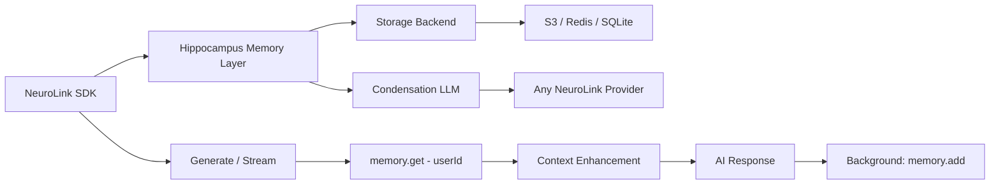

# Memory Integration with Hippocampus

Enhance your AI applications with persistent, context-aware memory using NeuroLink's integrated `@juspay/hippocampus` support. This feature enables your AI to remember user preferences, context, and conversation history across sessions while maintaining complete user isolation.

## Overview

NeuroLink's Hippocampus integration provides:

- **Cross-Session Memory**: AI remembers context across different conversations and sessions
- **User Isolation**: Complete separation of memory contexts between different users
- **LLM-Powered Condensation**: Memory is automatically summarized to stay within a configurable word limit
- **Multiple Storage Backends**: Support for S3, Redis, and SQLite
- **Non-blocking Storage**: Memory operations happen in the background without slowing down responses
- **Crash-safe**: Every SDK method is wrapped in try-catch — errors are logged, never thrown

## Architecture



The memory system operates in three phases:

1. **Memory Retrieval**: The user's condensed memory is fetched before generating a response
2. **Context Enhancement**: Retrieved memory is prepended to the user's prompt
3. **Memory Storage**: The new conversation turn is condensed and stored asynchronously

## Installation

`@juspay/hippocampus` is shipped as an **optional peer dependency** of NeuroLink. Memory features are off by default; install the package explicitly when you want them:

```bash
pnpm add @juspay/hippocampus
# or: npm install @juspay/hippocampus
```

If a memory configuration is supplied without the package installed, NeuroLink logs a warning and proceeds with memory disabled — no exception is thrown and the rest of the SDK continues to work. This packaging change exists to keep NeuroLink's production dependency graph free of the deprecated `@ai-sdk/google` and `@ai-sdk/google-vertex` packages, which Hippocampus's own `@juspay/neurolink` peer was previously dragging in.

## Quick Start

```typescript
import { NeuroLink } from "@juspay/neurolink";

const neurolink = new NeuroLink({
  conversationMemory: {
    enabled: true,
    memory: {
      enabled: true,
      storage: {
        type: "s3",
        bucket: "my-memory-bucket",
        prefix: "memory/condensed/",
      },
      neurolink: {
        provider: "google-ai",
        model: "gemini-2.5-flash",
      },
      maxWords: 50,
    },
  },
});

// First conversation — stores context
const response1 = await neurolink.generate({
  input: {
    text: "Hi! I'm Sarah, a frontend developer at TechCorp. I love React and TypeScript.",
  },
  context: {
    userId: "user_sarah_123",
    sessionId: "onboarding_session",
  },
  provider: "google-ai",
  model: "gemini-2.5-flash",
});

// Later conversation — memory retrieved automatically
const response2 = await neurolink.generate({
  input: {
    text: "What programming languages do I work with?",
  },
  context: {
    userId: "user_sarah_123",
    sessionId: "help_session",
  },
  provider: "google-ai",
});

// → "You work with React and TypeScript at TechCorp."
```

## Configuration

### Storage Backends

#### S3 (Recommended for production)

```typescript
memory: {
  enabled: true,
  storage: {
    type: "s3",
    bucket: "my-bucket",
    prefix: "memory/condensed/",
  },
  neurolink: { provider: "google-ai", model: "gemini-2.5-flash" },
  maxWords: 50,
}
```

Each user's memory is stored as a single S3 object at `{prefix}{userId}`.

#### Redis

```typescript
memory: {
  enabled: true,
  storage: {
    type: "redis",
    url: process.env.REDIS_URL,
  },
  neurolink: { provider: "openai", model: "gpt-4o-mini" },
}
```

#### SQLite (Development)

```typescript
memory: {
  enabled: true,
  storage: {
    type: "sqlite",
    path: "./memory.db",
  },
  neurolink: { provider: "google-ai", model: "gemini-2.5-flash" },
}
```

> **Note**: SQLite requires the `better-sqlite3` optional peer dependency: `pnpm add better-sqlite3`

### Condensation LLM

The `neurolink` field configures which AI provider and model is used to condense memory. You can use any provider registered with your NeuroLink instance:

```typescript
neurolink: {
  provider: "google-ai",   // or "openai", "anthropic", etc.
  model: "gemini-2.5-flash",
}
```

## Advanced Usage

### User Isolation in Multi-Tenant Applications

```typescript
// User Alice
await neurolink.generate({
  input: { text: "I prefer dark mode and use VSCode." },
  context: { userId: "tenant_1_alice_123" },
});

// User Bob (completely isolated memory)
await neurolink.generate({
  input: { text: "I love light themes and use WebStorm." },
  context: { userId: "tenant_2_bob_456" },
});

// Alice's query — only returns Alice's data
const aliceQuery = await neurolink.generate({
  input: { text: "What IDE do I use?" },
  context: { userId: "tenant_1_alice_123" },
});
// → "You use VSCode with dark mode." (not Bob's data)
```

### Streaming with Memory

```typescript
const stream = await neurolink.stream({
  input: {
    text: "Write me a personalized coding tutorial based on my experience.",
  },
  context: { userId: "developer_sarah" },
  provider: "anthropic",
  model: "claude-sonnet-4-5",
});

for await (const chunk of stream.stream) {
  if (chunk.content) process.stdout.write(chunk.content);
}

// Tutorial is personalized based on Sarah's stored background
```

### Custom Condensation Prompt

Control exactly how memory is condensed by providing a custom prompt:

```typescript
memory: {
  enabled: true,
  storage: { type: "s3", bucket: "my-bucket" },
  neurolink: { provider: "google-ai", model: "gemini-2.5-flash" },
  maxWords: 100,
  prompt: `You are a memory engine. Merge the old memory with new facts into a summary of at most {{MAX_WORDS}} words. Focus on persistent facts: name, job, preferences, goals. Ignore conversational filler.

OLD_MEMORY:
{{OLD_MEMORY}}

NEW_CONTENT:
{{NEW_CONTENT}}

Condensed memory:`,
}
```

| Placeholder       | Replaced With                                            |
| ----------------- | -------------------------------------------------------- |
| `{{OLD_MEMORY}}`  | The user's existing condensed memory (may be empty)      |
| `{{NEW_CONTENT}}` | The new conversation turn: `"User: ...\nAssistant: ..."` |
| `{{MAX_WORDS}}`   | The configured `maxWords` value                          |

## Memory Lifecycle

### When Memory Activates

For memory to activate on a call, all three conditions must be met:

1. `memory.enabled` is `true` in the config
2. `options.context.userId` is provided in the generate/stream call
3. The response has non-empty content (for storage)

### Retrieval Flow

1. `memory.get(userId)` fetches the condensed memory string
2. If memory exists, it is prepended to the prompt:

   ```
   Context from previous conversations:
   <condensed memory>

   Current user's request: <original prompt>
   ```

3. The LLM generates a response using the enhanced prompt

### Storage Flow

After the LLM response completes:

1. `setImmediate()` schedules background storage (non-blocking)
2. A conversation turn is formed: `"User: ...\nAssistant: ..."`
3. `memory.add(userId, content)` sends the old memory + new turn to the condensation LLM
4. The condensed summary is written to the storage backend

## Namespace and Tenant Isolation

For multi-tenant apps, use tenant-scoped collection names or key prefixes:

```typescript
// Tenant-scoped S3 prefix
const getMemoryConfig = (tenantId: string) => ({
  storage: {
    type: "s3" as const,
    bucket: "my-bucket",
    prefix: `tenants/${tenantId}/memory/`,
  },
  neurolink: { provider: "google-ai", model: "gemini-2.5-flash" },
});

// User ID should also encode tenant context
const userId = `${tenantId}::${localUserId}`;
```

## Environment Variables

| Variable                 | Default  | Description                                    |
| ------------------------ | -------- | ---------------------------------------------- |
| `HC_LOG_LEVEL`           | `warn`   | Log level: `debug`, `info`, `warn`, `error`    |
| `HC_CONDENSATION_PROMPT` | built-in | Default prompt (overridden by config `prompt`) |

## Error Handling

Memory is designed to **never crash the host application**:

- Every public method is wrapped in try-catch
- `get()` returns `null` on error — the call continues without memory context
- `add()` silently fails on error — the generate/stream result is not affected
- Storage initialization errors disable memory for that instance

```typescript
// These warnings appear in logs but never throw:
// logger.warn("Memory retrieval failed:", error)
// logger.warn("Memory storage failed:", error)
```

## Type Reference

```typescript
import type { Memory } from "@juspay/neurolink";

// Memory = HippocampusConfig & { enabled?: boolean }
type Memory = {
  enabled?: boolean;
  storage: {
    type: "s3" | "redis" | "sqlite";
    bucket?: string; // S3
    prefix?: string; // S3
    url?: string; // Redis
    path?: string; // SQLite
  };
  neurolink: {
    provider: string;
    model: string;
  };
  maxWords?: number; // default: 50
  prompt?: string; // custom condensation prompt
};
```

## Production Checklist

- [ ] Use S3 or Redis storage (not SQLite) in production
- [ ] Set `HC_LOG_LEVEL=warn` or higher in production
- [ ] Ensure `userId` is stable and unique per user across sessions
- [ ] For multi-tenant: use tenant-scoped prefixes or collection names
- [ ] Monitor `Memory retrieval failed` and `Memory storage failed` warnings in logs
- [ ] Verify the condensation LLM provider is configured and has sufficient quota

## See Also

- **[Memory Guide](../features/memory.md)** - Quick start and configuration reference
- **[Conversation Memory](../conversation-memory.md)** - Session-based conversation history
- **[Context Compaction](../features/context-compaction.md)** - Automatic context window management
