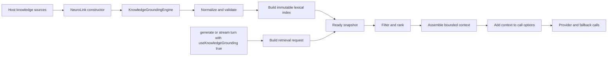
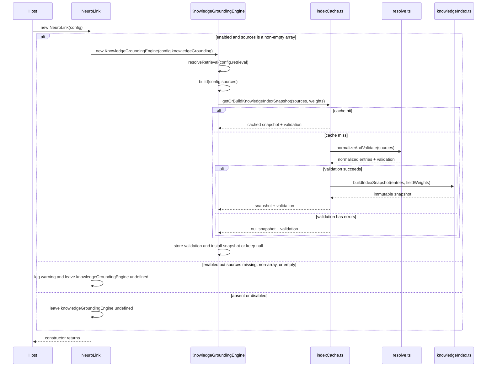
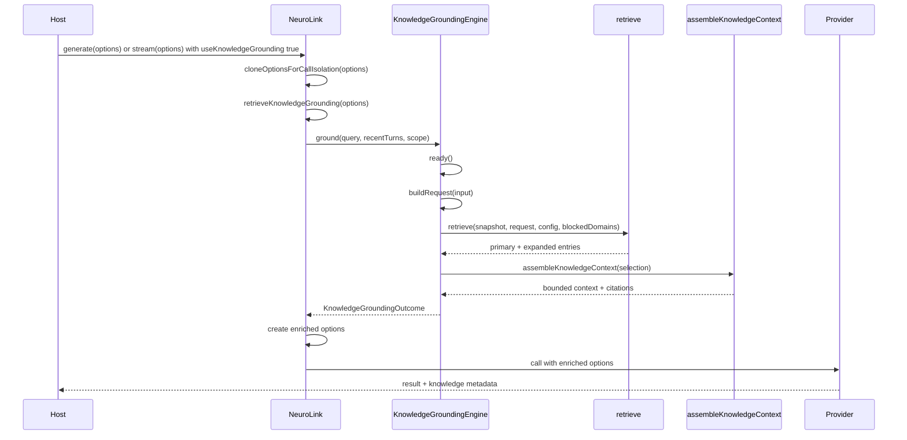

# Knowledge Grounding: Initialization and Turn Lifecycle

This document explains only the knowledge-grounding path in NeuroLink:

1. What happens when a `NeuroLink` instance initializes knowledge grounding.
2. What happens when knowledge grounding runs for a generate or stream turn.

It follows the current runtime implementation, not an older design proposal.

## Source map

| Responsibility                                       | Source                                |
| ---------------------------------------------------- | ------------------------------------- |
| NeuroLink constructor and call integration           | `src/lib/neurolink.ts`                |
| Public and internal knowledge types                  | `src/lib/types/knowledge.ts`          |
| Dynamic per-call options                             | `src/lib/types/dynamic.ts`            |
| Knowledge configuration on the NeuroLink constructor | `src/lib/types/config.ts`             |
| Engine lifecycle                                     | `src/lib/knowledge/engine.ts`         |
| Process-level index build cache                      | `src/lib/knowledge/indexCache.ts`     |
| Source normalization and validation                  | `src/lib/knowledge/resolve.ts`        |
| Immutable index and BM25 search                      | `src/lib/knowledge/knowledgeIndex.ts` |
| Per-turn selection                                   | `src/lib/knowledge/retrieval.ts`      |
| Token-bounded context assembly                       | `src/lib/knowledge/context.ts`        |
| Text normalization                                   | `src/lib/knowledge/normalize.ts`      |
| Default limits, weights, and boosts                  | `src/lib/knowledge/defaults.ts`       |

## 1. High-level lifecycle

Each NeuroLink instance requests index construction once from its constructor
sources. Identical source configurations in the same process can reuse the
bounded process-level index cache. Turns reuse the same immutable in-memory
snapshot.



There is no per-session index and no index rebuild per turn.

## 2. Configuration entering NeuroLink

The host supplies knowledge grounding through `NeurolinkConstructorConfig`:

```ts
const neurolink = new NeuroLink({
  knowledgeGrounding: {
    enabled: true,
    sources,
    blockedDomains: ["internal-debug"],
    retrieval: {
      mode: "lexical",
      candidateLimit: 24,
      resultLimit: 8,
      relationLimit: 4,
    },
    context: {
      maxTokens: 4000,
      includeCitations: true,
    },
  },
});
```

The important inputs are:

| Field            | Purpose                                                                                    |
| ---------------- | ------------------------------------------------------------------------------------------ |
| `enabled`        | Master switch checked by both NeuroLink and the engine.                                    |
| `sources`        | Structured knowledge entries used to build the one-time snapshot.                          |
| `blockedDomains` | Optional blocklist applied before candidate ranking. Empty means all domains are eligible. |
| `retrieval`      | Candidate, result, relation, field-weight, and exact/alias boost settings.                 |
| `context`        | Context token limit and citation behavior.                                                 |
| `timeoutMs`      | Hard ceiling for one grounding operation before it fails open.                             |

## 3. Initialization path



The index build is asynchronous. The engine stores its `buildPromise`, and the
first eligible turn waits for it through `ready()`.

### 3.1 `NeuroLink.constructor()`

The knowledge-specific constructor branch is:

```ts
const knowledgeGroundingConfig = config?.knowledgeGrounding;
if (knowledgeGroundingConfig?.enabled) {
  if (
    Array.isArray(knowledgeGroundingConfig.sources) &&
    knowledgeGroundingConfig.sources.length > 0
  ) {
    this.knowledgeGroundingEngine = new KnowledgeGroundingEngine(
      knowledgeGroundingConfig,
    );
  } else {
    logger.warn(
      "[KnowledgeGrounding] enabled but no sources were provided; grounding disabled for this instance",
    );
  }
}
```

If knowledge grounding is absent or disabled, `knowledgeGroundingEngine` remains
`undefined` and turns skip the feature.

If knowledge grounding is enabled but `sources` is missing, not an array, or an
empty array, NeuroLink logs the warning shown above, does not instantiate
`KnowledgeGroundingEngine`, skips grounding on every turn, and
`getKnowledgeStatus()` returns `null`.

If `sources` is a non-empty array, NeuroLink instantiates
`KnowledgeGroundingEngine` even when individual source entries are invalid.
Those entry-level validation issues are handled inside the engine: the engine is
visible through `getKnowledgeStatus()`, records validation issues, leaves its
snapshot unavailable, and keeps reporting not-ready status. Because the
constructor starts a one-time build and does not automatically retry with changed
source data, grounding returns `index-not-ready` until the engine is recreated
with corrected sources or explicitly rebuilt.

### 3.2 `KnowledgeGroundingEngine.constructor()`

The engine constructor:

1. stores `KnowledgeGroundingConfig`;
2. calls `resolveRetrieval()` to materialize runtime retrieval settings;
3. stores the clock function used for duration metadata;
4. starts `build()` when at least one source exists;
5. catches an unexpected build rejection and records it in `lastError`.

It does not wait synchronously for the index to finish.

### 3.3 `resolveRetrieval()`

Combines host overrides with SDK defaults:

- candidate limit;
- primary result limit;
- relationship expansion limit;
- per-field BM25 weights;
- exact-phrase boost;
- reviewed-alias boost.

These resolved values are calculated once and reused by every turn.

### 3.4 `build()`

The private engine build function:

1. calls `getOrBuildKnowledgeIndexSnapshot()`;
2. stores all validation issues for `getStatus()`;
3. leaves `snapshot` as `null` when validation contains errors;
4. otherwise installs the returned snapshot, which may be newly built or reused
   from the process-level cache, and clears `lastError`.

A partially valid source set is never installed.

This validation is separate from the constructor's source-shape guard. A
non-empty `sources` array reaches the engine; missing, non-array, or empty
`sources` never does.

The cache key includes the cache schema version, resolved field weights, encoded
source IDs and versions, entry IDs, and a deterministic hash of the effective
source content. That hash is built from normalized entries, including titles,
summaries, bodies, aliases, keywords, integrations, relationships, status, kind,
and resolved version. The cache is bounded by `KNOWLEDGE_INDEX_CACHE_LIMIT` and
evicts the least-recently used entry when the limit is exceeded.

### 3.5 `normalizeAndValidate()`

This function processes every source and entry.

#### Source loading

`loadSourceEntries()` resolves the source version. The source version is later
included in citations.

#### Entry validation

It reports errors for:

- a missing source ID;
- a missing entry ID;
- a duplicate entry ID;
- a missing title;
- a missing summary;
- a missing domain;
- missing integrations;
- integrations that are not an array of strings;
- an unsupported entry kind;
- an unsupported lifecycle status.

It reports warnings for:

- aliases that normalize to an empty string;
- the same normalized alias belonging to different entries;
- missing related-entry IDs;
- missing parent-entry IDs.

Errors block the snapshot. Warnings do not.

#### `resolveEntry()`

Converts `KnowledgeEntryInput` into `NormalizedKnowledgeEntry`:

- `integrations` is required and cloned after validation;
- optional `aliases`, `keywords`, and relationships default to cloned empty
  arrays;
- `body` defaults to an empty string;
- `kind` defaults to `text`;
- `status` defaults to `active`;
- the effective source version is copied to the entry.

### 3.6 `buildIndexSnapshot()`

The snapshot contains:

| Structure       | Purpose                                                |
| --------------- | ------------------------------------------------------ |
| `entriesById`   | Retrieves the complete normalized entry after scoring. |
| `exactIndex`    | Maps normalized IDs and titles to entry IDs.           |
| `aliasIndex`    | Maps normalized reviewed aliases to entry IDs.         |
| `relationIndex` | Maps an entry to related and parent entry IDs.         |
| `lexical`       | Performs weighted field-aware BM25 retrieval.          |

For each entry, `buildIndexSnapshot()`:

1. calls `buildDocument()`;
2. stores the normalized entry;
3. populates exact and alias phrase maps;
4. records relationships;
5. calls `KnowledgeLexicalIndex.add()`.

After all entries are added, it calls `KnowledgeLexicalIndex.finalize()`.

### 3.7 `buildDocument()`

Creates the internal searchable document:

- `normalizePhrases()` builds exact keys from the entry ID and title;
- `tokenize()` processes title, aliases, keywords, summary, and body;
- domain, integrations, and status stay on the normalized entry and are used
  later by authorization;
- related entry IDs remain available for later expansion.

### 3.8 `KnowledgeLexicalIndex`

The index is a field-aware BM25 implementation.

#### `constructor()`

Stores the field weights and initializes postings, document-length maps, and
token totals for title, aliases, keywords, summary, and body.

#### `add()`

For each field in one document, records:

- field length;
- total field tokens;
- term frequency per document;
- term-to-document postings.

#### `finalize()`

Calculates average field length across the complete document set. Search does
not run until this initialization is complete.

#### `search()`

At turn time, calculates BM25 contributions for each query term and field,
multiplies them by field weights, sums document scores, retains a per-field
breakdown, sorts deterministically, and returns the requested top matches.

### 3.9 `ready()` and `getStatus()`

`ready()` awaits the one-time build promise. It is safe to call on every turn
because a settled promise resolves immediately.

`getStatus()` exposes:

- whether grounding is enabled;
- whether a snapshot is ready;
- indexed entry count;
- last build error;
- validation issues.

`NeuroLink.getKnowledgeStatus()` delegates to this method and returns `null`
when the engine was never configured. For validation failures in a non-empty
source array, it returns the engine status with `ready: false`, `entryCount: 0`,
the validation issues, and the build error; it does not imply a later valid
snapshot will appear automatically.

## 4. Per-call generate and stream path

Knowledge grounding is available to both `generate()` and `stream()`, but a
call uses it only when `useKnowledgeGrounding: true` is present. Enabling the
constructor configuration builds and makes the index available; it does not
force every call on the instance to perform retrieval.



### 4.1 `NeuroLink.generate()` and `NeuroLink.stream()`

The knowledge-specific work happens at each outer public call layer:

1. `cloneOptionsForCallIsolation()` protects the caller's original object.
2. `retrieveKnowledgeGrounding()` checks the per-call opt-in and retrieves
   knowledge without mutating options.
3. When context is returned, the public method creates updated options by
   appending the knowledge block to `systemPrompt`.
4. The enriched options enter the existing provider/fallback path.
5. Returned knowledge metadata is attached to `GenerateResult.knowledge` or
   `StreamResult.knowledge`.

The option replacement is deliberately visible in the public method. The
retrieval helper only returns data.

Calls that omit `useKnowledgeGrounding` or set it to `false` continue through
the normal generation or streaming path without knowledge retrieval. The
`generate("prompt")` shorthand also skips grounding because it has no options
object on which to opt in; use `generate({ input, useKnowledgeGrounding: true })`
when grounding is required.

`DynamicOptions` exposes `useKnowledgeGrounding` and `knowledgeContext` as
static fields because retrieval happens before dynamic arguments are resolved.
Function-valued fields such as `systemPrompt` remain dynamic; NeuroLink wraps a
dynamic system prompt so the knowledge block is appended after that function
resolves.

### 4.2 `retrieveKnowledgeGrounding()`

This NeuroLink helper exits without calling the engine when:

- the engine was not configured;
- grounding is disabled;
- `useKnowledgeGrounding` is not exactly `true` for the current call;
- `options.input.text` is absent or empty.

Otherwise it:

1. uses `options.conversationMessages` when supplied, otherwise loads prior
   conversation memory through the existing history reader;
2. keeps only user and assistant roles;
3. keeps the latest `DEFAULT_RECENT_TURNS` messages, currently 4;
4. converts messages into `KnowledgeConversationTurn` objects, using empty text
   for non-string content;
5. passes `options.knowledgeContext` as the request scope;
6. calls `engine.ground()`;
7. catches an unexpected error and returns `undefined` so the turn continues.

This happens before dynamic option resolution, STT transcription, input
validation, PII redaction, and authentication. Grounding sees the current query
plus inline messages or the existing stored conversation history.

## 5. `KnowledgeGroundingEngine.ground()`

`ground()` owns the complete per-turn retrieval lifecycle.

### 5.1 Disabled path

When `config.enabled` is false, it returns immediately with:

- `ephemeralContext: null`;
- empty metadata;
- `retrieval: null`.

### 5.2 Wait for initialization

`ready()` waits for the constructor's build promise. If no snapshot exists
afterward, the engine returns empty metadata with `index-not-ready`.

This covers validation failure or build failure after an engine already exists
without breaking the model turn. Missing, non-array, or empty `sources` do not
create an engine in `NeuroLink.constructor()`.

### 5.3 `buildRequest()`

Builds the internal `KnowledgeRetrievalRequest`:

```ts
type KnowledgeRetrievalRequest = {
  query: string;
  recentTurns: KnowledgeConversationTurn[];
  enabledIntegrations: string[];
};
```

It:

- limits recent turns again to `DEFAULT_RECENT_TURNS`;
- defaults `enabledIntegrations` to `[]`.

There is no platform, page context, or server field in this request.

### 5.4 `retrieve()`

The selection pipeline runs in the following order.

#### A. Query normalization

`tokenize(request.query)` creates normalized query tokens.

#### B. Exact and alias lookup

`generateNGrams()` produces every contiguous query phrase from one token up to
the longest indexed exact or alias phrase in the active snapshot.
`lookupPhrases()` checks those phrases against `exactIndex` and `aliasIndex`.

An exact hit means the phrase matched an indexed entry ID or title. An alias
hit means it matched a reviewed alias.

#### C. Lexical query construction

`buildLexicalTokens()` combines:

- the current query;
- each recent turn, capped to 400 characters.

The combined text is tokenized for BM25.

#### D. BM25 search

Before BM25 runs, the retriever builds an `eligibleEntryIds` set by applying
status, blocked-domain, and enabled-integration checks to every indexed entry.
`snapshot.lexical.search()` receives that set and retrieves up to twice the
configured candidate limit only from eligible entries.

#### E. Candidate union

Entry IDs from exact hits, alias hits, and BM25 matches are added to one set.
Exact and alias hits are ignored when the entry is not in `eligibleEntryIds`.

#### F. Authorization and metadata filtering

`isAuthorized()` is the helper used to build `eligibleEntryIds` before lexical
top-K truncation and to re-check relationship-expanded entries. It rejects:

- entries whose status is not `active`;
- entries inside `config.blockedDomains`, when a domain blocklist is configured;
- integration-specific entries that do not match any enabled integration.

Integration matching is case-insensitive.

An entry with `integrations: []` applies to every request. If the request has
`enabledIntegrations: []`, integration-specific entries are excluded because
none of their required integrations are enabled.

#### G. Deterministic scoring

For each authorized candidate:

```text
score = weighted BM25
      + exact boost when matched
      + alias boost when matched
```

`compareCandidates()` sorts by descending score and uses entry ID as a stable
tiebreaker.

#### H. Primary selection

The candidate list is first capped by `candidateLimit`, then the top
`resultLimit` entries become the primary selection.

#### I. Relationship expansion

For every primary entry, the retriever reads `relationIndex` and adds related
entries until `relationLimit` is reached. Related entries are authorization
checked again and duplicates are skipped.

#### J. Confidence

`classifyConfidence()` returns:

| Confidence | Meaning                                                                                 |
| ---------- | --------------------------------------------------------------------------------------- |
| `none`     | No candidates survived.                                                                 |
| `high`     | The top candidate has an exact or alias hit.                                            |
| `medium`   | The top candidate matched multiple lexical fields or clearly dominates the next result. |
| `low`      | A candidate exists but has only a weak lexical signal.                                  |

### 5.5 `assembleKnowledgeContext()`

The assembler receives primary and expanded entries.

It calls:

- `buildOpening()` to create trusted reference-data instructions;
- `renderEntry()` to render full or summary-only entries;
- `estimateTokens()` to enforce an approximate four-characters-per-token
  budget.

Entries are added in relevance order:

1. primary entries;
2. relationship-expanded entries.

For each entry:

1. include the full entry when it fits;
2. otherwise include only its title, kind, and summary when that fits;
3. otherwise stop and drop remaining entries.

The result is wrapped in `<knowledge_context>` and optionally includes stable
citations such as:

```text
[KB:settings.multi-step-flow@2026-07-15]
```

### 5.6 Outcome construction

The engine creates `KnowledgeRetrievalResult` containing:

- selected and expanded entries;
- assembled context;
- confidence;
- citations;
- selected and expanded IDs;
- candidate count;
- context token estimate;
- truncation status;
- retrieval duration.

It also creates the smaller `KnowledgeGroundingMetadata` attached to the public
stream result.

When assembled context is empty, the engine returns the retrieval and metadata
but no ephemeral context.

When context exists, it creates:

```ts
{
  kind: "knowledge",
  trusted: true,
  content: assembledContext,
  citations,
  metadata: { confidence }
}
```

## 6. Applying knowledge to the model turn

Back in `NeuroLink.generate()` or `NeuroLink.stream()`, the returned block is
applied explicitly:

```ts
options = {
  ...options,
  systemPrompt: options.systemPrompt
    ? `${options.systemPrompt}\n\n${block}`
    : block,
};
```

The original caller object is not changed because it was cloned first.

The knowledge text is part of this turn's system prompt only. It is not written
to conversation memory as a user or assistant message.

## 7. Fallback behavior

Grounding runs once before the existing provider/fallback orchestration.

All provider/model attempts reuse the same enriched options:

| Fallback path                                                     | Knowledge behavior                   |
| ----------------------------------------------------------------- | ------------------------------------ |
| Stream creation fallback through `runWithFallbackOrchestration()` | Reuses the existing knowledge block. |
| Pre-first-chunk fallback through `streamWithIterationFallback()`  | Reuses the existing knowledge block. |
| `ModelPool` member fallback                                       | Reuses the existing knowledge block. |
| Empty-output fallback through `handleStreamFallback()`            | Reuses the existing knowledge block. |

The engine does not retrieve again for a fallback provider, and the context is
not appended a second time.

## 8. Failure behavior

Knowledge grounding is designed to fail open.

| Failure                                | Turn behavior                                                                                                                 |
| -------------------------------------- | ----------------------------------------------------------------------------------------------------------------------------- |
| Grounding not configured               | Skip grounding.                                                                                                               |
| Grounding disabled                     | Skip grounding.                                                                                                               |
| SDK-internal utility call              | Skip grounding.                                                                                                               |
| Query missing                          | Skip grounding.                                                                                                               |
| Sources missing, non-array, or empty   | No engine is created; `getKnowledgeStatus()` returns `null`.                                                                  |
| Validation errors in non-empty sources | Engine is created, records issues, keeps `ready: false`, and returns `index-not-ready` until recreated or explicitly rebuilt. |
| No retrieval match                     | Continue without a knowledge block.                                                                                           |
| Context budget fits no entry           | Continue without a knowledge block.                                                                                           |
| Unexpected retrieval error             | Return failure metadata or `undefined`; continue ungrounded.                                                                  |

Knowledge failure does not cause provider fallback because it is resolved before
the provider call and does not escape as a turn error.

## 9. Metadata and inspection

### Instance status

Call:

```ts
neurolink.getKnowledgeStatus();
```

This returns engine readiness, entry count, last build error, and validation
issues, or `null` when grounding was not configured.

### Turn result

After `generate()` or `stream()` returns, `result.knowledge` contains aggregate
grounding metadata when the engine ran. It reports selected IDs, expanded IDs,
candidate count, context tokens, truncation, duration, confidence, and any
failure reason.

The complete diagnostic retrieval exists inside `KnowledgeGroundingOutcome`
but is not attached wholesale to the public result.

## 10. Current implementation boundaries

- Knowledge grounding runs on both `generate()` and `stream()`.
- The index is built once from constructor sources.
- There is no runtime `setKnowledgeSources()` implementation.
- There is no runtime source hot reload or change detection. The process-level
  cache key includes a deterministic source-content hash to avoid stale index
  reuse when source content changes.
- There is no shadow mode.
- There is no page-context prior.
- There is no separate platform field; integrations are the single scope.
- There is no server field in `KnowledgeRetrievalRequest`.
- `KnowledgeGroundingConfig.timeoutMs` bounds one grounding operation; timeout
  returns an ungrounded result with a failure reason.

## 11. Recommended breakpoint order

To follow one complete grounding lifecycle in a debugger:

### Initialization

1. `NeuroLink.constructor`
2. `KnowledgeGroundingEngine.constructor`
3. `KnowledgeGroundingEngine.build`
4. `normalizeAndValidate`
5. `resolveEntry`
6. `buildIndexSnapshot`
7. `buildDocument`
8. `KnowledgeLexicalIndex.add`
9. `KnowledgeLexicalIndex.finalize`

### One stream turn

1. `NeuroLink.stream`
2. `NeuroLink.retrieveKnowledgeGrounding`
3. `KnowledgeGroundingEngine.ground`
4. `KnowledgeGroundingEngine.ready`
5. `KnowledgeGroundingEngine.buildRequest`
6. `retrieve`
7. `KnowledgeLexicalIndex.search`
8. `isAuthorized`
9. `classifyConfidence`
10. `assembleKnowledgeContext`
11. Return to `NeuroLink.stream` and inspect the enriched `options`
12. Inspect `StreamResult.knowledge`
