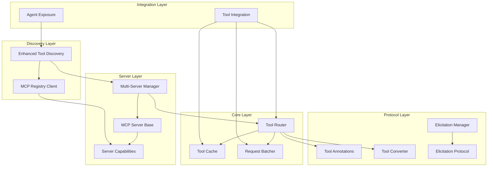
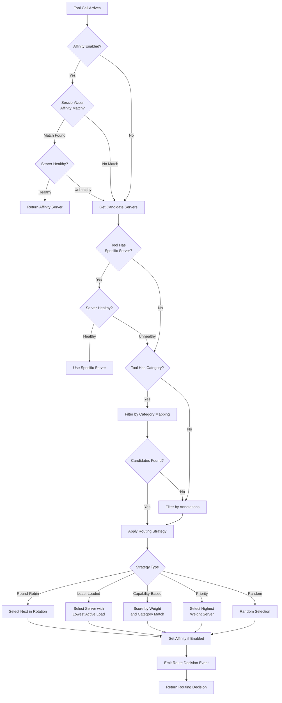
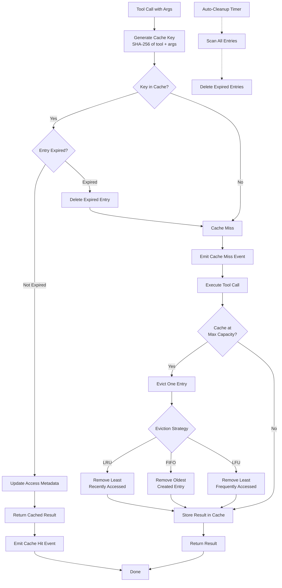
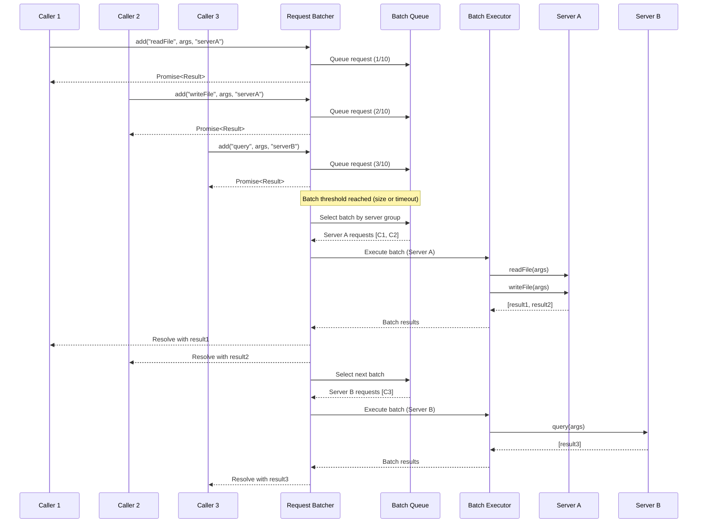
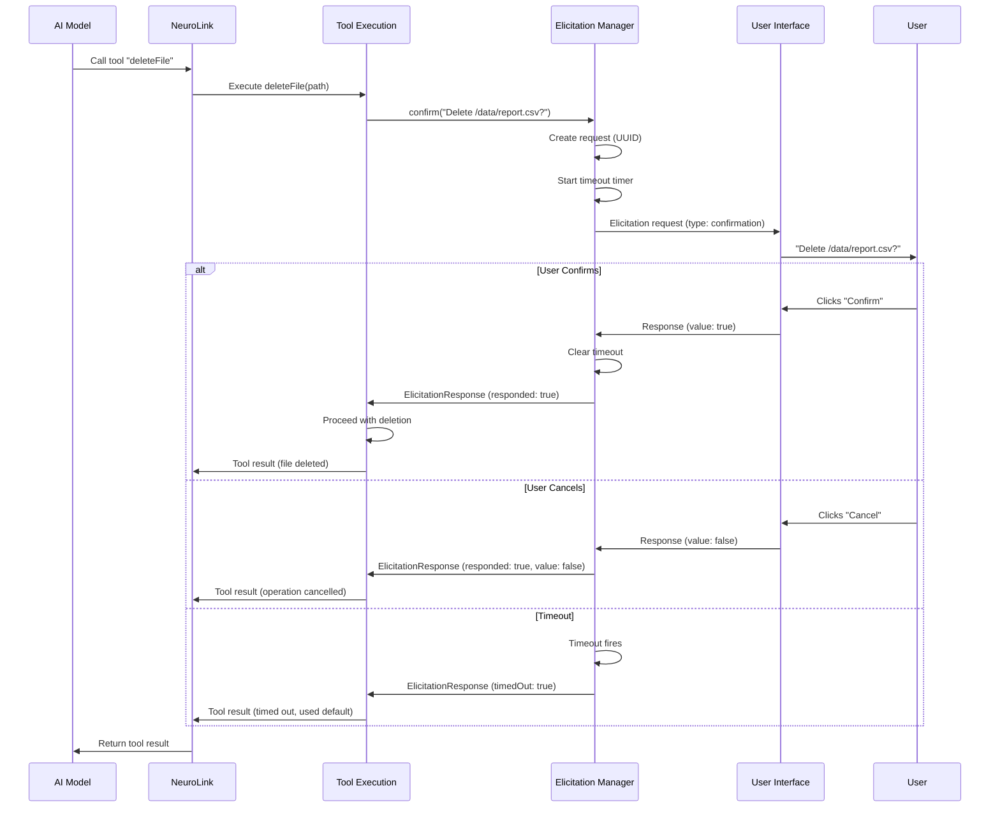
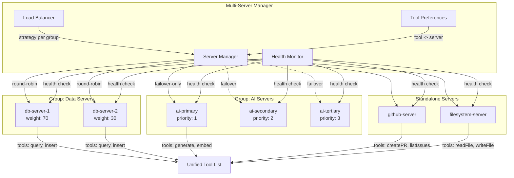

# MCP Enhancement Architecture Diagrams

Visual guides for understanding the MCP enhancement architecture, data flows, and component interactions.

> **Main documentation**: For API reference, configuration options, and code examples, see [MCP Enhancements](mcp-enhancements.md).

## Overall Architecture

The MCP enhancement system is organized into five layers, each serving a distinct role in tool management, routing, and execution across multiple MCP servers.

## Tool Router Flow

The Tool Router selects the best server for each tool call using a multi-step decision process. It checks session affinity first, then narrows candidates by category and annotation, and finally applies the configured strategy.

## Tool Cache Strategy

The Tool Cache intercepts tool calls before execution. On a cache hit the stored result is returned immediately. On a miss the tool executes, and the result is stored. When the cache reaches capacity, the configured eviction strategy selects which entry to remove.

## Request Batcher Flow

The Request Batcher collects individual tool calls into batches, groups them by server, and executes each group in parallel. Results are distributed back to the original callers through their individual promises.

## Elicitation Protocol

The Elicitation Protocol enables MCP tools to request interactive user input mid-execution. This sequence shows how a tool pauses, requests confirmation or data from the user, and resumes once a response arrives.

## Multi-Server Topology

The Multi-Server Manager organizes MCP servers into groups, applies per-group load balancing strategies, and maintains health metrics for routing decisions. This diagram shows a typical deployment with server groups, health monitoring, and failover paths.

