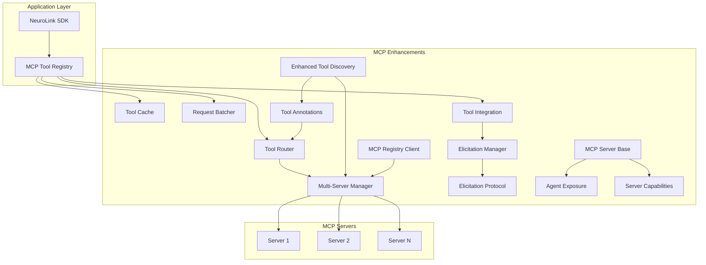
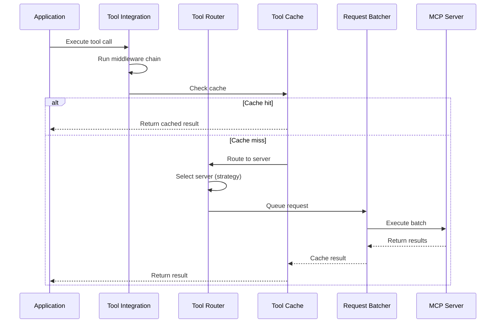

# MCP Enhancements

> **Since**: v9.16.0 | **Status**: Stable | **Availability**: SDK

## Overview

The MCP Enhancements suite extends NeuroLink's Model Context Protocol integration with production-grade capabilities for managing tool calls at scale. These modules address the operational challenges of running multiple MCP servers in enterprise environments:

- **Tool Router** -- Intelligent routing of tool calls across multiple servers with 6 strategies
- **Tool Cache** -- High-performance result caching with LRU, FIFO, and LFU eviction
- **Request Batcher** -- Automatic batching of tool calls for improved throughput
- **Tool Annotations** -- Safety metadata and behavior hints for MCP tools
- **Tool Converter** -- Bidirectional conversion between NeuroLink and MCP tool formats
- **Tool Integration** -- Middleware chain for confirmation, retry, timeout, and logging
- **Enhanced Tool Discovery** -- Advanced search and filtering across multi-server environments
- **Elicitation Protocol** -- Interactive user input during tool execution (HITL)
- **Multi-Server Manager** -- Load balancing and failover across server groups
- **MCP Server Base** -- Abstract base class for building custom MCP servers
- **Agent & Workflow Exposure** -- Expose agents and workflows as MCP tools
- **Server Capabilities** -- Resource and prompt management per MCP spec
- **MCP Registry Client** -- Discover servers from registries and well-known catalogs

> **Architecture Diagrams**: For visual diagrams of the overall architecture, routing flows, caching strategies, batching sequences, elicitation protocol, and multi-server topology, see [MCP Enhancement Architecture Diagrams](mcp-enhancements-diagrams.md).

## Quick Start

A complete, runnable example showing routing, caching, and batching working together:

```typescript
import {
  ToolRouter,
  ToolCache,
  RequestBatcher,
  createAnnotatedTool,
} from "@juspay/neurolink";

async function main() {
  // 1. Set up intelligent routing across servers
  const router = new ToolRouter({
    strategy: "least-loaded",
    enableAffinity: true,
    categoryMapping: {
      database: ["db-server-1", "db-server-2"],
      ai: ["ai-server-primary"],
    },
  });
  router.registerServer("db-server-1", ["database"]);
  router.registerServer("db-server-2", ["database"]);
  router.registerServer("ai-server-primary", ["ai"]);

  // 2. Cache tool results to reduce redundant calls
  const cache = new ToolCache({
    ttl: 60000,
    maxSize: 500,
    strategy: "lru",
  });

  // 3. Create a tool with safety annotations
  const tool = createAnnotatedTool({
    name: "queryUsers",
    description: "Query the users table",
    inputSchema: {
      type: "object",
      properties: { limit: { type: "number" } },
    },
    execute: async (params) => {
      return { users: ["Alice", "Bob"] };
    },
  });
  // Annotations inferred: { readOnlyHint: true, idempotentHint: true }

  // 4. Route the tool call to the best server
  const decision = router.route(
    { name: "queryUsers", category: "database" },
    { sessionId: "user-123" },
  );
  console.log(`Routed to: ${decision.serverId} (${decision.strategy})`);

  // 5. Execute with caching -- only calls the function on cache miss
  const result = await cache.getOrSet(
    ToolCache.generateKey("queryUsers", { limit: 10 }),
    async () => tool.execute!({ limit: 10 }),
  );
  console.log("Result:", result);

  // 6. Set up batching for high-throughput scenarios
  const batcher = new RequestBatcher({
    maxBatchSize: 10,
    maxWaitMs: 50,
    groupByServer: true,
  });

  batcher.setExecutor(async (requests) => {
    return requests.map((r) => ({
      success: true as const,
      result: { id: r.args.id, name: `User ${r.args.id}` },
    }));
  });

  // Batch multiple calls -- they execute together
  const [user1, user2] = await Promise.all([
    batcher.add("getUser", { id: 1 }, "db-server-1"),
    batcher.add("getUser", { id: 2 }, "db-server-1"),
  ]);
  console.log("Batched results:", user1, user2);

  // Clean up
  cache.destroy();
  batcher.destroy();
}

main().catch(console.error);
```

---

## Tool Router

Intelligent routing of tool calls to appropriate MCP servers based on categories, annotations, and server capabilities.

### Routing Strategies

| Strategy           | Description                                    | Confidence |
| ------------------ | ---------------------------------------------- | ---------- |
| `round-robin`      | Distribute calls evenly across servers         | 0.8        |
| `least-loaded`     | Route to server with fewest active connections | 0.9        |
| `capability-based` | Score servers by capability match and weight   | Variable   |
| `affinity`         | Maintain session/user consistency              | 1.0        |
| `priority`         | Route by server weight (higher = more traffic) | Variable   |
| `random`           | Random selection for load distribution         | 0.5        |

### Configuration

```typescript
import { ToolRouter, type ToolRouterConfig } from "@juspay/neurolink";

const config: ToolRouterConfig = {
  strategy: "least-loaded",
  enableAffinity: true,
  categoryMapping: {
    database: ["db-primary", "db-replica"],
    "file-system": ["fs-server"],
  },
  serverWeights: [
    { serverId: "db-primary", weight: 80, capabilities: ["database", "write"] },
    { serverId: "db-replica", weight: 20, capabilities: ["database", "read"] },
  ],
  fallbackStrategy: "round-robin",
  maxRetries: 3,
  healthCheckInterval: 30000,
  affinityTtl: 30 * 60 * 1000, // 30 minutes
};

const router = new ToolRouter(config);
```

### Usage

```typescript
// Register servers
router.registerServer("db-primary", ["database", "write"]);
router.registerServer("db-replica", ["database", "read"]);

// Route a tool call
const decision = router.route(
  { name: "queryUsers", category: "database" },
  { sessionId: "session-abc" },
);
// => { serverId: "db-primary", strategy: "least-loaded", confidence: 0.9, ... }

// Update server load after execution
router.updateServerLoad("db-primary", +1); // Request started
router.updateServerLoad("db-primary", -1); // Request completed

// Update health status
router.updateHealthStatus("db-replica", false); // Mark unhealthy

// Listen for events
router.on("routeDecision", ({ toolName, decision }) => {
  console.log(`${toolName} -> ${decision.serverId}`);
});

// Get routing statistics
const stats = router.getStats();
// => { availableServers: 2, healthyServers: 1, activeAffinities: 1, serverLoads: {...} }
```

### Annotation-Based Routing

The router automatically considers tool annotations when selecting servers:

- **Read-only tools** -- Routed to any healthy server
- **Destructive tools** -- Routed only to primary servers (weight >= 50)
- **Idempotent tools** -- Prefer servers in the "caching" category

```typescript
const candidates = router.routeByAnnotation({
  name: "deleteUser",
  annotations: { destructiveHint: true },
});
// Returns only high-weight primary servers
```

### Default Configuration

```typescript
import { DEFAULT_ROUTER_CONFIG } from "@juspay/neurolink";

// DEFAULT_ROUTER_CONFIG values:
// {
//   strategy: "least-loaded",
//   enableAffinity: true,
//   maxRetries: 3,
//   healthCheckInterval: 30000,       // 30 seconds
//   affinityTtl: 30 * 60 * 1000,     // 30 minutes
// }
```

### Events

`ToolRouter` extends `EventEmitter` and emits the following typed events (`ToolRouterEvents`):

| Event             | Payload                                                          | Fired When                                           |
| ----------------- | ---------------------------------------------------------------- | ---------------------------------------------------- |
| `routeDecision`   | `{ toolName: string, decision: RoutingDecision }`                | A routing decision is made for a tool call           |
| `routeFailed`     | `{ toolName: string, error: Error, attemptedServers: string[] }` | Routing fails after exhausting all candidate servers |
| `affinitySet`     | `{ key: string, serverId: string }`                              | A new session/user affinity rule is created          |
| `affinityExpired` | `{ key: string }`                                                | An affinity rule expires (TTL exceeded)              |
| `healthUpdate`    | `{ serverId: string, healthy: boolean }`                         | A server's health status changes                     |

```typescript
router.on("routeDecision", ({ toolName, decision }) => {
  console.log(`${toolName} -> ${decision.serverId} (${decision.strategy})`);
});

router.on("healthUpdate", ({ serverId, healthy }) => {
  console.log(`Server ${serverId} is now ${healthy ? "healthy" : "unhealthy"}`);
});
```

### Additional Methods

| Method                                          | Description                                          |
| ----------------------------------------------- | ---------------------------------------------------- |
| `registerServer(serverId, capabilities?)`       | Register a server as available for routing           |
| `unregisterServer(serverId)`                    | Remove a server from routing                         |
| `route(tool, context?)`                         | Route a tool call to the best server                 |
| `routeByCategory(tool, category)`               | Get healthy servers for a category                   |
| `routeByAnnotation(tool)`                       | Get servers based on tool annotation hints           |
| `routeByCapability(tool, requiredCapabilities)` | Get servers matching all required capabilities       |
| `updateServerLoad(serverId, delta)`             | Adjust server load counter (+1 on start, -1 on end)  |
| `updateHealthStatus(serverId, healthy)`         | Update server health; emits `healthUpdate` on change |
| `setAffinity(key, serverId)`                    | Manually set session/user affinity                   |
| `clearAffinity(key)`                            | Remove an affinity rule                              |
| `getStats()`                                    | Get routing statistics (servers, loads, affinities)  |
| `destroy()`                                     | Stop affinity cleanup timer and clear all rules      |

### Key Types

```typescript
import type {
  RoutingStrategy,
  ToolRouterConfig,
  RoutingDecision,
  ServerWeight,
  CategoryMapping,
  AffinityRule,
  ToolRouterEvents,
  MCPTool,
} from "@juspay/neurolink";
```

---

## Tool Cache

High-performance caching for MCP tool results with multiple eviction strategies, pattern-based invalidation, and cache-aside support.

### Cache Strategies

| Strategy | Description                            | Best For                        |
| -------- | -------------------------------------- | ------------------------------- |
| `lru`    | Evicts least recently accessed entries | General use, temporal locality  |
| `fifo`   | Evicts oldest entries first            | Streaming data, time-sensitive  |
| `lfu`    | Evicts least frequently used entries   | Stable workloads, popular items |

### Configuration

```typescript
import { ToolCache, type CacheConfig } from "@juspay/neurolink";

const cache = new ToolCache<unknown>({
  ttl: 5 * 60 * 1000, // 5 minutes
  maxSize: 1000,
  strategy: "lru",
  enableAutoCleanup: true,
  cleanupInterval: 60000,
  namespace: "my-app",
});
```

### Usage

```typescript
// Basic set/get
cache.set("getUserById:123", { id: 123, name: "Alice" });
const user = cache.get("getUserById:123");

// Cache-aside pattern (recommended)
const result = await cache.getOrSet(
  "getUserById:456",
  async () => {
    return await fetchUser(456); // Only called on cache miss
  },
  30000, // Optional: custom TTL for this entry
);

// Pattern-based invalidation (glob-style)
cache.invalidate("getUserById:*"); // Invalidate all user cache entries

// Generate cache keys from tool name + arguments
const key = ToolCache.generateKey("queryDatabase", {
  table: "users",
  limit: 10,
});

// Monitor cache performance
const stats = cache.getStats();
// => { hits: 42, misses: 8, evictions: 3, size: 47, maxSize: 1000, hitRate: 0.84 }

// Listen for cache events
cache.on("hit", ({ key }) => console.log(`Cache hit: ${key}`));
cache.on("evict", ({ key, reason }) =>
  console.log(`Evicted: ${key} (${reason})`),
);

// Clean up
cache.destroy();
```

### ToolResultCache

A specialized wrapper that automatically generates cache keys from tool name and arguments:

```typescript
import { ToolResultCache } from "@juspay/neurolink";

const resultCache = new ToolResultCache({
  ttl: 120000,
  strategy: "lfu",
});

// Cache tool results directly
resultCache.cacheResult("getUserById", { id: 123 }, { name: "Alice" });
const cached = resultCache.getCachedResult("getUserById", { id: 123 });

// Invalidate all results for a specific tool
resultCache.invalidateTool("getUserById");
```

### Default Configuration

```typescript
import { DEFAULT_CACHE_CONFIG } from "@juspay/neurolink";

// DEFAULT_CACHE_CONFIG values:
// {
//   ttl: 5 * 60 * 1000,            // 5 minutes
//   maxSize: 1000,
//   strategy: "lru",
//   enableAutoCleanup: true,
//   cleanupInterval: 60000,         // 1 minute
// }
```

### Events

`ToolCache` extends `EventEmitter` and emits the following typed events (`CacheEvents`):

| Event   | Payload                                                        | Fired When                                              |
| ------- | -------------------------------------------------------------- | ------------------------------------------------------- |
| `hit`   | `{ key: string, value: unknown }`                              | A cache lookup finds a valid (non-expired) entry        |
| `miss`  | `{ key: string }`                                              | A cache lookup finds no entry or an expired entry       |
| `set`   | `{ key: string, value: unknown, ttl: number }`                 | A new entry is stored in the cache                      |
| `evict` | `{ key: string, reason: "expired" \| "capacity" \| "manual" }` | An entry is removed (expiry, capacity limit, or manual) |
| `clear` | `{ entriesRemoved: number }`                                   | All entries are cleared from the cache                  |

### CacheStats Fields

The `getStats()` method returns a `CacheStats` object:

| Field       | Type     | Description                                     |
| ----------- | -------- | ----------------------------------------------- |
| `hits`      | `number` | Total cache hits since creation or last reset   |
| `misses`    | `number` | Total cache misses since creation or last reset |
| `evictions` | `number` | Total evictions (expired + capacity + manual)   |
| `size`      | `number` | Current number of entries in the cache          |
| `maxSize`   | `number` | Maximum capacity from configuration             |
| `hitRate`   | `number` | Hit rate (0-1): `hits / (hits + misses)`        |

### Additional Methods

| Method                              | Description                                              |
| ----------------------------------- | -------------------------------------------------------- |
| `get(key)`                          | Get a value; returns `undefined` on miss or expiry       |
| `set(key, value, ttl?)`             | Store a value with optional per-entry TTL override       |
| `has(key)`                          | Check if a key exists and is not expired                 |
| `delete(key)`                       | Delete a specific key (emits `evict` with `"manual"`)    |
| `invalidate(pattern)`               | Delete entries matching a glob pattern (e.g. `"user:*"`) |
| `clear()`                           | Remove all entries                                       |
| `getOrSet(key, factory, ttl?)`      | Cache-aside pattern: get or compute and cache            |
| `getStats()`                        | Get cache performance statistics                         |
| `resetStats()`                      | Reset hit/miss/eviction counters                         |
| `keys()`                            | Get all keys currently in the cache                      |
| `size`                              | Property: current entry count                            |
| `ToolCache.generateKey(name, args)` | Static: generate a deterministic cache key               |
| `destroy()`                         | Stop auto-cleanup timer and clear all entries            |

### Key Types

```typescript
import type {
  CacheConfig,
  CacheStrategy,
  CacheStats,
  CacheEvents,
} from "@juspay/neurolink";
```

---

## Request Batcher

Automatic batching of MCP tool calls for improved throughput. Groups requests by server, flushes based on batch size or timeout, and executes batches in parallel.

### Configuration

```typescript
import { RequestBatcher, type BatchConfig } from "@juspay/neurolink";

const batcher = new RequestBatcher<ToolResult>({
  maxBatchSize: 10, // Flush when 10 requests are queued
  maxWaitMs: 100, // Or after 100ms, whichever comes first
  enableParallel: true, // Execute batch items in parallel
  maxConcurrentBatches: 5, // Maximum batches in flight
  groupByServer: true, // Group requests by server ID
});
```

### Usage

```typescript
// Set the batch executor
batcher.setExecutor(async (requests) => {
  return Promise.all(
    requests.map(async (r) => {
      try {
        const result = await executeToolCall(r.tool, r.args, r.serverId);
        return { success: true, result };
      } catch (error) {
        return { success: false, error };
      }
    }),
  );
});

// Add requests -- they are batched and flushed automatically
const [result1, result2, result3] = await Promise.all([
  batcher.add("getUserById", { id: 1 }, "db-server"),
  batcher.add("getUserById", { id: 2 }, "db-server"),
  batcher.add("getOrder", { orderId: 99 }, "order-server"),
]);

// Manual flush
await batcher.flush();

// Wait for all pending requests
await batcher.drain();

// Check status
console.log(batcher.queueSize); // 0
console.log(batcher.isIdle); // true

// Clean up
batcher.destroy();
```

### ToolCallBatcher

A higher-level wrapper designed specifically for MCP tool execution:

```typescript
import { ToolCallBatcher } from "@juspay/neurolink";

const toolBatcher = new ToolCallBatcher({ maxBatchSize: 5, maxWaitMs: 50 });

toolBatcher.setToolExecutor(async (tool, args, serverId) => {
  return await mcpClient.callTool(tool, args);
});

const result = await toolBatcher.execute("readFile", { path: "/data.json" });
```

### Default Configuration

```typescript
import { DEFAULT_BATCH_CONFIG } from "@juspay/neurolink";

// DEFAULT_BATCH_CONFIG values:
// {
//   maxBatchSize: 10,
//   maxWaitMs: 100,                  // 100 milliseconds
//   enableParallel: true,
//   maxConcurrentBatches: 5,
//   groupByServer: true,
// }
```

### Events

`RequestBatcher` extends `EventEmitter` and emits the following typed events (`BatcherEvents`):

| Event            | Payload                                                          | Fired When                                          |
| ---------------- | ---------------------------------------------------------------- | --------------------------------------------------- |
| `batchStarted`   | `{ batchId: string, size: number }`                              | A batch begins execution                            |
| `batchCompleted` | `{ batchId: string, results: BatchResult<T>[] }`                 | A batch finishes executing all requests             |
| `batchFailed`    | `{ batchId: string, error: Error }`                              | A batch-level failure rejects all its requests      |
| `requestQueued`  | `{ requestId: string, queueSize: number }`                       | A new request is added to the queue                 |
| `flushTriggered` | `{ reason: "size" \| "timeout" \| "manual", queueSize: number }` | A flush is triggered (batch full, timer, or manual) |

```typescript
batcher.on("batchCompleted", ({ batchId, results }) => {
  const successes = results.filter((r) => r.success).length;
  console.log(`Batch ${batchId}: ${successes}/${results.length} succeeded`);
});
```

### Additional Methods

| Method                       | Description                                                     |
| ---------------------------- | --------------------------------------------------------------- |
| `setExecutor(fn)`            | Set the batch executor function                                 |
| `add(tool, args, serverId?)` | Add a request to the queue; returns a Promise                   |
| `flush()`                    | Manually flush the current batch                                |
| `drain()`                    | Flush and wait for all active batches to complete (30s timeout) |
| `queueSize`                  | Property: number of pending requests                            |
| `activeBatchCount`           | Property: number of batches currently in flight                 |
| `isIdle`                     | Property: `true` when no pending requests and no active batches |
| `destroy()`                  | Reject all pending requests and stop the batcher                |

### Key Types

```typescript
import type {
  BatchConfig,
  BatchResult,
  BatchExecutor,
  BatcherEvents,
} from "@juspay/neurolink";
```

---

## Tool Annotations

Safety metadata and behavior hints for MCP tools, implementing the MCP 2024-11-05 specification. Annotations guide AI models and middleware on how to handle tool execution.

### Annotation Fields

| Field                  | Type       | Description                                        |
| ---------------------- | ---------- | -------------------------------------------------- |
| `readOnlyHint`         | `boolean`  | Tool only reads data, no side effects              |
| `destructiveHint`      | `boolean`  | Tool performs destructive operations               |
| `idempotentHint`       | `boolean`  | Tool can be safely retried                         |
| `requiresConfirmation` | `boolean`  | Tool needs user confirmation before running        |
| `title`                | `string`   | Human-readable title                               |
| `tags`                 | `string[]` | Custom tags for categorization                     |
| `estimatedDuration`    | `number`   | Expected execution time in milliseconds            |
| `rateLimitHint`        | `number`   | Suggested calls per minute                         |
| `costHint`             | `number`   | Relative cost (arbitrary units)                    |
| `complexity`           | `string`   | `"simple"`, `"medium"`, or `"complex"`             |
| `securityLevel`        | `string`   | `"public"`, `"internal"`, or `"restricted"`        |
| `openWorldHint`        | `boolean`  | Tool may interact with external/open-world systems |
| `auditRequired`        | `boolean`  | Tool execution should be audit-logged              |

### Usage

```typescript
import {
  createAnnotatedTool,
  inferAnnotations,
  getToolSafetyLevel,
  filterToolsByAnnotations,
  requiresConfirmation,
  isSafeToRetry,
  validateAnnotations,
  getAnnotationSummary,
  mergeAnnotations,
} from "@juspay/neurolink";

// Create a tool with automatic annotation inference
const tool = createAnnotatedTool({
  name: "deleteUser",
  description: "Delete a user account permanently",
  inputSchema: {
    type: "object",
    properties: { userId: { type: "string" } },
    required: ["userId"],
  },
  execute: async (params) => {
    /* ... */
  },
});
// Annotations inferred: { destructiveHint: true, requiresConfirmation: true, complexity: "simple" }

// Check safety level
getToolSafetyLevel(tool); // => "dangerous"

// Check if confirmation is needed
requiresConfirmation(tool); // => true

// Check if safe to auto-retry on failure
isSafeToRetry(tool); // => false

// Get human-readable summary
getAnnotationSummary(tool.annotations);
// => "[DESTRUCTIVE | requires confirmation | simple complexity]"

// Filter tools by annotation predicates
const safeTools = filterToolsByAnnotations(
  allTools,
  (annotations) => annotations.readOnlyHint === true,
);

// Validate annotations for conflicts
const errors = validateAnnotations({
  readOnlyHint: true,
  destructiveHint: true, // Conflict!
});
// => ["Tool cannot be both readOnly and destructive - these are conflicting hints"]

// Merge multiple annotation objects (arrays like tags are merged, not overwritten)
const merged = mergeAnnotations(
  { readOnlyHint: true, tags: ["data"] },
  { idempotentHint: true, tags: ["safe"] },
);
// => { readOnlyHint: true, idempotentHint: true, tags: ["data", "safe"] }
```

### Inference Heuristics

`inferAnnotations` analyzes tool names and descriptions to automatically assign hints:

- **Read-only**: Names/descriptions containing `get`, `list`, `read`, `fetch`, `query`, `search`, `find`
- **Destructive**: Names/descriptions containing `delete`, `remove`, `drop`, `destroy`, `clear`, `purge`
- **Idempotent**: Names/descriptions containing `set`, `update`, `put`, `upsert`, `replace`
- **Complexity**: Determined by keywords (`analyze`, `process`, `generate` = complex) and description length

---

## Tool Converter

Bidirectional conversion between NeuroLink's internal tool format and the MCP protocol tool format, enabling interoperability with external MCP clients and servers.

### Conversion Functions

```typescript
import {
  neuroLinkToolToMCP,
  mcpToolToNeuroLink,
  mcpProtocolToolToServerTool,
  serverToolToMCPProtocol,
  batchConvertToMCP,
  batchConvertToNeuroLink,
  createToolFromFunction,
  validateToolName,
  sanitizeToolName,
} from "@juspay/neurolink";

// Convert NeuroLink tool to MCP format
const mcpTool = neuroLinkToolToMCP(neuroLinkTool, {
  inferAnnotations: true,
  namespacePrefix: "myapp",
  preserveMetadata: true,
});

// Convert MCP tool to NeuroLink format
const nlTool = mcpToolToNeuroLink(mcpServerTool, {
  removeNamespacePrefix: "myapp",
});

// Batch convert
const mcpTools = batchConvertToMCP(neuroLinkTools);
const nlTools = batchConvertToNeuroLink(mcpServerTools);

// Create tool from a plain function
const tool = createToolFromFunction(
  "calculateSum",
  "Calculate the sum of two numbers",
  async (params: { a: number; b: number }) => params.a + params.b,
  {
    parameters: {
      type: "object",
      properties: {
        a: { type: "number" },
        b: { type: "number" },
      },
      required: ["a", "b"],
    },
  },
);

// Validate and sanitize tool names
const { valid, errors } = validateToolName("my-tool");
const safeName = sanitizeToolName("My Tool Name!"); // => "My_Tool_Name_"
```

### Compatibility Matrix

```typescript
import { TOOL_COMPATIBILITY } from "@juspay/neurolink";

console.log(TOOL_COMPATIBILITY.MCP_2024_11_05);
// { annotations: true, inputSchema: true, outputSchema: false, ... }

console.log(TOOL_COMPATIBILITY.NEUROLINK);
// { annotations: true, inputSchema: true, outputSchema: true, categories: true, tags: true, ... }
```

### Key Types

```typescript
import type {
  NeuroLinkTool,
  MCPProtocolTool,
  ToolConverterOptions,
} from "@juspay/neurolink";
```

---

## Tool Integration & Middleware

A middleware chain system for tool execution that integrates elicitation (interactive user input), confirmation flows, retry logic, timeouts, and logging.

### Built-in Middleware

| Middleware                | Description                                         |
| ------------------------- | --------------------------------------------------- |
| `loggingMiddleware`       | Logs tool execution start, duration, and errors     |
| `confirmationMiddleware`  | Prompts user confirmation for destructive tools     |
| `validationMiddleware`    | Validates required parameters, elicits missing ones |
| `createTimeoutMiddleware` | Wraps execution with a timeout                      |
| `createRetryMiddleware`   | Retries failed calls for idempotent/read-only tools |

### Usage with ToolIntegrationManager

```typescript
import {
  ToolIntegrationManager,
  loggingMiddleware,
  confirmationMiddleware,
  createTimeoutMiddleware,
  createRetryMiddleware,
} from "@juspay/neurolink";

const manager = new ToolIntegrationManager();

// Set up elicitation handler (for interactive confirmation)
manager.setElicitationHandler(async (request) => {
  if (request.type === "confirmation") {
    const confirmed = await promptUser(request.message);
    return {
      requestId: request.id,
      responded: true,
      value: confirmed,
      timestamp: Date.now(),
    };
  }
  return { requestId: request.id, responded: false, timestamp: Date.now() };
});

// Add middleware chain
manager
  .use(loggingMiddleware)
  .use(confirmationMiddleware)
  .use(createTimeoutMiddleware(30000))
  .use(createRetryMiddleware(3, 1000));

// Register and execute tools
manager.registerTool(myTool);
const result = await manager.executeTool("myTool", { param: "value" });
```

### Custom Middleware

```typescript
import type { ToolMiddleware } from "@juspay/neurolink";

const metricsMiddleware: ToolMiddleware = async (
  tool,
  params,
  context,
  next,
) => {
  const start = Date.now();
  try {
    const result = await next();
    recordMetric(tool.name, Date.now() - start, "success");
    return result;
  } catch (error) {
    recordMetric(tool.name, Date.now() - start, "error");
    throw error;
  }
};
```

### Composable Middleware Chain

```typescript
import {
  createToolMiddlewareChain,
  createElicitationContext,
  globalToolIntegrationManager,
} from "@juspay/neurolink";

// Create a reusable middleware chain from an array of middlewares
const chain = createToolMiddlewareChain([
  loggingMiddleware,
  confirmationMiddleware,
  createTimeoutMiddleware(30000),
]);

// Create elicitation context for middleware that needs interactive input
const elicitationCtx = createElicitationContext(elicitationManager);

// Use the pre-configured global singleton (has default middleware already wired)
globalToolIntegrationManager.registerTool(myTool);
const result = await globalToolIntegrationManager.executeTool("myTool", params);
```

| Export                                   | Description                               |
| ---------------------------------------- | ----------------------------------------- |
| `createToolMiddlewareChain(middlewares)` | Create composable middleware chain        |
| `createElicitationContext(manager)`      | Create elicitation context for middleware |
| `globalToolIntegrationManager`           | Pre-configured singleton instance         |

### Wrapping Individual Tools

```typescript
import {
  wrapToolWithElicitation,
  wrapToolsWithElicitation,
} from "@juspay/neurolink";

const wrappedTool = wrapToolWithElicitation(tool, {
  autoConfirmDestructive: false,
  elicitationTimeout: 60000,
  enableLogging: true,
});

// Batch wrap
const wrappedTools = wrapToolsWithElicitation(tools);
```

### Key Types

```typescript
import type {
  ToolMiddleware,
  EnhancedExecutionContext,
  ToolWrapperOptions,
} from "@juspay/neurolink";
```

---

## Enhanced Tool Discovery

Advanced tool search and filtering across multi-server environments with annotation awareness, category inference, compatibility checking, and safety-level grouping.

### Usage

```typescript
import { EnhancedToolDiscovery } from "@juspay/neurolink";

const discovery = new EnhancedToolDiscovery();

// Discover tools from a server with automatic annotation inference
const result = await discovery.discoverToolsWithAnnotations(
  "github-server",
  mcpClient,
  10000, // timeout
);
console.log(`Found ${result.toolCount} tools`);

// Search with advanced criteria
const searchResult = discovery.searchTools({
  name: "file",
  category: "file-system",
  annotations: { readOnlyHint: true },
  sortBy: "name",
  sortDirection: "asc",
  limit: 10,
});

// Filter by safety level
const safeTools = discovery.getToolsBySafetyLevel("safe");
const dangerousTools = discovery.getToolsBySafetyLevel("dangerous");

// Get tools that require confirmation
const confirmationTools = discovery.getToolsRequiringConfirmation();

// Get tools for a specific server
const serverTools = discovery.getServerTools("github-server");

// Check tool compatibility
const compat = discovery.checkCompatibility("readFile", "fs-server", "2.0.0");
// => { compatible: true, issues: [], warnings: [], recommendations: [] }

// Get comprehensive statistics
const stats = discovery.getStatistics();
// => { totalTools, toolsByServer, toolsByCategory, toolsBySafetyLevel, ... }
```

### Search Criteria

```typescript
import type { ToolSearchCriteria } from "@juspay/neurolink";

const criteria: ToolSearchCriteria = {
  name: "query", // Partial name match
  description: "database", // Keyword match in description
  serverIds: ["db-server-1"], // Filter by servers
  category: "database", // Filter by inferred category
  tags: ["sql"], // Filter by annotation tags
  annotations: { readOnlyHint: true }, // Filter by annotation flags
  includeUnavailable: false, // Exclude offline tools
  sortBy: "successRate", // Sort field
  sortDirection: "desc", // Sort direction
  limit: 20, // Max results
};
```

### Events

`EnhancedToolDiscovery` extends `EventEmitter` and emits the following events:

| Event                | Payload                                                                                    | Fired When                            |
| -------------------- | ------------------------------------------------------------------------------------------ | ------------------------------------- |
| `toolDiscovered`     | `{ serverId: string, toolName: string, annotations: MCPToolAnnotations, timestamp: Date }` | A tool is discovered from a server    |
| `annotationsUpdated` | `{ serverId: string, toolName: string, annotations: MCPToolAnnotations, timestamp: Date }` | Tool annotations are manually updated |

### Additional Methods

| Method                                                     | Description                                                      |
| ---------------------------------------------------------- | ---------------------------------------------------------------- |
| `discoverToolsWithAnnotations(serverId, client, timeout?)` | Discover tools from a server with auto-inferred annotations      |
| `searchTools(criteria)`                                    | Search tools with advanced filtering criteria                    |
| `getToolsBySafetyLevel(level)`                             | Get tools by safety level: `"safe"`, `"moderate"`, `"dangerous"` |
| `getToolsRequiringConfirmation()`                          | Get tools that require user confirmation                         |
| `getReadOnlyTools()`                                       | Get all read-only tools                                          |
| `checkCompatibility(toolName, serverId, targetVersion?)`   | Check tool version and feature compatibility                     |
| `getTool(serverId, toolName)`                              | Get a specific tool by server and name                           |
| `getAllTools()`                                            | Get all registered tools across all servers                      |
| `getServerTools(serverId)`                                 | Get all tools for a specific server                              |
| `updateToolAnnotations(serverId, toolName, annotations)`   | Update tool annotations manually                                 |
| `registerServer(server)`                                   | Register a server with the internal multi-server manager         |
| `getUnifiedTools()`                                        | Get unified tool list from all servers                           |
| `getStatistics()`                                          | Get comprehensive statistics by server, category, safety         |

### Key Types

```typescript
import type {
  EnhancedToolInfo,
  ToolSearchCriteria,
  ToolSearchResult,
  CompatibilityCheckResult,
} from "@juspay/neurolink";
```

---

## Elicitation Protocol

The elicitation system enables MCP tools to request interactive user input mid-execution. This is critical for human-in-the-loop (HITL) workflows such as confirming destructive operations, requesting missing parameters, or handling authentication challenges.

### Elicitation Types

| Type           | Description                     | Response Type             |
| -------------- | ------------------------------- | ------------------------- |
| `confirmation` | Yes/no confirmation dialog      | `boolean`                 |
| `text`         | Free text input                 | `string`                  |
| `select`       | Single selection from options   | `string`                  |
| `multiselect`  | Multiple selection from options | `string[]`                |
| `form`         | Structured form with fields     | `Record<string, unknown>` |
| `file`         | File selection/upload           | File reference            |
| `secret`       | Sensitive input (passwords)     | `string`                  |

### ElicitationManager

```typescript
import { ElicitationManager } from "@juspay/neurolink";

const manager = new ElicitationManager({
  defaultTimeout: 60000,
  enabled: true,
  fallbackBehavior: "timeout", // "timeout" | "default" | "error"
  handler: async (request) => {
    // Implement your UI prompt based on request type
    switch (request.type) {
      case "confirmation": {
        const confirmed = await showConfirmDialog(request.message);
        return {
          requestId: request.id,
          responded: true,
          value: confirmed,
          timestamp: Date.now(),
        };
      }
      case "text": {
        const text = await showTextInput(request.message);
        return {
          requestId: request.id,
          responded: true,
          value: text,
          timestamp: Date.now(),
        };
      }
      default:
        return {
          requestId: request.id,
          responded: false,
          timestamp: Date.now(),
        };
    }
  },
});

// Convenience methods
const confirmed = await manager.confirm("Delete this file?", {
  toolName: "deleteFile",
  confirmLabel: "Yes, delete",
  cancelLabel: "Cancel",
});

const name = await manager.getText("Enter project name:", {
  placeholder: "my-project",
  defaultValue: "untitled",
});

const choice = await manager.select("Select environment:", [
  { value: "dev", label: "Development" },
  { value: "staging", label: "Staging" },
  { value: "prod", label: "Production" },
]);

const formData = await manager.form("Configure deployment:", [
  {
    name: "region",
    label: "Region",
    type: "select",
    required: true,
    options: [
      { value: "us-east-1", label: "US East" },
      { value: "eu-west-1", label: "EU West" },
    ],
  },
  {
    name: "replicas",
    label: "Replicas",
    type: "number",
    required: true,
    defaultValue: 3,
  },
]);

// Request secret/password input (masked)
const apiKey = await manager.getSecret("Enter API key:", {
  toolName: "configureService",
});

// Multi-selection from options
const regions = await manager.multiSelect(
  "Select deployment regions:",
  [
    { value: "us-east-1", label: "US East" },
    { value: "eu-west-1", label: "EU West" },
    { value: "ap-south-1", label: "AP South" },
  ],
  { minSelections: 1, maxSelections: 2 },
);

// Cancel a pending request
manager.cancel("request-id-123", "User navigated away");

// Enable/disable elicitation
manager.setEnabled(false);
console.log(manager.isEnabled()); // => false

// Inspect pending requests
console.log(manager.getPendingCount()); // => 0
const pending = manager.getPendingRequests();
manager.clearPending("Session ended");
```

### Additional Methods

| Method                                   | Description                   |
| ---------------------------------------- | ----------------------------- |
| `confirm(message, options?)`             | Yes/no confirmation dialog    |
| `getText(message, options?)`             | Free text input               |
| `select(message, options, config?)`      | Single selection from options |
| `multiSelect(message, options, config?)` | Multi-selection from options  |
| `form(message, fields)`                  | Structured form with fields   |
| `getSecret(message, options?)`           | Request secret/password input |
| `cancel(requestId, reason?)`             | Cancel pending request        |
| `setEnabled(enabled)`                    | Enable/disable elicitation    |
| `isEnabled()`                            | Check if enabled              |
| `getPendingCount()`                      | Get pending request count     |
| `getPendingRequests()`                   | Get all pending requests      |
| `clearPending(reason?)`                  | Clear all pending requests    |

### ElicitationProtocolAdapter

Bridges protocol-level JSON-RPC 2.0 messages with the ElicitationManager for cross-transport communication:

```typescript
import {
  ElicitationProtocolAdapter,
  createConfirmationRequest,
  createTextInputRequest,
  isElicitationProtocolMessage,
} from "@juspay/neurolink";

const adapter = new ElicitationProtocolAdapter({
  defaultTimeout: 30000,
  enableLogging: true,
});

// Handle incoming protocol messages
const response = await adapter.handleMessage(incomingMessage);

// Create protocol-compliant request messages
const confirmMsg = createConfirmationRequest("Are you sure?", {
  toolName: "dropTable",
  confirmLabel: "Drop it",
  cancelLabel: "Keep",
  timeout: 15000,
});

// Check if a message is an elicitation protocol message
if (isElicitationProtocolMessage(msg)) {
  await adapter.handleMessage(msg);
}
```

### Events

`ElicitationManager` extends `EventEmitter` and emits the following events:

| Event                  | Payload                                    | Fired When                                      |
| ---------------------- | ------------------------------------------ | ----------------------------------------------- |
| `elicitationRequested` | `Elicitation` (the full request object)    | A new elicitation request is created            |
| `elicitationResponded` | `ElicitationResponse`                      | The handler successfully responds to a request  |
| `elicitationError`     | `{ request: Elicitation, error: unknown }` | The handler throws an error                     |
| `elicitationTimeout`   | `{ request: Elicitation }`                 | A request times out before receiving a response |
| `elicitationCancelled` | `{ requestId: string, reason?: string }`   | A pending request is manually cancelled         |

```typescript
manager.on("elicitationRequested", (request) => {
  console.log(`Elicitation requested: ${request.type} for ${request.toolName}`);
});

manager.on("elicitationTimeout", ({ request }) => {
  console.log(`Request ${request.id} timed out`);
});
```

### Key Types

```typescript
import type {
  ElicitationType,
  Elicitation,
  ElicitationResponse,
  ElicitationHandler,
  ElicitationManagerConfig,
  ElicitationContext,
  FormField,
  SelectOption,
  ElicitationProtocolMessage,
  ElicitationProtocolPayload,
} from "@juspay/neurolink";
```

---

## Multi-Server Manager

Coordinates multiple MCP servers with load balancing, failover, unified tool discovery, and server grouping.

### Load Balancing Strategies

| Strategy        | Description                                  |
| --------------- | -------------------------------------------- |
| `round-robin`   | Rotate through servers sequentially          |
| `least-loaded`  | Prefer server with fewest active requests    |
| `random`        | Random selection                             |
| `weighted`      | Weighted random based on server priority     |
| `failover-only` | Use primary server, failover only on failure |

### Usage

```typescript
import { MultiServerManager } from "@juspay/neurolink";

const manager = new MultiServerManager({
  defaultStrategy: "least-loaded",
  healthAwareRouting: true,
  healthCheckInterval: 30000,
  maxFailoverRetries: 3,
  autoNamespace: true,
  namespaceSeparator: ".",
  conflictResolution: "first-wins",
});

// Add servers
manager.addServer({ id: "db-primary", name: "DB Primary", status: "connected", tools: [...] });
manager.addServer({ id: "db-replica", name: "DB Replica", status: "connected", tools: [...] });

// Create server groups for load balancing
manager.createGroup({
  id: "database-pool",
  name: "Database Servers",
  servers: ["db-primary", "db-replica"],
  strategy: "least-loaded",
  healthAware: true,
  weights: [
    { serverId: "db-primary", weight: 70, priority: 0 },
    { serverId: "db-replica", weight: 30, priority: 1 },
  ],
});

// Select a server for a tool call
const selection = manager.selectServer("queryUsers", "database-pool");
if (selection) {
  console.log(`Using server: ${selection.serverId}`);
}

// Get unified tool list across all servers
const tools = manager.getUnifiedTools();
for (const tool of tools) {
  console.log(`${tool.name} - available on ${tool.servers.length} server(s)`);
  if (tool.hasConflict) {
    console.log("  WARNING: Tool name conflict across servers");
  }
}

// Track request metrics
manager.requestStarted("db-primary");
// ... execute request ...
manager.requestCompleted("db-primary", 150, true);

// Get namespaced tools (server.toolName format)
const nsTools = manager.getNamespacedTools();
// => [{ fullName: "db-primary.queryUsers", toolName: "queryUsers", ... }]
```

### Methods

| Method                                          | Description                              |
| ----------------------------------------------- | ---------------------------------------- |
| `addServer(server)`                             | Add a server to the manager              |
| `removeServer(serverId)`                        | Remove a server from the manager         |
| `updateServer(serverId, updates)`               | Update server configuration              |
| `getServers()`                                  | Get all servers                          |
| `getServer(serverId)`                           | Get specific server                      |
| `createGroup(group)`                            | Create a server group                    |
| `removeGroup(groupId)`                          | Remove a server group                    |
| `addServerToGroup(serverId, groupId)`           | Add server to group                      |
| `removeServerFromGroup(serverId, groupId)`      | Remove server from group                 |
| `getGroups()`                                   | Get all groups                           |
| `getGroup(groupId)`                             | Get specific group                       |
| `selectServer(toolName, groupId?)`              | Select a server for a tool call          |
| `setToolPreference(toolName, serverId)`         | Set preferred server for a tool          |
| `clearToolPreference(toolName)`                 | Clear tool preference                    |
| `getUnifiedTools()`                             | Get unified tool list across all servers |
| `getNamespacedTools()`                          | Get tools with server namespace prefixes |
| `requestStarted(serverId)`                      | Track request start for load balancing   |
| `requestCompleted(serverId, duration, success)` | Track request completion                 |
| `getServerMetrics(serverId)`                    | Get server metrics                       |
| `getAllMetrics()`                               | Get all metrics                          |

### Events

`MultiServerManager` extends `EventEmitter` and emits the following events:

| Event                    | Payload                                        | Fired When                           |
| ------------------------ | ---------------------------------------------- | ------------------------------------ |
| `serverAdded`            | `{ serverId: string, server: MCPServerInfo }`  | A server is added to the manager     |
| `serverRemoved`          | `{ serverId: string }`                         | A server is removed from the manager |
| `serverUpdated`          | `{ serverId: string, server: MCPServerInfo }`  | Server info is updated               |
| `groupCreated`           | `{ group: ServerGroup }`                       | A new server group is created        |
| `groupRemoved`           | `{ groupId: string }`                          | A server group is removed            |
| `serverAddedToGroup`     | `{ serverId: string, groupId: string }`        | A server is added to a group         |
| `serverRemovedFromGroup` | `{ serverId: string, groupId: string }`        | A server is removed from a group     |
| `metricsUpdated`         | `{ serverId: string, metrics: ServerMetrics }` | Server metrics are updated           |
| `toolPreferenceSet`      | `{ toolName: string, serverId: string }`       | A tool routing preference is set     |

### Key Types

```typescript
import type {
  LoadBalancingStrategy,
  MultiServerManagerConfig,
  ServerGroup,
  ServerWeight,
  UnifiedTool,
} from "@juspay/neurolink";
```

---

## MCP Server Base

Abstract base class for building custom MCP servers with consistent patterns for tool registration, execution, and lifecycle management.

### Creating a Custom Server

```typescript
import { MCPServerBase, type MCPServerTool } from "@juspay/neurolink";

class DataProcessingServer extends MCPServerBase {
  constructor() {
    super({
      id: "data-processing",
      name: "Data Processing Server",
      description: "Provides data transformation and analysis tools",
      version: "1.0.0",
      category: "data",
      defaultAnnotations: {
        securityLevel: "internal",
      },
    });

    // Register tools
    this.registerTool({
      name: "transformCSV",
      description: "Transform CSV data with column mapping",
      annotations: {
        readOnlyHint: true,
        idempotentHint: true,
        estimatedDuration: 5000,
      },
      inputSchema: {
        type: "object",
        properties: {
          data: { type: "string", description: "CSV content" },
          mapping: { type: "object", description: "Column mapping" },
        },
        required: ["data"],
      },
      execute: async (params) => {
        const { data, mapping } = params as { data: string; mapping?: object };
        const transformed = await this.processCSV(data, mapping);
        return { success: true, data: transformed };
      },
    });
  }

  protected async onInit(): Promise<void> {
    // Async initialization (load configs, warm caches, etc.)
  }

  protected async onStart(): Promise<void> {
    // Start background tasks
  }

  protected async onStop(): Promise<void> {
    // Clean up resources
  }

  private async processCSV(data: string, mapping?: object): Promise<string> {
    // Implementation
    return data;
  }
}

// Usage
const server = new DataProcessingServer();
await server.init();
await server.start();

// Execute tools
const result = await server.executeTool("transformCSV", { data: "a,b\n1,2" });

// Convert to MCPServerInfo for registration with MultiServerManager
const serverInfo = server.toServerInfo();

// Query tools by annotation
const readOnlyTools = server.getReadOnlyTools();
const destructiveTools = server.getDestructiveTools();

// Lifecycle events
server.on("toolRegistered", ({ toolName }) =>
  console.log(`Registered: ${toolName}`),
);
server.on("toolExecuted", ({ toolName, duration }) =>
  console.log(`${toolName}: ${duration}ms`),
);
```

### Additional Methods

| Method                                    | Description                                              |
| ----------------------------------------- | -------------------------------------------------------- |
| `init()`                                  | Run `onInit()` lifecycle hook                            |
| `start()`                                 | Start the server (calls `onStart()`)                     |
| `stop()`                                  | Stop the server (calls `onStop()`)                       |
| `registerTool(tool)`                      | Register a tool with the server                          |
| `registerTools(tools)`                    | Register multiple tools at once                          |
| `executeTool(name, params)`               | Execute a registered tool by name                        |
| `getTools()`                              | Get all registered tools                                 |
| `getTool(name)`                           | Get a specific tool by name                              |
| `hasTool(name)`                           | Check if tool exists                                     |
| `removeTool(name)`                        | Remove a tool                                            |
| `toServerInfo()`                          | Convert server state to `MCPServerInfo` for registration |
| `getToolsByAnnotation(annotation, value)` | Filter tools by a specific annotation key and value      |
| `getReadOnlyTools()`                      | Get tools with `readOnlyHint: true`                      |
| `getDestructiveTools()`                   | Get tools with `destructiveHint: true`                   |
| `getIdempotentTools()`                    | Get tools with `idempotentHint: true`                    |
| `getToolsRequiringConfirmation()`         | Get tools with `requiresConfirmation: true`              |

### Events

`MCPServerBase` extends `EventEmitter` and emits the following typed events (`MCPServerEvents`):

| Event            | Payload                                                    | Fired When                                     |
| ---------------- | ---------------------------------------------------------- | ---------------------------------------------- |
| `toolRegistered` | `{ toolName: string, tool: MCPServerTool }`                | A tool is registered with the server           |
| `toolExecuted`   | `{ toolName: string, duration: number, success: boolean }` | A tool finishes execution (success or failure) |
| `toolError`      | `{ toolName: string, error: Error }`                       | A tool throws an error during execution        |
| `serverReady`    | `{ tools: string[] }`                                      | The server finishes initialization             |
| `serverStopped`  | `{ reason?: string }`                                      | The server is stopped                          |

### Key Types

```typescript
import type {
  MCPServerBaseConfig,
  MCPServerEvents,
  MCPServerTool,
  MCPToolAnnotations,
} from "@juspay/neurolink";
```

---

## Agent & Workflow Exposure

Expose NeuroLink agents and workflows as MCP tools, allowing external MCP clients to invoke complex AI operations through the standardized MCP protocol.

### Exposing Agents

```typescript
import {
  exposeAgentAsTool,
  exposeAgentsAsTools,
  AgentExposureManager,
  type ExposableAgent,
} from "@juspay/neurolink";

const agent: ExposableAgent = {
  id: "support-agent",
  name: "Customer Support Agent",
  description: "Handles customer support queries with knowledge base lookup",
  inputSchema: {
    type: "object",
    properties: {
      query: { type: "string", description: "Customer question" },
      customerId: { type: "string" },
    },
    required: ["query"],
  },
  execute: async (input) => {
    // Agent execution logic
    return { answer: "...", confidence: 0.95 };
  },
  metadata: {
    version: "2.1.0",
    category: "support",
    tags: ["customer-service", "knowledge-base"],
    estimatedDuration: 5000,
  },
};

// Expose as a single MCP tool
const { tool, toolName } = exposeAgentAsTool(agent, {
  prefix: "agent",
  executionTimeout: 300000,
  enableLogging: true,
});
// => toolName: "agent_customer_support_agent"
```

### Exposing Workflows

```typescript
import {
  exposeWorkflowAsTool,
  type ExposableWorkflow,
} from "@juspay/neurolink";

const workflow: ExposableWorkflow = {
  id: "onboarding-flow",
  name: "User Onboarding",
  description: "Complete user onboarding workflow",
  steps: [
    { id: "validate", name: "Validate Input" },
    { id: "create-account", name: "Create Account" },
    { id: "send-welcome", name: "Send Welcome Email" },
  ],
  inputSchema: {
    type: "object",
    properties: {
      email: { type: "string" },
      name: { type: "string" },
    },
    required: ["email", "name"],
  },
  execute: async (input) => {
    return { userId: "user-123", status: "onboarded" };
  },
  metadata: {
    version: "1.0.0",
    idempotent: true,
    estimatedDuration: 15000,
  },
};

const { tool } = exposeWorkflowAsTool(workflow, {
  prefix: "workflow",
  executionTimeout: 600000,
});
```

### AgentExposureManager

Manages the lifecycle of all exposed agents and workflows:

```typescript
const exposureManager = new AgentExposureManager({
  prefix: "neurolink",
  enableLogging: true,
});

exposureManager.exposeAgent(supportAgent);
exposureManager.exposeWorkflow(onboardingWorkflow);

const allTools = exposureManager.getExposedTools();
const agentTools = exposureManager.getToolsBySourceType("agent");
const stats = exposureManager.getStatistics();
// => { totalExposed: 2, exposedAgents: 1, exposedWorkflows: 1, toolNames: [...] }
```

### ExposureOptions

| Field                          | Type                       | Default                                | Description                                    |
| ------------------------------ | -------------------------- | -------------------------------------- | ---------------------------------------------- |
| `prefix`                       | `string`                   | `"agent"`/`"workflow"`                 | Prefix for generated tool names                |
| `defaultAnnotations`           | `MCPToolAnnotations`       | `{}`                                   | Annotations applied to all exposed tools       |
| `includeMetadataInDescription` | `boolean`                  | `true`                                 | Append source metadata to tool description     |
| `nameTransformer`              | `(name: string) => string` | lowercase + `_`                        | Transform source name to MCP tool name         |
| `wrapWithContext`              | `boolean`                  | `true`                                 | Wrap execution with context (logging, timeout) |
| `executionTimeout`             | `number`                   | `300000` (agent) / `600000` (workflow) | Timeout in ms                                  |
| `enableLogging`                | `boolean`                  | `true`                                 | Log execution start/end/errors                 |

### ExposureResult

| Field        | Type                    | Description                         |
| ------------ | ----------------------- | ----------------------------------- |
| `tool`       | `MCPServerTool`         | The generated MCP tool              |
| `sourceType` | `"agent" \| "workflow"` | Whether source is agent or workflow |
| `sourceId`   | `string`                | Original agent/workflow ID          |
| `toolName`   | `string`                | Generated MCP tool name             |

### Additional Methods (AgentExposureManager)

| Method                        | Description                                     |
| ----------------------------- | ----------------------------------------------- |
| `exposeAgent(agent)`          | Expose an agent and register the tool           |
| `exposeWorkflow(workflow)`    | Expose a workflow and register the tool         |
| `getExposedTools()`           | Get all exposed tools as `MCPServerTool[]`      |
| `getExposureResult(toolName)` | Get the `ExposureResult` for a tool name        |
| `getToolsBySourceType(type)`  | Get tools filtered by `"agent"` or `"workflow"` |
| `unexpose(toolName)`          | Remove a single exposed tool; returns boolean   |
| `clear()`                     | Remove all exposed tools                        |
| `getStatistics()`             | Get counts: totalExposed, agents, workflows     |

### Key Types

```typescript
import type {
  ExposableAgent,
  ExposableWorkflow,
  ExposureOptions,
  ExposureResult,
} from "@juspay/neurolink";
```

---

## Server Capabilities

Manages resources and prompts for MCP servers according to the MCP specification. Enables servers to expose data as resources and reusable prompt templates.

### Resources

```typescript
import {
  ServerCapabilitiesManager,
  createTextResource,
  createJsonResource,
} from "@juspay/neurolink";

const capabilities = new ServerCapabilitiesManager({
  resources: true,
  prompts: true,
  resourceSubscriptions: true,
});

// Register a static text resource
capabilities.registerResource(
  createTextResource(
    "config://app/settings",
    "Application Settings",
    "key=value\nport=3000",
    { description: "Current application settings" },
  ),
);

// Register a dynamic JSON resource
capabilities.registerResource(
  createJsonResource(
    "data://metrics/current",
    "Current Metrics",
    async () => ({ cpu: 45, memory: 72, requests: 1250 }),
    { description: "Live system metrics", dynamic: true },
  ),
);

// Register a resource template for pattern-matched URIs
capabilities.registerResourceTemplate("data://users/{id}", {
  name: "User Data",
  uriPattern: "data://users/{id}",
  mimeType: "application/json",
  reader: async (uri) => {
    const id = uri.split("/").pop();
    return {
      uri,
      mimeType: "application/json",
      text: JSON.stringify({ id, name: "User" }),
    };
  },
});

// Read a resource
const content = await capabilities.readResource("config://app/settings");

// Subscribe to resource changes
const unsubscribe = capabilities.subscribeToResource(
  "data://metrics/current",
  (uri, content) => {
    console.log(`Metrics updated:`, content.text);
  },
);

// Notify subscribers of a change
await capabilities.notifyResourceChanged("data://metrics/current");

// Unsubscribe
unsubscribe();
```

### Prompts

```typescript
import { createPrompt } from "@juspay/neurolink";

// Register a simple template-based prompt
capabilities.registerPrompt(
  createPrompt(
    "summarize",
    "Please summarize the following text concisely:\n\n{text}",
    {
      description: "Summarize text content",
      arguments: [
        { name: "text", description: "Text to summarize", required: true },
      ],
    },
  ),
);

// Register a prompt with a custom generator
capabilities.registerPrompt({
  name: "code-review",
  description: "Review code for issues and improvements",
  arguments: [
    { name: "code", description: "Source code to review", required: true },
    { name: "language", description: "Programming language" },
  ],
  generator: async (args) => ({
    messages: [
      {
        role: "user",
        content: {
          type: "text",
          text: `Review this ${args.language || "code"} for bugs, security issues, and improvements:\n\n${args.code}`,
        },
      },
    ],
  }),
});

// Generate a prompt
const result = await capabilities.getPrompt("summarize", {
  text: "NeuroLink is an enterprise AI platform...",
});

// List all prompts and resources
const prompts = capabilities.listPrompts();
const resources = capabilities.listResources();

// Get MCP capabilities object for protocol negotiation
const caps = capabilities.getCapabilities();
// => { resources: { subscribe: true, listChanged: true }, prompts: { listChanged: true } }
```

### Additional Methods (ServerCapabilitiesManager)

| Method                                        | Description                                               |
| --------------------------------------------- | --------------------------------------------------------- |
| `registerResource(resource)`                  | Register a static or dynamic resource                     |
| `registerResourceTemplate(pattern, template)` | Register a URI-template resource for pattern matching     |
| `readResource(uri)`                           | Read a resource by URI (resolves templates)               |
| `listResources()`                             | List all registered resources as `MCPResource[]`          |
| `getResource(uri)`                            | Get a registered resource by URI                          |
| `subscribeToResource(uri, callback)`          | Subscribe to resource changes; returns unsubscribe fn     |
| `notifyResourceChanged(uri)`                  | Notify all subscribers that a resource has changed        |
| `registerPrompt(prompt)`                      | Register a prompt with static template or async generator |
| `getPrompt(name, args?)`                      | Generate a prompt result with provided arguments          |
| `listPrompts()`                               | List all registered prompts as `MCPPrompt[]`              |
| `getCapabilities()`                           | Get MCP capabilities object for protocol negotiation      |

### Events

`ServerCapabilitiesManager` extends `EventEmitter` and emits the following events:

| Event                        | Payload                                                                                                        | Fired When                                   |
| ---------------------------- | -------------------------------------------------------------------------------------------------------------- | -------------------------------------------- |
| `resourceRegistered`         | `{ uri: string, name: string, timestamp: Date }`                                                               | A resource is registered                     |
| `resourceTemplateRegistered` | `{ pattern: string, timestamp: Date }`                                                                         | A resource template is registered            |
| `resourceUnregistered`       | `{ uri: string, timestamp: Date }`                                                                             | A resource is unregistered                   |
| `resourceRead`               | `{ uri: string, duration: number, success: boolean, timestamp: Date, error?: string }`                         | A resource is read (success or failure)      |
| `resourceSubscribed`         | `{ uri: string, timestamp: Date }`                                                                             | A subscription is added to a resource        |
| `resourceUnsubscribed`       | `{ uri: string, timestamp: Date }`                                                                             | A subscription is removed from a resource    |
| `resourceChanged`            | `{ uri: string, subscriberCount: number, timestamp: Date }`                                                    | A resource change is notified to subscribers |
| `promptRegistered`           | `{ name: string, timestamp: Date }`                                                                            | A prompt is registered                       |
| `promptUnregistered`         | `{ name: string, timestamp: Date }`                                                                            | A prompt is unregistered                     |
| `promptGenerated`            | `{ name: string, duration: number, success: boolean, messageCount?: number, timestamp: Date, error?: string }` | A prompt is generated                        |
| `cleared`                    | `{ timestamp: Date }`                                                                                          | All resources and prompts are cleared        |

### Additional Methods

| Method                                        | Description                                                 |
| --------------------------------------------- | ----------------------------------------------------------- |
| `registerResource(resource)`                  | Register a resource with a reader function                  |
| `registerResourceTemplate(pattern, template)` | Register a URI-pattern-based resource template              |
| `unregisterResource(uri)`                     | Remove a resource and its subscriptions                     |
| `listResources()`                             | List all registered resources                               |
| `readResource(uri, context?)`                 | Read a resource by URI (checks templates on miss)           |
| `getResource(uri)`                            | Get resource definition by URI                              |
| `subscribeToResource(uri, callback)`          | Subscribe to resource changes; returns unsubscribe function |
| `notifyResourceChanged(uri)`                  | Read resource and notify all subscribers                    |
| `registerPrompt(prompt)`                      | Register a prompt with a generator function                 |
| `unregisterPrompt(name)`                      | Remove a prompt                                             |
| `listPrompts()`                               | List all registered prompts                                 |
| `getPrompt(name, args?, context?)`            | Generate a prompt with arguments                            |
| `getPromptDefinition(name)`                   | Get prompt definition without generating                    |
| `getCapabilities()`                           | Get MCP capabilities object for protocol negotiation        |
| `getStatistics()`                             | Get counts of resources, templates, prompts, subscriptions  |
| `clear()`                                     | Clear all resources, templates, prompts, and subscriptions  |

### Key Types

```typescript
import type {
  MCPResource,
  ResourceContent,
  ResourceReader,
  RegisteredResource,
  MCPPrompt,
  PromptMessage,
  PromptResult,
  PromptGenerator,
  RegisteredPrompt,
  ServerCapabilitiesConfig,
  ResourceSubscriptionCallback,
} from "@juspay/neurolink";
```

---

## MCP Registry Client

Discover MCP servers from registries, including a built-in catalog of well-known servers. Search by category, tags, transport type, and verification status.

### Usage

```typescript
import {
  MCPRegistryClient,
  getWellKnownServer,
  getAllWellKnownServers,
} from "@juspay/neurolink";

const client = new MCPRegistryClient({
  enableCache: true,
  defaultCacheTTL: 3600000, // 1 hour
});

// Search for servers
const results = await client.search({
  query: "database",
  categories: ["database"],
  verifiedOnly: true,
  sortBy: "downloads",
  limit: 10,
});

for (const entry of results.entries) {
  console.log(`${entry.name} - ${entry.description}`);
  console.log(`  Install: ${client.getInstallCommand(entry)}`);

  // Check if required env vars are set
  const { ready, missing } = client.checkRequiredEnvVars(entry);
  if (!ready) {
    console.log(`  Missing: ${missing.join(", ")}`);
  }
}

// Get a specific well-known server
const postgres = getWellKnownServer("postgres");
// => { id: "postgres", name: "PostgreSQL", npmPackage: "@modelcontextprotocol/server-postgres", ... }

// Convert registry entry to MCPServerInfo for NeuroLink
const serverInfo = client.toServerInfo(postgres);

// Browse by category
const dbServers = await client.getByCategory("database");
const searchServers = await client.getByTag("search");

// Get all available categories and tags
const categories = await client.getCategories();
const tags = await client.getTags();

// Add custom registry entries
client.addCustomEntry({
  id: "my-internal-server",
  name: "Internal Data Server",
  description: "Company internal data API",
  version: "3.0.0",
  command: "node",
  args: ["./servers/data-server.js"],
  categories: ["data", "internal"],
  verified: false,
});
```

### Methods

| Method                        | Description                         |
| ----------------------------- | ----------------------------------- |
| `search(options)`             | Search for servers with filters     |
| `getByCategory(category)`     | Browse servers by category          |
| `getByTag(tag)`               | Filter entries by tag               |
| `getCategories()`             | Get all available categories        |
| `getTags()`                   | Get all available tags              |
| `getEntry(id)`                | Get a specific registry entry       |
| `getAllEntries()`             | Get all entries from all registries |
| `addCustomEntry(entry)`       | Add a custom registry entry         |
| `removeCustomEntry(id)`       | Remove a custom entry               |
| `addRegistry(config)`         | Add a custom registry source        |
| `getPopularServers(limit?)`   | Get popular servers                 |
| `getVerifiedServers()`        | Get verified servers                |
| `getStatistics()`             | Get registry statistics             |
| `toServerInfo(entry)`         | Convert entry to `MCPServerInfo`    |
| `getInstallCommand(entry)`    | Get install command for an entry    |
| `checkRequiredEnvVars(entry)` | Check if required env vars are set  |

### Well-Known Servers

The registry includes these verified servers out of the box:

| ID             | Name         | Categories           | Key Tools                       |
| -------------- | ------------ | -------------------- | ------------------------------- |
| `filesystem`   | Filesystem   | file-system          | read_file, write_file, list_dir |
| `github`       | GitHub       | version-control, api | create_repo, list_commits       |
| `postgres`     | PostgreSQL   | database             | query, list_tables              |
| `sqlite`       | SQLite       | database             | query, list_tables              |
| `brave-search` | Brave Search | search, api          | web_search, local_search        |
| `puppeteer`    | Puppeteer    | automation, web      | navigate, screenshot, click     |
| `git`          | Git          | version-control      | git_status, git_log, git_diff   |
| `memory`       | Memory       | memory, storage      | store, retrieve, search         |
| `slack`        | Slack        | communication, api   | send_message, list_channels     |
| `google-drive` | Google Drive | file-system, api     | list_files, read_file           |

### Key Types

```typescript
import type {
  MCPRegistryClientConfig,
  RegistryConfig,
  RegistryEntry,
  RegistrySearchOptions,
  RegistrySearchResult,
  RegistrySourceType,
} from "@juspay/neurolink";
```

---

## Architecture

> For detailed per-module flow diagrams (Tool Router decision flow, Tool Cache eviction, Request Batcher sequencing, Elicitation Protocol handshake, and Multi-Server topology), see [MCP Enhancement Architecture Diagrams](mcp-enhancements-diagrams.md).

The MCP enhancement modules are layered on top of NeuroLink's existing MCP infrastructure:



### Data Flow



---

## End-to-End Integration Example

This example shows how ToolCache, Tool Annotations, ToolIntegration middleware, and MCPServerBase compose together in a realistic scenario: a custom MCP server whose tools are executed through a middleware pipeline with caching, retry, timeout, and confirmation for destructive operations.

```typescript
import {
  MCPServerBase,
  ToolCache,
  ToolIntegrationManager,
  createAnnotatedTool,
  loggingMiddleware,
  confirmationMiddleware,
  createTimeoutMiddleware,
  createRetryMiddleware,
  requiresConfirmation,
  isSafeToRetry,
  type MCPServerTool,
} from "@juspay/neurolink";

// -------------------------------------------------------
// 1. Build a custom MCP server with annotated tools
// -------------------------------------------------------

class InventoryServer extends MCPServerBase {
  constructor() {
    super({
      id: "inventory",
      name: "Inventory Server",
      description: "Product inventory management tools",
      version: "1.0.0",
      category: "database",
    });

    // Read-only tool -- annotations are inferred automatically
    this.registerTool(
      createAnnotatedTool({
        name: "getProduct",
        description: "Get product details by SKU",
        inputSchema: {
          type: "object",
          properties: { sku: { type: "string" } },
          required: ["sku"],
        },
        execute: async (params) => {
          const { sku } = params as { sku: string };
          // Simulate a database lookup
          return { sku, name: "Widget", stock: 42, price: 9.99 };
        },
      }),
    );

    // Destructive tool -- inferred as destructive, requires confirmation
    this.registerTool(
      createAnnotatedTool({
        name: "deleteProduct",
        description: "Permanently delete a product from inventory",
        inputSchema: {
          type: "object",
          properties: { sku: { type: "string" } },
          required: ["sku"],
        },
        execute: async (params) => {
          const { sku } = params as { sku: string };
          return { deleted: true, sku };
        },
      }),
    );
  }
}

// -------------------------------------------------------
// 2. Wire up caching, middleware, and the server
// -------------------------------------------------------

async function main() {
  // Start the custom server
  const server = new InventoryServer();
  await server.init();
  await server.start();

  // Create a cache for read-only tool results
  const cache = new ToolCache({
    ttl: 5 * 60 * 1000, // 5 minutes
    maxSize: 200,
    strategy: "lru",
  });

  // Set up middleware pipeline: logging -> confirmation -> timeout -> retry
  const integration = new ToolIntegrationManager();

  integration.setElicitationHandler(async (request) => {
    if (request.type === "confirmation") {
      // In production, prompt the user via your UI framework.
      // Here we auto-approve for demonstration purposes.
      console.log(\`[Confirmation] \${request.message} -> auto-approved\`);
      return {
        requestId: request.id,
        responded: true,
        value: true,
        timestamp: Date.now(),
      };
    }
    return { requestId: request.id, responded: false, timestamp: Date.now() };
  });

  integration
    .use(loggingMiddleware)
    .use(confirmationMiddleware)
    .use(createTimeoutMiddleware(30_000))
    .use(createRetryMiddleware(3, 1000));

  // Register server tools with the middleware manager
  for (const tool of server.listTools()) {
    integration.registerTool(tool);
  }

  // -------------------------------------------------------
  // 3. Execute tools through the integrated pipeline
  // -------------------------------------------------------

  // Read-only call: cached + retryable, no confirmation needed
  const getProduct = server.listTools().find((t) => t.name === "getProduct")!;
  console.log("Requires confirmation:", requiresConfirmation(getProduct)); // false
  console.log("Safe to retry:", isSafeToRetry(getProduct)); // true

  const productResult = await cache.getOrSet(
    ToolCache.generateKey("getProduct", { sku: "W-100" }),
    () => integration.executeTool("getProduct", { sku: "W-100" }),
  );
  console.log("Product:", productResult);

  // Second call hits cache
  const cachedResult = cache.get(
    ToolCache.generateKey("getProduct", { sku: "W-100" }),
  );
  console.log("From cache:", cachedResult !== undefined);
  console.log("Cache stats:", cache.getStats());

  // Destructive call: triggers confirmation middleware, skips cache
  const deleteResult = await integration.executeTool("deleteProduct", {
    sku: "W-100",
  });
  console.log("Delete result:", deleteResult);

  // Invalidate cache for the deleted product
  cache.invalidate("getProduct:*");

  // -------------------------------------------------------
  // 4. Clean up
  // -------------------------------------------------------
  cache.destroy();
  await server.stop();
}

main().catch(console.error);
```

**What this demonstrates:**

- **MCPServerBase** provides a structured way to define and register tools with lifecycle hooks (\`init\`, \`start\`, \`stop\`).
- **Tool Annotations** are inferred automatically from tool names and descriptions -- \`getProduct\` is read-only, \`deleteProduct\` is destructive.
- **ToolIntegrationManager** chains middleware so every tool call passes through logging, confirmation (for destructive tools), timeout, and retry (for idempotent/read-only tools).
- **ToolCache** wraps read-only calls with \`getOrSet\` to avoid redundant execution, and \`invalidate\` clears stale entries after mutations.

> See the [Architecture Diagrams](mcp-enhancements-diagrams.md) for visual flows of how these components interact.

---

## Error Handling

All MCP enhancement modules use `ErrorFactory` from `@juspay/neurolink` for consistent, typed errors. Errors include a descriptive message and often a `hint` field with a suggested fix.

### Error Types by Module

| Module                    | ErrorFactory Method           | When Thrown                                                    |
| ------------------------- | ----------------------------- | -------------------------------------------------------------- |
| **ToolRouter**            | (none -- returns empty array) | Returns empty candidates array instead of throwing             |
| **ToolCache**             | (none -- returns undefined)   | Returns `undefined` on miss; eviction events carry reason      |
| **RequestBatcher**        | `invalidConfiguration()`      | `maxBatchSize < 1` or `maxWaitMs < 0`                          |
| **RequestBatcher**        | `missingConfiguration()`      | `setExecutor()` not called before `add()` or `flush()`         |
| **RequestBatcher**        | `toolTimeout()`               | `drain()` exceeds 30-second timeout                            |
| **ToolCallBatcher**       | `missingConfiguration()`      | `setToolExecutor()` not called before `execute()`              |
| **MCPServerBase**         | `invalidConfiguration()`      | Missing required config (`id`, `name`, `version`, etc.)        |
| **MCPServerBase**         | `toolTimeout()`               | Tool execution exceeds timeout                                 |
| **MultiServerManager**    | `invalidConfiguration()`      | Duplicate server ID, unknown server in group, unknown group    |
| **EnhancedToolDiscovery** | `toolExecutionFailed()`       | Discovery fails for a server                                   |
| **ToolIntegration**       | `toolTimeout()`               | Timeout middleware expires                                     |
| **ToolIntegration**       | `toolNotFound()`              | Tool not registered in the integration manager                 |
| **ServerCapabilities**    | `invalidConfiguration()`      | Resources/prompts disabled, duplicate URI/name, missing reader |

### Example: Catching Errors

```typescript
import { RequestBatcher } from "@juspay/neurolink";

const batcher = new RequestBatcher({ maxBatchSize: 10, maxWaitMs: 50 });

try {
  // Throws missingConfiguration because no executor is set
  await batcher.add("myTool", { id: 1 });
} catch (error) {
  // error.message: "Missing configuration: batchExecutor"
  // error.hint: "Call setExecutor() before adding requests to the batcher"
  console.error(error.message);
}
```

---

## SDK Integration

The MCP enhancement modules can be configured declaratively through the `NeuroLink` constructor. When provided, these modules are automatically wired into the `generate()` and `stream()` execution paths -- no additional setup required.

### Constructor Configuration

```typescript
import { NeuroLink } from "@juspay/neurolink";

const neurolink = new NeuroLink({
  mcp: {
    cache: { enabled: true, ttl: 60000, maxSize: 200, strategy: "lru" },
    annotations: { enabled: true, autoInfer: true },
    router: { enabled: true, strategy: "least-loaded", enableAffinity: false },
    batcher: { enabled: true, maxBatchSize: 10, maxWaitMs: 100 },
    discovery: { enabled: true },
    middleware: [loggingMiddleware, confirmationMiddleware],
  },
});
```

### How Enhancements Apply to generate()/stream()

When MCP enhancements are configured, `ToolsManager` (the internal component that wires tools for `generate()` and `stream()`) routes every tool call through `executeTool()`. This means the full enhancement pipeline -- annotation inference, middleware chain, cache lookup, routing, and batching -- applies automatically to every tool invocation during generation and streaming, with no per-call setup required.

### `MCPEnhancementsConfig` Options

| Field                   | Type               | Default          | Description                                                                                                       |
| ----------------------- | ------------------ | ---------------- | ----------------------------------------------------------------------------------------------------------------- |
| `cache.enabled`         | `boolean`          | `false`          | Enable tool result caching for read-only tools                                                                    |
| `cache.ttl`             | `number`           | `300000`         | Cache TTL in milliseconds (5 minutes)                                                                             |
| `cache.maxSize`         | `number`           | `500`            | Maximum cache entries before eviction                                                                             |
| `cache.strategy`        | `CacheStrategy`    | `'lru'`          | Eviction strategy: `'lru'`, `'fifo'`, or `'lfu'`                                                                  |
| `annotations.enabled`   | `boolean`          | `true`           | Enable tool annotation auto-inference                                                                             |
| `annotations.autoInfer` | `boolean`          | `true`           | Auto-infer annotations from tool name and description                                                             |
| `router.enabled`        | `boolean`          | auto             | Enable tool routing. Auto-activates when 2+ external servers exist                                                |
| `router.strategy`       | `RoutingStrategy`  | `'least-loaded'` | Routing strategy: `'round-robin'`, `'least-loaded'`, `'capability-based'`, `'affinity'`, `'priority'`, `'random'` |
| `router.enableAffinity` | `boolean`          | `false`          | Enable session affinity (sticky routing)                                                                          |
| `batcher.enabled`       | `boolean`          | `false`          | Enable request batching for programmatic `executeTool()` calls                                                    |
| `batcher.maxBatchSize`  | `number`           | `10`             | Maximum requests per batch                                                                                        |
| `batcher.maxWaitMs`     | `number`           | `100`            | Maximum wait time before flushing a batch (ms)                                                                    |
| `discovery.enabled`     | `boolean`          | `true`           | Enable enhanced tool discovery and search                                                                         |
| `middleware`            | `ToolMiddleware[]` | `[]`             | Global middleware chain applied to every tool execution                                                           |

### Per-Request Cache Bypass

You can disable tool caching for individual requests using the `disableToolCache` option:

```typescript
const result = await neurolink.generate({
  prompt: "What is the current server status?",
  disableToolCache: true, // bypass cache for this request
});

const stream = await neurolink.stream({
  prompt: "Get the latest metrics",
  disableToolCache: true, // also supported in stream()
});
```

This is useful when you need fresh results for a specific call without disabling caching globally.

---

## NeuroLink SDK Methods

The `NeuroLink` class exposes 15 MCP enhancement methods for programmatic access to routing, caching, batching, annotations, elicitation, discovery, tool conversion, and agent/workflow exposure.

### Method Reference

| Method                                       | Return Type                                 | Description                                                     |
| -------------------------------------------- | ------------------------------------------- | --------------------------------------------------------------- |
| `useToolMiddleware(middleware)`              | `this`                                      | Register a global tool middleware; returns `this` for chaining  |
| `getToolMiddlewares()`                       | `ToolMiddleware[]`                          | Get all registered tool middlewares                             |
| `flushToolBatch()`                           | `Promise<void>`                             | Flush any pending batched tool calls immediately                |
| `getMCPEnhancementsConfig()`                 | `MCPEnhancementsConfig \| undefined`        | Get the current MCP enhancements configuration                  |
| `getElicitationManager()`                    | `Promise<ElicitationManager>`               | Get the global elicitation manager for interactive tool input   |
| `registerElicitationHandler(handler)`        | `Promise<void>`                             | Register a handler for interactive elicitation requests         |
| `getMultiServerManager()`                    | `Promise<MultiServerManager>`               | Get the multi-server manager for load balancing and failover    |
| `getEnhancedToolDiscovery()`                 | `Promise<EnhancedToolDiscovery>`            | Get the enhanced tool discovery service                         |
| `getMCPRegistryClient()`                     | `Promise<MCPRegistryClient>`                | Get the MCP registry client for discovering servers             |
| `exposeAgentAsTool(agent, options?)`         | `Promise<ExposureResult>`                   | Expose a NeuroLink agent as an MCP tool                         |
| `exposeWorkflowAsTool(workflow, options?)`   | `Promise<ExposureResult>`                   | Expose a workflow as an MCP tool                                |
| `getToolIntegrationManager()`                | `Promise<ToolIntegrationManager>`           | Get the tool integration manager for middleware and elicitation |
| `convertToolsToMCPFormat(tools, options?)`   | `Promise<MCPTool[]>`                        | Convert NeuroLink tools to MCP format                           |
| `convertToolsFromMCPFormat(tools, options?)` | `Promise<NeuroLinkTool[]>`                  | Convert MCP tools to NeuroLink format                           |
| `getToolAnnotations(toolName)`               | `Promise<{ annotations, summary } \| null>` | Get annotations and safety information for a tool               |

### Middleware Chaining

`useToolMiddleware` returns `this`, enabling a fluent chaining pattern:

```typescript
import { NeuroLink } from "@juspay/neurolink";
import type { ToolMiddleware } from "@juspay/neurolink";

const loggingMiddleware: ToolMiddleware = async (
  tool,
  params,
  context,
  next,
) => {
  console.log(`Calling tool: ${tool.name}`, params);
  const result = await next();
  console.log(`Tool result: ${tool.name}`, result);
  return result;
};

const confirmationMiddleware: ToolMiddleware = async (
  tool,
  params,
  context,
  next,
) => {
  if (tool.annotations?.destructiveHint) {
    const confirmed = await askUser(`Allow ${tool.name}?`);
    if (!confirmed) throw new Error("User declined");
  }
  return next();
};

const neurolink = new NeuroLink();

neurolink
  .useToolMiddleware(loggingMiddleware)
  .useToolMiddleware(confirmationMiddleware);
```

### Elicitation (Interactive Tool Input)

Use `getElicitationManager()` or the shorthand `registerElicitationHandler()` to handle interactive input requests from tools during execution:

```typescript
// Shorthand: register a handler directly
await neurolink.registerElicitationHandler(async (request) => {
  switch (request.type) {
    case "confirmation":
      return { confirmed: await confirmWithUser(request.message) };
    case "text":
      return { value: await promptUser(request.message) };
    case "select":
      return { value: await selectFromOptions(request.options) };
  }
});

// Full access: get the manager for advanced configuration
const elicitationManager = await neurolink.getElicitationManager();
elicitationManager.registerHandler(async (request) => {
  if (request.type === "confirmation") {
    const answer = await askUser(request.message);
    return { confirmed: answer === "yes" };
  }
});
```

### Agent & Workflow Exposure

Expose agents and workflows as MCP tools so they can be invoked by other systems via the MCP protocol:

```typescript
// Expose an agent
const agent = {
  id: "my-agent",
  name: "My Agent",
  description: "An agent that processes data",
  execute: async (params) => {
    /* ... */
  },
};
const agentTool = await neurolink.exposeAgentAsTool(agent, {
  prefix: "agent_",
});

// Expose a workflow
const workflow = {
  id: "data-pipeline",
  name: "Data Pipeline",
  description: "Runs the data processing pipeline",
  execute: async (params) => {
    /* ... */
  },
  steps: [
    { id: "step1", name: "Extract" },
    { id: "step2", name: "Transform" },
    { id: "step3", name: "Load" },
  ],
};
const workflowTool = await neurolink.exposeWorkflowAsTool(workflow, {
  prefix: "workflow_",
  includeMetadataInDescription: true,
  executionTimeout: 60000,
  enableLogging: true,
});
```

### Tool Annotations

Retrieve annotations and safety metadata for any registered tool:

```typescript
const annotations = await neurolink.getToolAnnotations("deleteFile");
if (annotations) {
  console.log(annotations.annotations);
  // { destructiveHint: true, idempotentHint: false, readOnlyHint: false, ... }

  console.log(annotations.summary);
  // Human-readable summary of the tool's safety characteristics
}
```

Annotations are inferred from the tool name and description. Explicit annotations set on the tool take precedence over inferred values.

### Tool Format Conversion

Convert between NeuroLink and MCP tool formats for interoperability:

```typescript
// Export local tools to MCP format
const mcpTools = await neurolink.convertToolsToMCPFormat(
  [{ name: "myTool", description: "Does something", execute: async () => {} }],
  { namespacePrefix: "myapp_" },
);

// Import external MCP tools to NeuroLink format
const neurolinkTools = await neurolink.convertToolsFromMCPFormat(
  externalTools,
  {
    removeNamespacePrefix: "external_",
  },
);
```

---

## CLI Commands

The `neurolink mcp` command group provides 12 subcommands for managing MCP servers, tools, and annotations from the terminal.

### `neurolink mcp list`

List all configured MCP servers.

```bash
neurolink mcp list
```

### `neurolink mcp servers`

Show detailed server status including health and connection info.

```bash
neurolink mcp servers
neurolink mcp servers --status connected
neurolink mcp servers --category database
neurolink mcp servers --detailed
```

### `neurolink mcp tools`

List tools across all servers with filtering and search.

```bash
neurolink mcp tools
neurolink mcp tools --server github
neurolink mcp tools --category file-system
neurolink mcp tools --tag sql
neurolink mcp tools --safety dangerous
neurolink mcp tools --annotations
neurolink mcp tools --search "read file"
```

### `neurolink mcp discover`

Discover tools from servers with automatic annotation inference.

```bash
neurolink mcp discover
neurolink mcp discover --server github
neurolink mcp discover --infer-annotations
```

### `neurolink mcp create-server <name>`

Scaffold a new custom MCP server project.

```bash
neurolink mcp create-server my-data-server
neurolink mcp create-server my-server --template basic --output ./servers
neurolink mcp create-server my-server --tools readData,writeData,listItems
```

### `neurolink mcp annotate`

Add, update, or infer annotations on MCP tools.

```bash
neurolink mcp annotate --tool deleteUser --destructive
neurolink mcp annotate --tool getUser --read-only --idempotent
neurolink mcp annotate --infer
neurolink mcp annotate --list
```

### `neurolink mcp install <server>`

Install a well-known MCP server from the built-in registry.

```bash
neurolink mcp install postgres
neurolink mcp install github
neurolink mcp install brave-search
```

### `neurolink mcp add <name> <command>`

Add a custom MCP server by name and command.

```bash
neurolink mcp add my-server "npx -y @my-org/my-mcp-server"
neurolink mcp add data-api "node ./servers/data.js"
```

### `neurolink mcp test [server]`

Test connectivity to MCP servers.

```bash
neurolink mcp test
neurolink mcp test github
neurolink mcp test postgres --timeout 10000
```

### `neurolink mcp exec <server> <tool>`

Execute a specific tool on a server with parameters.

```bash
neurolink mcp exec github list_repos
neurolink mcp exec postgres query --params '{"sql": "SELECT * FROM users LIMIT 5"}'
```

### `neurolink mcp remove <server>`

Remove a configured MCP server.

```bash
neurolink mcp remove my-server
```

### `neurolink mcp registry <action>`

Browse and search the MCP server registry.

```bash
neurolink mcp registry search database
neurolink mcp registry list
neurolink mcp registry info postgres
neurolink mcp registry categories
neurolink mcp registry popular
```

---

## API Reference

### Classes

| Class                        | Description                                       |
| ---------------------------- | ------------------------------------------------- |
| `ToolRouter`                 | Intelligent routing across MCP servers            |
| `ToolCache<T>`               | Generic cache with LRU/FIFO/LFU eviction          |
| `ToolResultCache`            | Tool-specific cache with auto key generation      |
| `RequestBatcher<T>`          | Automatic request batching with server grouping   |
| `ToolCallBatcher`            | High-level batcher for MCP tool calls             |
| `ToolIntegrationManager`     | Middleware chain manager with elicitation support |
| `EnhancedToolDiscovery`      | Advanced tool search and discovery                |
| `ElicitationManager`         | Interactive user input during tool execution      |
| `ElicitationProtocolAdapter` | JSON-RPC protocol bridge for elicitation          |
| `MultiServerManager`         | Load balancing and failover coordinator           |
| `MCPServerBase`              | Abstract base class for custom MCP servers        |
| `AgentExposureManager`       | Lifecycle manager for exposed agents/workflows    |
| `ServerCapabilitiesManager`  | Resource and prompt manager per MCP spec          |
| `MCPRegistryClient`          | Server discovery from registries                  |

### Factory Functions

| Function                   | Returns              |
| -------------------------- | -------------------- |
| `createToolRouter()`       | `ToolRouter`         |
| `createToolCache()`        | `ToolCache<T>`       |
| `createToolResultCache()`  | `ToolResultCache`    |
| `createRequestBatcher()`   | `RequestBatcher<T>`  |
| `createToolCallBatcher()`  | `ToolCallBatcher`    |
| `createAnnotatedTool()`    | `MCPServerTool`      |
| `createToolFromFunction()` | `MCPServerTool`      |
| `createTextResource()`     | `RegisteredResource` |
| `createJsonResource()`     | `RegisteredResource` |
| `createPrompt()`           | `RegisteredPrompt`   |

### Global Instances

| Instance                       | Type                         |
| ------------------------------ | ---------------------------- |
| `globalMultiServerManager`     | `MultiServerManager`         |
| `globalElicitationManager`     | `ElicitationManager`         |
| `globalElicitationProtocol`    | `ElicitationProtocolAdapter` |
| `globalToolIntegrationManager` | `ToolIntegrationManager`     |
| `globalAgentExposureManager`   | `AgentExposureManager`       |
| `globalMCPRegistryClient`      | `MCPRegistryClient`          |

### Utility Functions

| Function                         | Description                                  |
| -------------------------------- | -------------------------------------------- |
| `inferAnnotations()`             | Infer annotations from tool name/description |
| `mergeAnnotations()`             | Merge annotation objects with precedence     |
| `validateAnnotations()`          | Validate annotations for conflicts           |
| `getToolSafetyLevel()`           | Get safety level: safe, moderate, dangerous  |
| `requiresConfirmation()`         | Check if tool needs user confirmation        |
| `isSafeToRetry()`                | Check if tool is safe for automatic retry    |
| `filterToolsByAnnotations()`     | Filter tools by annotation predicate         |
| `getAnnotationSummary()`         | Get human-readable annotation summary        |
| `neuroLinkToolToMCP()`           | Convert NeuroLink tool to MCP format         |
| `mcpToolToNeuroLink()`           | Convert MCP tool to NeuroLink format         |
| `batchConvertToMCP()`            | Batch convert tools to MCP format            |
| `batchConvertToNeuroLink()`      | Batch convert tools to NeuroLink format      |
| `validateToolName()`             | Validate tool name per MCP spec              |
| `sanitizeToolName()`             | Sanitize tool name for MCP compatibility     |
| `getWellKnownServer()`           | Look up a well-known MCP server by ID        |
| `getAllWellKnownServers()`       | Get all well-known MCP servers               |
| `exposeAgentAsTool()`            | Expose an agent as an MCP tool               |
| `exposeWorkflowAsTool()`         | Expose a workflow as an MCP tool             |
| `exposeAgentsAsTools()`          | Batch expose agents                          |
| `exposeWorkflowsAsTools()`       | Batch expose workflows                       |
| `isElicitationProtocolMessage()` | Check if message is elicitation protocol     |
| `createConfirmationRequest()`    | Create protocol confirmation request         |
| `createTextInputRequest()`       | Create protocol text input request           |
| `createSelectRequest()`          | Create protocol select request               |
| `createFormRequest()`            | Create protocol form request                 |

---

## Testing

The MCP enhancements include a comprehensive continuous test suite covering all 14 modules.

### Running the Test Suite

```bash
npx tsx test/continuous-test-suite-mcp.ts --provider=vertex
```

### Environment Variables

| Variable        | Description                              | Default                |
| --------------- | ---------------------------------------- | ---------------------- |
| `TEST_PROVIDER` | AI provider to use for integration tests | `vertex`               |
| `TEST_MODEL`    | Model name override                      | Provider default model |

### Test Coverage

The suite contains **44 test functions** with **172+ assertions** organized across 9 parts:

| Part | Module                            | Tests | Focus                                                 |
| ---- | --------------------------------- | ----- | ----------------------------------------------------- |
| 1    | Tool Router                       | 5     | Strategies, registration, affinity, health, events    |
| 2    | Tool Cache                        | 5     | Set/get, TTL, eviction, invalidation, stats           |
| 3    | Request Batcher                   | 5     | Batching, flush, drain, server grouping, events       |
| 4    | Tool Annotations                  | 5     | Inference, safety levels, validation, merge, filter   |
| 5    | Tool Converter                    | 5     | Bidirectional conversion, batch, function, sanitize   |
| 6    | Tool Integration & Middleware     | 5     | Middleware chain, elicitation, timeout, retry, custom |
| 7    | Enhanced Discovery & Multi-Server | 5     | Search, safety filter, server groups, namespacing     |
| 8    | Server Base, Exposure, Registry   | 5     | Custom server, agent/workflow exposure, registry      |
| 9    | Server Capabilities & Elicitation | 4     | Resources, prompts, subscriptions, elicitation types  |
