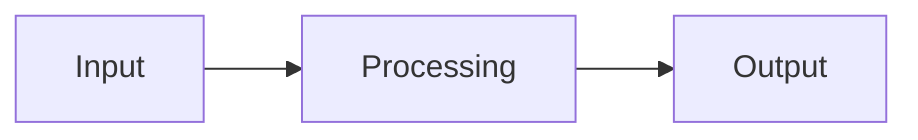

# NeuroLink Documentation Patterns and Standards

This document provides a comprehensive analysis of NeuroLink's documentation patterns, templates, and best practices. Use this as a reference when creating documentation for new features.

---

## Table of Contents

1. [Documentation Structure Overview](#documentation-structure-overview)
2. [README.md Patterns](#readmemd-patterns)
3. [Feature Documentation Format](#feature-documentation-format)
4. [API Reference Style](#api-reference-style)
5. [CLI Documentation Patterns](#cli-documentation-patterns)
6. [JSDoc/TSDoc Patterns](#jsdoctsdoc-patterns)
7. [CHANGELOG Format](#changelog-format)
8. [Migration Guide Patterns](#migration-guide-patterns)
9. [Code Comment Standards](#code-comment-standards)
10. [Documentation Templates](#documentation-templates)
11. [Best Practices Summary](#best-practices-summary)

---

## Documentation Structure Overview

### Directory Organization

NeuroLink organizes documentation in a hierarchical structure:

```
docs/
├── getting-started/        # Onboarding and setup guides
│   ├── index.md           # Overview and quick start
│   ├── quick-start.md     # 2-minute setup guide
│   ├── installation.md    # Detailed installation
│   ├── provider-setup.md  # Provider configuration
│   └── providers/         # Per-provider setup guides
│       ├── index.md
│       ├── openai.md
│       ├── google-ai.md
│       └── ...
│
├── features/              # Feature-specific documentation
│   ├── index.md          # Feature overview with tables
│   ├── video-generation.md
│   ├── structured-output.md
│   └── ...
│
├── sdk/                   # SDK documentation
│   ├── index.md
│   ├── api-reference.md   # Complete API reference
│   └── custom-tools.md
│
├── cli/                   # CLI documentation
│   ├── index.md
│   ├── commands.md        # Command reference
│   └── examples.md
│
├── advanced/              # Advanced topics
│   ├── streaming.md
│   ├── mcp-integration.md
│   └── enterprise.md
│
├── guides/                # How-to guides
│   ├── migration-guide.md
│   ├── enterprise/        # Enterprise-specific guides
│   └── migration/         # Framework migration guides
│
├── reference/             # Reference documentation
│   ├── provider-comparison.md
│   ├── troubleshooting.md
│   └── faq.md
│
├── development/           # Contributing and development
│   ├── contributing.md
│   ├── architecture.md
│   └── versioning.md
│
└── tracking/              # Internal tracking
    └── FEATURE-DOC-MATRIX.md
```

### Key Documentation Files at Root

| File           | Purpose                                        |
| -------------- | ---------------------------------------------- |
| `README.md`    | Main project introduction and feature showcase |
| `CLAUDE.md`    | AI assistant context and codebase guidance     |
| `CHANGELOG.md` | Version history with conventional commits      |

---

## README.md Patterns

### Structure Pattern

The main README follows this structure:

```markdown
<div align="center">
  <h1>Project Name</h1>
  <p><strong>Tagline</strong></p>
  <p>Key metrics summary</p>
</div>

<div align="center">
  [Badges: npm version, downloads, build status, coverage, license, TypeScript, stars, discord]
</div>

Brief description (2-3 sentences)

## What is [Project]?

Extended explanation with key differentiators.

## What's New (Current Quarter)

| Feature          | Version | Description       | Guide            |
| ---------------- | ------- | ----------------- | ---------------- |
| **Feature Name** | v8.x.x  | Brief description | [Link](docs/...) |

<details>
<summary><strong>Previous Updates</strong></summary>
Collapsed historical updates
</details>

## Get Started in Two Steps

Quick CLI commands for immediate usage.

## Complete Feature Set

### Category 1

Tables with provider support, status, documentation links.

### Category 2

...

## Platform Capabilities at a Glance

Summary table of all capabilities.

## Documentation Map

| Area | When to Use | Link |
| ---- | ----------- | ---- |
| ...  | ...         | ...  |

## Contributing & Support

Links to issues, contributing guide, documentation matrix.
```

### Badge Pattern

```markdown
[](URL)
[](URL)
[](URL)
[](URL)
[](URL)
[](URL)
```

### Feature Table Pattern

```markdown
| Feature          | Version | Description                     | Guide                             |
| ---------------- | ------- | ------------------------------- | --------------------------------- |
| **Feature Name** | v8.32.0 | Brief description of capability | [Guide](docs/features/feature.md) |
```

### Provider Support Matrix Pattern

```markdown
| Provider   | Models              | Free Tier | Tool Support            | Status                        | Documentation           |
| ---------- | ------------------- | --------- | ----------------------- | ----------------------------- | ----------------------- |
| **OpenAI** | GPT-4o, GPT-4o-mini | :x:       | :white_check_mark: Full | :white_check_mark: Production | [Setup Guide](docs/...) |
```

---

## Feature Documentation Format

### YAML Frontmatter

All feature docs should include frontmatter:

```yaml
---
title: Feature Name
description: One-line description for SEO and navigation
keywords: comma, separated, keywords, for, search
---
```

### Standard Section Structure

````markdown
# Feature Name

Brief introduction (2-3 sentences) explaining what the feature does.

## Overview

Detailed explanation with optional Mermaid diagram:


````

## What You Get

Bullet list of capabilities:

- **Capability 1** - Brief description
- **Capability 2** - Brief description

## Supported Provider & Model

### Provider Compatibility

| Provider | Model        | Feature 1              | Feature 2 | Notes           |
| -------- | ------------ | ---------------------- | --------- | --------------- |
| `vertex` | `model-name` | :white_check_mark: Yes | :x: No    | Additional info |

### Known Limitations

- Limitation 1
- Limitation 2

## Prerequisites

Numbered list of requirements.

## Quick Start

### SDK Usage

```typescript
import { NeuroLink } from "@juspay/neurolink";

// Basic example with comments
const neurolink = new NeuroLink();
const result = await neurolink.generate({
  input: { text: "Example prompt" },
});
```

#### With Full Options

```typescript
// More complete example
```

### CLI Usage

```bash
# Basic command
npx @juspay/neurolink command "args"

# With options
npx @juspay/neurolink command "args" \
  --option1 value \
  --option2 value
```

### CLI Arguments

| Argument | Type   | Default  | Description |
| -------- | ------ | -------- | ----------- |
| `--arg1` | string | Required | Description |

## Comprehensive Examples

### Example 1: Basic Usage

```typescript
// Complete working example
```

### Example 2: Advanced Pattern

```typescript
// More complex example
```

## Type Definitions

### TypeName

```typescript
type TypeName = {
  /** Description of field */
  field: Type;
};
```

## Configuration & Best Practices

### Configuration Options

| Option   | Type     | Default     | Required | Description |
| -------- | -------- | ----------- | -------- | ----------- |
| `option` | `string` | `"default"` | No       | Description |

### Best Practices

#### 1. Practice Category

```typescript
// ✅ Good pattern
const good = "example";

// ❌ Bad pattern
const bad = "anti-pattern";
```

## Error Handling & Validation

### Validation Rules

| Parameter | Validation | Error Type     | Example Message |
| --------- | ---------- | -------------- | --------------- |
| `param`   | Rule       | NeuroLinkError | `Error message` |

### Error Handling Example

```typescript
try {
  // Operation
} catch (error) {
  if (error instanceof NeuroLinkError) {
    // Handle specific error types
  }
}
```

## Token & Cost Information

### Pricing Structure

| Setting  | Cost   | Notes    |
| -------- | ------ | -------- |
| Option 1 | ~$X.XX | Use case |

## Troubleshooting

| Symptom       | Cause      | Solution   |
| ------------- | ---------- | ---------- |
| Error message | Root cause | How to fix |

## Limitations

### Current Limitations

| Limitation | Description | Workaround |
| ---------- | ----------- | ---------- |

## Testing

### Unit Test Examples

```typescript
import { describe, it, expect } from "vitest";

describe("Feature", () => {
  it("should behavior", async () => {
    // Test implementation
  });
});
```

## Related Features

- [Feature 1](./feature1.md) - Description
- [Feature 2](./feature2.md) - Description

## Implementation Files

| File                   | Purpose     |
| ---------------------- | ----------- |
| `src/lib/path/file.ts` | Description |

**Next:** [Next Feature](./next-feature.md) | [Previous Feature](./prev-feature.md)

````

---

## API Reference Style

### Class Documentation Pattern

```markdown
## ClassName

Description of the class purpose.

### Constructor: `new ClassName(config?)`

Description of constructor.

```typescript
import { ClassName } from "@juspay/neurolink";

const instance = new ClassName(config?: ConfigType)
````

**Parameters:**

```typescript
type ConfigType = {
  // Field with description
  field?: Type;
};
```

**Examples:**

```typescript
// Basic usage
const basic = new ClassName();

// With configuration
const configured = new ClassName({
  field: value,
});
```

See also:

- [Related Feature](../features/feature.md)

````

### Method Documentation Pattern

```markdown
### `methodName(options)` {#method-name}

Brief description of what the method does.

```typescript
async methodName(options: OptionsType): Promise<ResultType>
````

**Parameters:**

```typescript
type OptionsType = {
  required: Type; // Description of required field
  optional?: Type; // Description of optional field (default: value)
};
```

**Returns:**

```typescript
type ResultType = {
  field: Type; // Description
};
```

**Example:**

```typescript
const result = await instance.methodName({
  required: value,
  optional: value,
});

console.log(result.field);
```

````

### Type Definition Pattern

```markdown
### `TypeName`

Description of the type and when to use it.

```typescript
type TypeName = {
  /** JSDoc description for field */
  field: Type;

  /**
   * Multi-line description
   * @default defaultValue
   */
  optionalField?: Type;
};
````

**Field Descriptions:**

| Field           | Type   | Required | Description                    |
| --------------- | ------ | -------- | ------------------------------ |
| `field`         | `Type` | Yes      | Description                    |
| `optionalField` | `Type` | No       | Description (default: `value`) |

````

---

## CLI Documentation Patterns

### Command Reference Pattern

```markdown
### `command <input>` {#command}

```bash
npx @juspay/neurolink command "input" \
  --option1 value --option2 value
````

Key flags:

- `--option`, `-o` - Description (default `value`).
- `--flag` - Boolean flag description.

**Full Example:**

```bash
# Description of what this does
npx @juspay/neurolink command "detailed example" \
  --provider google-ai \
  --model gemini-2.5-pro \
  --enableAnalytics
```

**Output:**

```json
{
  "field": "example output"
}
```

````

### Command Options Table Pattern

```markdown
| Option | Alias | Type | Default | Description |
| ------ | ----- | ---- | ------- | ----------- |
| `--provider` | `-p` | string | `auto` | Provider to use |
| `--model` | `-m` | string | - | Model name |
| `--temperature` | `-t` | number | `0.7` | Creativity level |
````

---

## JSDoc/TSDoc Patterns

### Class Documentation

````typescript
/**
 * ClassName - Brief description of the class
 *
 * Detailed description explaining the purpose and key features:
 * - Feature 1 description
 * - Feature 2 description
 * - Feature 3 description
 *
 * @category CategoryName
 *
 * @example Basic usage
 * ```typescript
 * import { ClassName } from '@juspay/neurolink';
 *
 * const instance = new ClassName();
 * const result = await instance.method({
 *   input: { text: 'Example' }
 * });
 *
 * console.log(result.content);
 * ```
 *
 * @example With configuration
 * ```typescript
 * const instance = new ClassName({
 *   option: value
 * });
 * ```
 */
export class ClassName {
  // ...
}
````

### Method Documentation

````typescript
/**
 * Brief description of what the method does.
 *
 * @param options - Description of the options parameter
 * @param options.field - Description of specific field
 * @param options.optionalField - Description (optional)
 * @returns Promise resolving to result with content and metadata
 *
 * @throws {NeuroLinkError} When validation fails
 * @throws {TimeoutError} When operation exceeds timeout
 *
 * @example Basic usage
 * ```typescript
 * const result = await instance.method({
 *   field: value
 * });
 * ```
 *
 * @example With all options
 * ```typescript
 * const result = await instance.method({
 *   field: value,
 *   optionalField: value
 * });
 * ```
 */
async method(options: OptionsType): Promise<ResultType> {
  // Implementation
}
````

### Type Documentation

````typescript
/**
 * Description of what this type represents.
 *
 * @example
 * ```typescript
 * const config: TypeName = {
 *   field: 'value',
 *   optional: 123
 * };
 * ```
 */
export type TypeName = {
  /** Brief description of field */
  field: string;

  /**
   * Longer description that needs multiple lines.
   * Can include additional context.
   * @default 100
   */
  optional?: number;
};
````

### Utility Function Documentation

````typescript
/**
 * Brief description of function purpose.
 *
 * @param param1 - Description of first parameter
 * @param param2 - Description of second parameter
 * @returns Description of return value
 *
 * @example
 * ```typescript
 * const result = utilityFunction('input', 42);
 * console.log(result); // Expected output
 * ```
 */
export function utilityFunction(param1: string, param2: number): ResultType {
  // Implementation
}
````

### Common JSDoc Tags Used

| Tag           | Usage                 | Example                                |
| ------------- | --------------------- | -------------------------------------- |
| `@param`      | Document parameters   | `@param name - Description`            |
| `@returns`    | Document return value | `@returns Promise resolving to result` |
| `@throws`     | Document exceptions   | `@throws {ErrorType} When condition`   |
| `@example`    | Provide code examples | See above                              |
| `@category`   | Organize in docs      | `@category Core`                       |
| `@default`    | Document defaults     | `@default 100`                         |
| `@deprecated` | Mark as deprecated    | `@deprecated Use newMethod instead`    |

---

## CHANGELOG Format

### Conventional Commits Structure

```markdown
## [8.37.0](https://github.com/juspay/neurolink/compare/v8.36.0...v8.37.0) (2026-01-22)

### Features

- **(scope):** Brief description of feature ([commit-hash](URL))

## [8.36.0](https://github.com/juspay/neurolink/compare/v8.35.2...v8.36.0) (2026-01-22)

### Features

- **(scope):** Brief description ([commit-hash](URL))

### Bug Fixes

- **(scope):** Brief description of fix ([commit-hash](URL)), closes [#issue](URL)

## [8.0.0](URL) (2025-11-19)

### BREAKING CHANGES

- **(deps):** Description of breaking change

  Detailed explanation of what changed and migration steps.

  Changes:
  - Change 1
  - Change 2
```

### Commit Message Scopes Used

- `(sdk)` - SDK changes
- `(cli)` - CLI changes
- `(provider)` - Provider-related changes
- `(mcp)` - MCP integration changes
- `(types)` - Type definition changes
- `(video)` - Video generation feature
- `(csv)` - CSV support
- `(pdf)` - PDF support
- `(security)` - Security-related changes
- `(ci)` - CI/CD changes
- `(deps)` - Dependency updates

---

## Migration Guide Patterns

### Structure

````markdown
# Migration Guide (vX.XX → vY.YY)

Use this guide when upgrading... Brief intro.

## Compatibility Summary

| Area          | Status                                                |
| ------------- | ----------------------------------------------------- |
| Core SDK APIs | :white_check_mark: Backward compatible. Description.  |
| CLI commands  | :white_check_mark: Existing scripts continue to work. |
| Configuration | :warning: New variables required. Review `.env`.      |

## Recommended Upgrade Steps

1. **Update dependencies**

   ```bash
   npm install @juspay/neurolink@^X.YY.0
   ```
````

2. **Review new environment variables**
   - Variable 1 description
   - Variable 2 description

3. **Adopt new features (optional)**
   - CLI: description
   - SDK: description

## Behavior Changes to Note

- **Change 1** - Description and impact
- **Change 2** - Description and impact

## Testing Checklist

- Run `command` after upgrade
- Execute test with new feature
- Verify output format

## Rollback Plan

- Keep previous version handy
- Maintain separate config files
- Disable new features if issues occur

````

---

## Code Comment Standards

### File Header Comment

```typescript
/**
 * ModuleName - Brief description
 *
 * DESIGN PATTERN - Optional pattern description
 * Explanation of architectural decisions.
 * Uses [pattern] for [reason].
 */
````

### Section Comments

```typescript
// ====================
// Section Name
// ====================

// --- Sub-section ---

// Single line explanation
```

### TODO Comments

```typescript
// TODO: Description of what needs to be done

// FIXME: Description of bug to fix

// NOTE: Important information about this code

// HACK: Temporary workaround explanation
```

### Inline Documentation

```typescript
// Description of what this block does
const value = complexOperation();

// Process each item with specific transformation
items.forEach((item) => {
  // Step 1: Validate
  validate(item);

  // Step 2: Transform
  const transformed = transform(item);

  // Step 3: Store result
  results.push(transformed);
});
```

---

## Documentation Templates

### New Feature Documentation Template

````markdown
---
title: [Feature Name]
description: [One-line SEO description]
keywords: [feature], [capability], [provider], neurolink
---

# [Feature Name]

[2-3 sentence introduction explaining what this feature does and why it's valuable.]

## Overview

[Detailed explanation of the feature. Include a Mermaid diagram if helpful.]

## What You Get

- **[Capability 1]** - [Description]
- **[Capability 2]** - [Description]
- **[Capability 3]** - [Description]

## Supported Provider & Model

### Provider Compatibility

| Provider     | Model     | [Key Feature]          | Status                        | Notes   |
| ------------ | --------- | ---------------------- | ----------------------------- | ------- |
| `[provider]` | `[model]` | :white_check_mark: Yes | :white_check_mark: Production | [notes] |

### Known Limitations

- [Limitation 1]
- [Limitation 2]

## Prerequisites

1. [Requirement 1]
2. [Requirement 2]
3. [Requirement 3]

## Quick Start

### SDK Usage

```typescript
import { NeuroLink } from "@juspay/neurolink";

const neurolink = new NeuroLink();

// [Brief description of what this does]
const result = await neurolink.[method]({
  input: { text: "[example prompt]" },
  [option]: [value],
});

console.log(result.[field]);
```
````

### CLI Usage

```bash
# [Description]
npx @juspay/neurolink [command] "[prompt]" \
  --[option] [value]
```

## Configuration Options

| Option     | Type     | Default     | Required | Description   |
| ---------- | -------- | ----------- | -------- | ------------- |
| `[option]` | `[type]` | `[default]` | [Yes/No] | [description] |

## Comprehensive Examples

### Example 1: [Use Case Name]

[Brief description of the use case]

```typescript
[Complete working code example]
```

### Example 2: [Use Case Name]

[Brief description]

```typescript
[Complete working code example]
```

## Type Definitions

### [TypeName]

```typescript
type [TypeName] = {
  /** [field description] */
  [field]: [Type];
};
```

## Error Handling

### Common Errors

| Error         | Cause   | Solution   |
| ------------- | ------- | ---------- |
| `[ErrorName]` | [cause] | [solution] |

### Error Handling Example

```typescript
try {
  const result = await neurolink.[method]({ ... });
} catch (error) {
  if (error instanceof NeuroLinkError) {
    // Handle error
  }
}
```

## Best Practices

1. **[Practice Category]**

   ```typescript
   // ✅ Recommended approach
   [good example]

   // ❌ Avoid this
   [bad example]
   ```

## Troubleshooting

| Symptom   | Cause   | Solution   |
| --------- | ------- | ---------- |
| [symptom] | [cause] | [solution] |

## Related Features

- [[Related Feature]](./[related].md) - [brief description]

## Implementation Files

| File                       | Purpose       |
| -------------------------- | ------------- |
| `src/lib/[path]/[file].ts` | [description] |

**Next:** [[Next Feature]](./[next].md) | **Previous:** [[Prev Feature]](./[prev].md)

````

### API Method Documentation Template

```markdown
### `methodName(options)` {#method-name}

[Brief description of what the method does.]

```typescript
async methodName(options: [OptionsType]): Promise<[ResultType]>
````

**Parameters:**

```typescript
type [OptionsType] = {
  [field]: [Type];           // [Description]
  [optionalField]?: [Type];  // [Description] (default: [value])
};
```

**Returns:**

```typescript
type [ResultType] = {
  [field]: [Type];  // [Description]
};
```

**Example:**

```typescript
const result = await instance.methodName({
  [field]: [value],
});

console.log(result.[field]);
```

**Notes:**

- [Important consideration 1]
- [Important consideration 2]

````

---

## Best Practices Summary

### Documentation Principles

1. **Lead with Examples** - Start with working code, then explain details
2. **Use Tables** - For options, parameters, and comparisons
3. **Include Types** - Always show TypeScript types inline
4. **Cross-Reference** - Link to related features and guides
5. **Version Information** - Note version requirements for features
6. **Error Guidance** - Include troubleshooting for common issues

### Writing Style

1. **Active Voice** - "Configure the provider" not "The provider should be configured"
2. **Second Person** - "You can configure..." not "One can configure..."
3. **Present Tense** - "This method returns..." not "This method will return..."
4. **Concise** - Avoid unnecessary words while maintaining clarity

### Code Examples

1. **Complete and Working** - Examples should be copy-paste ready
2. **Commented** - Explain non-obvious parts
3. **Realistic** - Use meaningful variable names and prompts
4. **Progressive** - Start simple, add complexity in later examples

### Formatting

1. **Consistent Headers** - Use `##` for major sections, `###` for subsections
2. **Code Blocks** - Always specify language (`typescript`, `bash`, `json`)
3. **Tables** - Align columns for readability
4. **Emoji Use** - Limited to specific contexts (badges, status indicators)
5. **Whitespace** - Use horizontal rules (`---`) to separate major sections

### Maintenance

1. **Update with Code** - Keep docs in sync with implementation
2. **Test Examples** - Verify code snippets work
3. **Review Links** - Check for broken references
4. **Track Coverage** - Use `FEATURE-DOC-MATRIX.md` to track documentation status

---

## Quick Reference

### File Naming

- Feature docs: `feature-name.md` (kebab-case)
- Index files: `index.md`
- Guides: `descriptive-name.md`

### Common Markdown Patterns

```markdown
<!-- Callout box -->
> **Note:** Important information here.

<!-- Warning -->
> **Warning:** Critical information here.

<!-- Collapsible section -->
<details>
<summary><strong>Click to expand</strong></summary>
Hidden content here.
</details>

<!-- Emoji indicators in tables -->
:white_check_mark: Yes
:x: No
:warning: Partial
````

### Link Formats

```markdown
<!-- Relative link to sibling doc -->

[Feature Name](./feature.md)

<!-- Relative link to parent directory -->

[Feature Name](../features/feature.md)

<!-- Absolute from docs root -->

[Feature Name](/docs/features/feature.md)

<!-- Anchor link within document -->

[Section Name](#section-name)

<!-- External link -->

[External Site](https://example.com)
```

---

**Last Updated:** 2026-01-22

**Related:**

- [CLAUDE.md](/CLAUDE.md) - AI assistant context
- [Contributing Guide](/docs/development/contributing.md) - How to contribute
- [Feature-Doc Matrix](/docs/tracking/FEATURE-DOC-MATRIX.md) - Documentation coverage tracking
