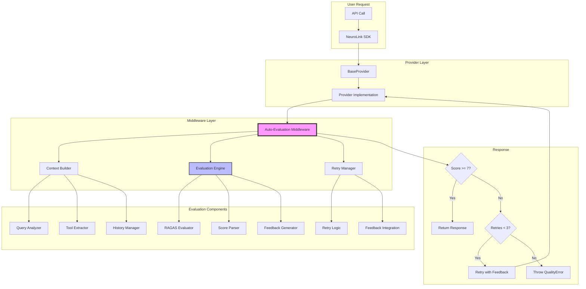
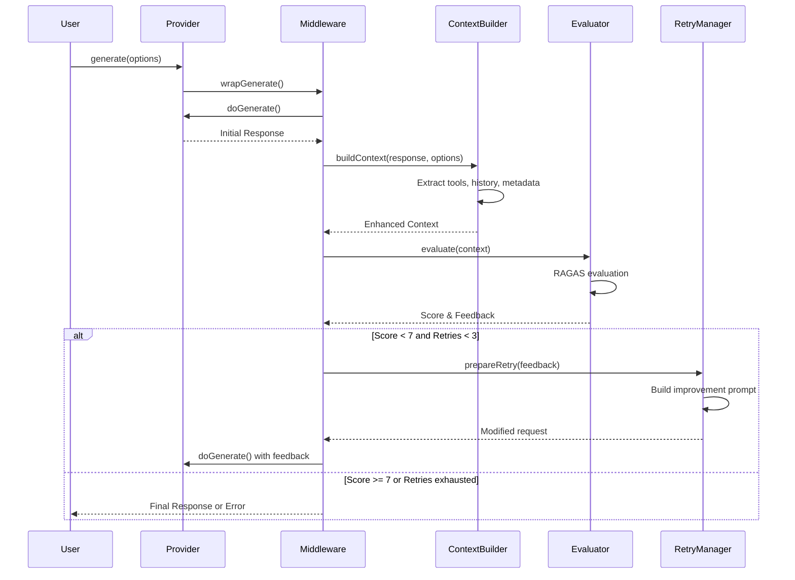
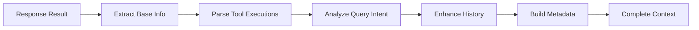
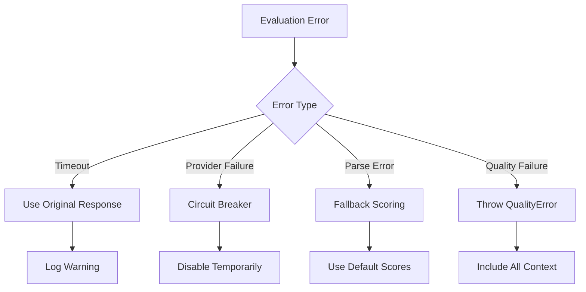

# Auto-Evaluation Architecture Document

## Table of Contents

1. [Executive Summary](#executive-summary)
2. [Architecture Overview](#architecture-overview)
3. [System Components](#system-components)
4. [Data Flow](#data-flow)
5. [Code Changes Required](#code-changes-required)
6. [New Components](#new-components)
7. [Integration Points](#integration-points)
8. [Technical Design Details](#technical-design-details)
9. [Performance Considerations](#performance-considerations)
10. [Security & Error Handling](#security--error-handling)

## Executive Summary

This document outlines the architecture for implementing an automatic evaluation system in NeuroLink that:

- Evaluates every LLM response automatically without requiring flags
- Implements retry logic with progressive feedback for responses scoring below 7/10
- Uses RAGAS-inspired methodology for comprehensive evaluation
- Integrates seamlessly as middleware without breaking existing APIs

### Key Architecture Decisions

1. **Middleware Pattern**: Implement as middleware to ensure transparency and maintainability
2. **RAGAS-Style Evaluation**: Use component-wise evaluation with LLM-as-judge
3. **Progressive Retry**: Maximum 3 attempts with increasingly specific feedback
4. **Rich Context**: Capture all relevant metadata for accurate evaluation

## Architecture Overview

### High-Level Architecture



### Component Interaction Diagram



## System Components

### 1. Auto-Evaluation Middleware

**Location**: `src/lib/middleware/builtin/autoEvaluation.ts` (NEW)

**Responsibilities**:

- Intercept generation requests and responses
- Orchestrate evaluation flow
- Manage retry logic
- Handle errors and fallbacks

**Key Interfaces**:

```typescript
interface AutoEvaluationMiddleware extends NeuroLinkMiddleware {
  wrapGenerate(params: WrapParams): Promise<GenerateResult>;
  wrapStream(params: WrapParams): Promise<StreamResult>;
}
```

### 2. Enhanced Context Builder

**Location**: `src/lib/evaluation/contextBuilder.ts` (NEW)

**Responsibilities**:

- Extract comprehensive context from responses
- Capture tool execution details
- Build enhanced conversation history
- Analyze query intent

**Key Interfaces**:

```typescript
interface EnhancedEvaluationContext {
  // Query Information
  userQuery: string;
  queryAnalysis: QueryIntentAnalysis;

  // Response Information
  aiResponse: string;
  provider: string;
  model: string;

  // Generation Metadata
  generationParams: {
    temperature?: number;
    maxTokens?: number;
    systemPrompt?: string;
  };

  // Tool Execution Data
  toolExecutions: ToolExecution[];

  // Conversation Context
  conversationHistory: EnhancedConversationTurn[];

  // Performance Data
  responseTime: number;
  tokenUsage: TokenUsage;

  // Retry Context
  previousEvaluations?: EvaluationResult[];
  attemptNumber: number;
}
```

### 3. RAGAS-Style Evaluator

**Location**: `src/lib/evaluation/ragasEvaluator.ts` (NEW)

**Responsibilities**:

- Implement RAGAS evaluation methodology
- Generate structured evaluation prompts
- Parse evaluation results
- Generate improvement feedback

### 4. Retry Manager

**Location**: `src/lib/evaluation/retryManager.ts` (NEW)

**Responsibilities**:

- Manage retry attempts
- Build progressive feedback
- Integrate feedback into prompts
- Track evaluation history

## Data Flow

### 1. Initial Request Flow

```
User Request → BaseProvider → Middleware Interception → Original Generation
```

### 2. Evaluation Flow

```
Generated Response → Context Building → Query Analysis → RAGAS Evaluation → Score Parsing
```

### 3. Retry Flow

```
Low Score → Feedback Generation → Prompt Modification → Regeneration → Re-evaluation
```

### 4. Final Response Flow

```
Successful Evaluation → Response Enhancement → Return to User
OR
Max Retries → Quality Error → Detailed Error Information
```

## Code Changes Required

### 1. Modifications to `BaseProvider` Class

**File**: `src/lib/core/baseProvider.ts`

**Current State**:

- `createEvaluation()` method builds limited context
- `enhanceResult()` only evaluates when `enableEvaluation: true`

**Required Changes**:

#### a. Remove Evaluation Flag Dependency

```typescript
// REMOVE this condition in enhanceResult():
if (options.enableEvaluation) {
  const evaluation = await this.createEvaluation(result, options);
  enhancedResult = { ...enhancedResult, evaluation };
}

// REPLACE with middleware approach - evaluation happens in middleware
```

#### b. Enhance Context Access

```typescript
// ADD method to expose generation options for middleware
protected getGenerationContext(): GenerationContext {
  return {
    provider: this.providerName,
    model: this.modelName,
    options: this.lastGenerationOptions, // Need to store this
  };
}
```

#### c. Store Generation Options

```typescript
// ADD property to store last generation options
private lastGenerationOptions?: TextGenerationOptions;

// UPDATE generate method to store options
async generate(optionsOrPrompt: TextGenerationOptions | string) {
  const options = this.normalizeOptions(optionsOrPrompt);
  this.lastGenerationOptions = options; // Store for context
  // ... rest of method
}
```

### 2. Modifications to Evaluation Module

**File**: `src/lib/core/evaluation.ts`

**Current State**:

- Simple evaluation prompt
- Basic context structure
- Limited scoring criteria

**Required Changes**:

#### a. Move Core Logic to New Evaluator

```typescript
// DEPRECATE current generateEvaluation function
// MOVE logic to new RAGAS evaluator with enhanced prompts
```

#### b. Update Context Interfaces

```typescript
// EXTEND EvaluationContext interface
export interface EvaluationContext {
  // ... existing fields ...

  // ADD new fields:
  toolExecutions?: ToolExecution[];
  generationMetadata?: GenerationMetadata;
  queryAnalysis?: QueryIntentAnalysis;
  previousAttempts?: EvaluationAttempt[];
}
```

### 3. Modifications to Middleware System

**File**: `src/lib/middleware/factory.ts`

**Required Changes**:

#### a. Register Auto-Evaluation Middleware

```typescript
// In initialize() method, ADD:
const builtInMiddlewareCreators: Record<string, ...> = {
  analytics: createAnalyticsMiddleware,
  guardrails: createGuardrailsMiddleware,
  autoEvaluation: createAutoEvaluationMiddleware, // ADD THIS
};
```

### 4. Modifications to Types

**File**: `src/lib/types/errors.ts`

**Required Changes**:

#### a. Add Quality Assurance Errors

```typescript
// ADD new error classes:
export class QualityAssuranceError extends NeuroLinkError {
  public readonly evaluationHistory: EvaluationResult[];
  public readonly finalScore: number;
  public readonly attempts: number;

  constructor(message: string, details: QualityErrorDetails) {
    super(message, "QUALITY_ASSURANCE_FAILED");
    this.evaluationHistory = details.evaluationHistory;
    this.finalScore = details.finalScore;
    this.attempts = details.attempts;
  }
}
```

### 5. Modifications to Conversation Memory

**File**: `src/lib/core/conversationMemoryManager.ts`

**Required Changes**:

#### a. Enhanced Turn Storage

```typescript
// MODIFY storeConversationTurn to accept enhanced metadata
async storeConversationTurn(
  sessionId: string,
  turn: ConversationTurn | EnhancedConversationTurn
): Promise<void> {
  // Store additional metadata if provided
}
```

## New Components

### 1. Context Builder Module

**Path**: `src/lib/evaluation/contextBuilder.ts`

**Components**:

- `ContextBuilder` class
- `QueryAnalyzer` utility
- `ToolExecutionExtractor` utility
- `ConversationEnhancer` utility

### 2. RAGAS Evaluator Module

**Path**: `src/lib/evaluation/ragasEvaluator.ts`

**Components**:

- `RAGASEvaluator` class
- `EvaluationPromptBuilder` utility
- `ScoreParser` utility
- `FeedbackGenerator` utility

### 3. Retry Manager Module

**Path**: `src/lib/evaluation/retryManager.ts`

**Components**:

- `RetryManager` class
- `FeedbackIntegrator` utility
- `ProgressiveEnhancer` utility

### 4. Auto-Evaluation Middleware

**Path**: `src/lib/middleware/builtin/autoEvaluation.ts`

**Components**:

- `createAutoEvaluationMiddleware` function
- `AutoEvaluationConfig` interface
- Internal evaluation orchestrator

### 5. Query Intent Analyzer

**Path**: `src/lib/evaluation/queryIntentAnalyzer.ts`

**Components**:

- `QueryIntentAnalyzer` class
- Intent classification logic
- Complexity assessment logic

## Integration Points

### 1. Middleware Registration

```typescript
// In BaseProvider constructor or factory
if (!options.disableAutoEvaluation) {
  this.middleware.use(
    createAutoEvaluationMiddleware({
      threshold: 7,
      maxRetries: 3,
      evaluationModel: process.env.NEUROLINK_EVALUATION_MODEL,
    }),
  );
}
```

### 2. Configuration

```typescript
// New environment variables
NEUROLINK_AUTO_EVALUATION_ENABLED = true;
NEUROLINK_EVALUATION_THRESHOLD = 7;
NEUROLINK_MAX_EVAL_RETRIES = 3;
```

### 3. Event Emission

```typescript
// New events for monitoring
neurolink.on("evaluation:start", (context) => {});
neurolink.on("evaluation:complete", (result) => {});
neurolink.on("evaluation:retry", (attempt) => {});
neurolink.on("evaluation:failed", (error) => {});
```

## Technical Design Details

### 1. Context Building Process



**Implementation Details**:

1. Extract from `EnhancedGenerateResult`:

   - `content`: The AI response
   - `toolExecutions`: Actual tool calls with inputs/outputs
   - `usage`: Token counts
   - `responseTime`: Performance metric

2. Extract from `TextGenerationOptions`:

   - `temperature`, `maxTokens`, `systemPrompt`
   - `provider`, `model` preferences
   - `context`: Custom context data

3. Query Analysis (Post-Generation):
   - Classify query type using patterns
   - Assess complexity based on length and keywords
   - Determine if tools should have been used

### 2. RAGAS Evaluation Process

**Stage 1: Context Preparation**

```
Enhanced Context → Structured Prompt Sections → Markdown Formatting
```

**Stage 2: Component Evaluation**

```
Atomic Statement Extraction → Individual Scoring → Aggregation
```

**Stage 3: Feedback Generation**

```
Score Analysis → Issue Identification → Improvement Suggestions
```

### 3. Retry Mechanism Design

**Attempt 1**:

- Basic feedback: "Response lacks detail"
- General guidance: "Provide more comprehensive information"

**Attempt 2**:

- Specific feedback: "Missing explanation of X, Y, Z"
- Examples: "A better response would include..."

**Attempt 3**:

- Strict requirements: "You MUST address these points..."
- Final constraints: "Focus only on fixing these issues..."

### 4. Error Handling Strategy



## Performance Considerations

### 1. Latency Impact

- **Expected**: 500-2000ms per evaluation
- **Mitigation**:
  - Cache evaluation results
  - Use fast evaluation models
  - Implement timeouts

### 2. Cost Management

- **Additional Calls**: 1-4 per request (evaluation + retries)
- **Mitigation**:
  - Use cheaper models for evaluation
  - Implement budget controls
  - Sample high-volume endpoints

### 3. Resource Usage

- **Memory**: Context objects ~1-5KB each
- **CPU**: Minimal (mostly I/O bound)
- **Network**: Additional API calls

### 4. Optimization Strategies

```typescript
// Caching strategy
const evaluationCache = new LRUCache<string, EvaluationResult>({
  max: 1000,
  ttl: 1000 * 60 * 60, // 1 hour
});

// Concurrent evaluation
const evaluationPool = new PromisePool({
  concurrency: 5,
});
```

## Security & Error Handling

### 1. Error Types

- `QualityAssuranceError`: Max retries exhausted
- `EvaluationTimeoutError`: Evaluation took too long
- `EvaluationProviderError`: Judge LLM failed
- `ContextBuildingError`: Failed to extract context

### 2. Circuit Breaker Pattern

```typescript
const evaluationCircuitBreaker = new CircuitBreaker({
  failureThreshold: 5,
  resetTimeout: 60000,
  monitoredFunction: evaluate,
});
```

### 3. Graceful Degradation

1. If evaluation fails → Return original response
2. If context building fails → Use partial context
3. If retry fails → Return best attempt
4. If all fails → Log and monitor

### 4. Security Considerations

- Sanitize evaluation prompts
- Limit retry attempts
- Monitor for evaluation loops
- Protect against prompt injection

## Migration Strategy

### Phase 1: Shadow Mode

- Deploy middleware in monitoring mode
- Collect metrics without affecting responses
- Validate evaluation accuracy

### Phase 2: Gradual Rollout

- Enable for 10% of traffic
- Monitor performance and errors
- Gradually increase coverage

### Phase 3: Full Deployment

- Enable for all traffic
- Remove `enableEvaluation` flag
- Update documentation

This architecture provides a robust, scalable solution for automatic quality evaluation while maintaining system stability and performance.
