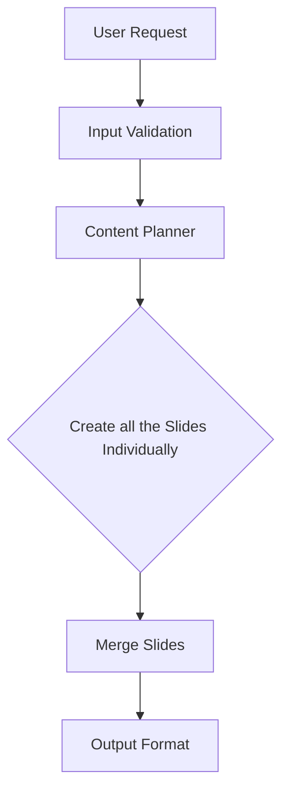
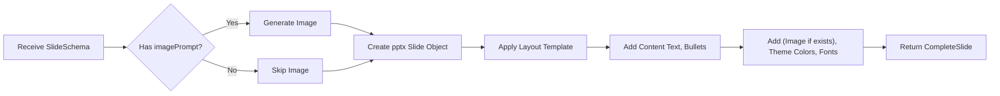

# NeuroLink Presentation Generation Implementation Plan

## Executive Summary

This document outlines the approach for implementing AI-powered Presentation/Slide Generation in NeuroLink.  The implementation leverages existing image generation capabilities and integrates slide creation as a native output modality through the `generate()` method.

**Status:  🚧 IMPLEMENTATION PLANNED**

---

## Table of Contents

1. [Problem Statement & Solution](#problem-statement--solution)
2. [Architecture Overview](#architecture-overview)
3. [Implementation Strategy](#implementation-strategy)
4. [Usage Examples](#usage-examples)
5. [Technical Implementation Details](#technical-implementation-details)
6. [Model Defaults](#model-defaults)

---

### Core Challenge

Implement presentation generation that:  

1. **Maintains NeuroLink Architecture**: Uses existing `generate()` method
2. **Leverages Existing Features**: Reuses image generation capabilities
3. **Provides Complete Automation**: From topic to final PPTX
4. **Ensures Quality**:  AI-planned structure with professional layouts

### Solution Architecture

Presentation generation implemented as a **multi-stage pipeline** with PPT as an output modality.  


```typescript
const result = await neurolink.generate({
  input: {
    text: "Introducing Our New Product - Revolutionary AI-Powered Solution",
    images: [readFileSync("./logo.png")], // Optional:  background or logo
  },
  provider: "vertex",
  output: {
    ppt: {
      pages: 10,
      format: "pptx"
    },
  },
});

// Access generated presentation
console.log(result.ppt.filePath);     // "./output/presentation.pptx"
console.log(result.ppt.totalSlides);  // 10
```

---

## Architecture Overview

### High-Level Data Flow


# Component Responsibilities

| Component | Responsibility | Input | Output |
| :--- | :--- | :--- | :--- |
| **Content Planner** | Generate slide structure from topic | Topic, config | ContentPlan (JSON) |
| **Slide Generator** | Create individual slides | SlideSchema, theme | CompleteSlide |
| **PPTX Assembler** | Merge slides & export | CompleteSlide[], config | PPTX file |
| **Orchestrator** | Coordinate workflow | User request | Final result |

---

## Implementation Strategy

### Step 1: Types + Validation

### Files to Create:

* `src/lib/presentation/types.ts`
* `src/lib/presentation/validators.ts`
* `src/lib/presentation/constants.ts`

### Core Type Structure (Minimal, flexible for future changes):

```typescript
export type GenerateOptions = {
  // ... existing fields ...

  output?:{
    ppt?: {
      pages: number;            // Number of slides (default: 10, max: 50)
      format?: string;           // Output format (default: 'pptx')
      theme?: string;           // Theme name (default: "modern")
      audience?: string;       // Target audience (e.g., "business", "students")
      tone?: string;           // Presentation tone (e.g., "professional", "casual")
      includeImages?: boolean;  // Whether to generate AI images (default: true)
      outputPath?: string;     // Custom output file path
    };
  }
};

export type GenerateResult = {
  // ... existing fields ...

  ppt?: {
    filePath: string;           // Path to generated PPTX file
    totalSlides: number;        // Total number of slides
    format: 'pptx';             // Output format
  };
};
```

**Success Criteria**:
- ✅ Type definitions compile without errors
- ✅ Optional fields don't affect existing code
- ✅ Clear documentation in type definitions

---

## Step 2: Content Planner

**File:** `src/lib/presentation/content-planner.ts`

**Responsibility:** Generate structured slide plan from input text

**Process:**

1. Extract topic from input text
2. Build LLM prompt with configuration
3. Call LLM to generate slide structure
4. Parse and validate JSON response
5. Return `ContentPlan`

**Key Features:**

* Intelligent slide count distribution
* Audience-appropriate content
* Image prompt generation for visual slides
* Theme color selection
* Speaker notes generation

---

## Step 3: Slide Generator

**File:** `src/lib/presentation/slide-generator.ts`

**Responsibility:** Create ONE complete slide with image and layout



```typescript
class SlideGenerator {
  async generateSlide(
    slideSchema: SlideSchema,
    theme: PresentationTheme
  ): Promise<CompleteSlide> {
    // 1. Generate image using existing feature
    const image = slideSchema.imagePrompt
      ? await this.generateImage(slideSchema.imagePrompt)
      : null;

    // 2. Create slide with pptxgen
    const ppt = new pptxgen();
    const slide = ppt.addSlide();

    // 3. Apply layout based on type
    this.applyLayout(slide, slideSchema, image, theme);

    // 4. Return complete slide
    return { slideNumber: slideSchema.slideNumber, slide, pptInstance: ppt };
  }
}
```
  
----

## Step 4: Orchestrator + Assembly

**File:** `src/lib/presentation/orchestrator.ts`

**Responsibility:** Create ONE complete slide with image and layout

**Key Functions:**

```typescript
class PresentationOrchestrator {
  async generate(options): Promise<PPTResult> {
    // 1. Validate
    // 2. Plan content
    // 3. Generate slides (loop)
    // 4. Merge into PPTX
    // 5. Convert if needed
    // 6. Return result
  }
  
  private async mergeToPPTX(plan, slides, options): Promise<string> {
    // Merge all slides into final presentation
    // Apply global theme
    // Save to file
  }
  
}
```

----

## Phase 5: CLI Interface (Presentation)

**Objective:** Add CLI commands for automated presentation generation and customization.

**Files Modified:**
* `src/cli/commands/presentation.ts` - New Presentation command module
* `src/cli/index.ts` - Register presentation commands

**CLI Commands:**

1. **Generate Presentation:**
   ```bash
   neurolink generate "<topic>" [options]
   ```


**CLI Flags**:
- `--pages <number>`: Number of slides (default: 10)
- `--theme <theme>`: Theme name (default: modern)
- `--audience <audience>`: Target audience (default: general)
- `--tone <tone>`: Presentation tone (default: professional)
- `--no-images`: Disable AI image generation
- `--output <path>`: Custom output file path
- `--provider <provider>`: AI provider (google-ai/vertex)
- `--model <model>`: AI model to use

**Note**: The `generate` command automatically plans, generates slides with AI images, and creates the final presentation file.

---

### Phase 6: Testing & Validation

**Objective**:  Comprehensive testing across platforms and scenarios

**Test Categories**:

1. **Unit Tests**:
   - Content planner tests (mocked AI responses)
   - Slide generator tests
   - PPTX assembler tests
   - Theme registry tests
   - Validation logic tests

2. **Integration Tests**:
   - End-to-end presentation generation
   - Provider integration tests
   - CLI command tests
   - File output verification

3. **Visual Quality Tests**:
   - Theme rendering verification
   - Layout consistency checks
   - Image placement validation
   - Font and color accuracy

4. **Performance Tests**:
   - Generation time benchmarks
   - Memory usage monitoring
   - Large presentation handling (50+ slides)

**Success Criteria**:
- ✅ >80% code coverage
- ✅ All themes render correctly
- ✅ No breaking changes to existing tests
- ✅ Generation completes within reasonable time (<5 min for 10 slides)

---

## Existing NeuroLink Infrastructure (To Be Leveraged)

This section documents the **already implemented** components in NeuroLink that will be reused for PPT generation:

### 1. 📄 **PPTX File Handling Infrastructure**
**Location:** `src/lib/types/fileTypes.ts`, `src/lib/utils/fileDetector.ts`

**What exists:**
```typescript
// PPTX is already recognized as an OfficeDocumentType
type OfficeDocumentType = "docx" | "pptx" | "xlsx";

// Office file processing options already defined
export type OfficeProcessorOptions = {
  format?: OfficeDocumentType;
  includeSlideNotes?: boolean;  // PPTX-specific option
  extractTextOnly?: boolean;
  includeMetadata?: boolean;
  maxSizeMB?: number;
};
```

**How we'll reuse it:**
- ✅ Buffer handling patterns for PPTX files (similar to video buffers)
- ✅ Magic byte detection for Office Open XML formats (ZIP-based)
- ✅ MIME type validation: `application/vnd.openxmlformats-officedocument.presentationml.presentation`
- ✅ File size validation patterns (5MB limit from office document processing)
- ✅ Metadata extraction structure (slideCount, hasImages, etc.)

---

### 2. 🎨 **Image Generation System**
**Location:** `src/lib/adapters/providerImageAdapter.ts`, `src/lib/neurolink.ts`

**What exists:**
```typescript
// Full-featured image generation across multiple providers
const imageResult = await neurolink.generate({
  input: { text: "professional business chart" },
  output: { 
    image: { 
      count: 1, 
      size: "1024x1024",
      aspectRatio: "16:9"
    } 
  },
  provider: "vertex" // Also: openai, stability, etc.
});
```

**How we'll reuse it:**
- ✅ `providerImageAdapter` for multi-provider image generation
- ✅ Support for Vertex Imagen, OpenAI DALL-E, Stability AI
- ✅ Buffer/Base64 image handling
- ✅ Aspect ratio management (perfect for slide layouts)
- ✅ Concurrent image generation (for multiple slides)
- ✅ Image prompt optimization

---

## Theme & Layout Options

### 6 Built-in Themes

1.  **Modern** (default): Blue/Purple/Cyan - Tech, product launches
2.  **Corporate**: Dark blue/Gray/Green - Business, investor pitches
3.  **Creative**: Orange/Pink/Yellow - Creative agencies, marketing
4.  **Minimal**: Black/Gray/White - Academic, minimalist
5.  **Dark**: Cyan/Purple/Dark bg - Tech conferences, developers
6.  **Vibrant**: Green/Blue/Yellow - Marketing, sales

### 8 Slide Layouts

1.  **Title**: Centered title + subtitle + logo
2.  **Content**: Title + bullets (up to 6) + optional image
3.  **Two-Column**: Split 50/50 or 60/40
4.  **Image-Focus**: Title + large image (70%) + caption
5.  **Full-Image**: Background image + text overlay
6.  **Quote**: Centered quote + author
7.  **Conclusion**: Summary bullets + CTA
8.  **Thank You**: Large text + contact info

Auto-selection based on: Content type, slide position, image availability, text length, presentation flow
---
## SDK Integration Examples

### Basic

```typescript
const result = await neurolink.generate({
  input: { text: "Topic" },
  provider: "vertex",
  output: { mode: "ppt", ppt: { pages:  10, theme: "modern" } }
});
console.log(result.ppt?. filePath, result.ppt?.totalSlides);
```

### Batch Generation

```typescript
for (const audience of audiences) {
  await neurolink.generate({
    input: { text: `${product} for ${audience. name}` },
    output: { mode: "ppt", ppt:  { theme: audience.theme, pages: 12 } }
  });
}
```

### Error Handling

```typescript
async function generateWithRetry(topic, options, maxRetries = 3) {
  for (let attempt = 1; attempt <= maxRetries; attempt++) {
    try {
      const result = await neurolink. generate({
        input: { text: topic },
        output: { mode: "ppt", ppt: options }
      });
      if (! result.ppt?. filePath) throw new Error("No output file");
      return { success: true, presentation:  result.ppt, attempt };
    } catch (error) {
      if (error.message.includes('invalid')) break; // Don't retry validation errors
      if (attempt < maxRetries) await new Promise(r => setTimeout(r, 2000 * attempt));
    }
  }
  return { success: false, error: lastError?. message };
}
```

## Technical Implementation Details

### Content Planning

AI Prompt → Generates JSON ContentPlan with slide schemas (type, layout, title, content, imagePrompt, speakerNotes) → Validation

**ContentPlan JSON**:

```json
{
  "title": ".. .", "totalSlides": 10,
  "slides": [
    {
      "slideNumber": 1, "type": "title", "layout": "title-only",
      "title": ".. .", "content": {... }, "imagePrompt": ".. .", "speakerNotes":  "..."
    }
  ]
}
```

### Image Integration

SlideSchema → Check includeImages → Call existing image generation → Resize (1920x1080 full / 1280x720 focus / 800x600 column) → Embed

Image Prompts: Match content, consistent style, professional quality, no text in images

### PPTX Assembly Process

#### Slide Merging Strategy

```
Individual CompleteSlide objects (from parallel generation)
  ↓
Sort by slideNumber
  ↓
Create master PPTX instance
  ↓
For each CompleteSlide:
  - Extract slide content
  - Copy to master PPTX
  - Apply global theme
  - Add page numbers
  ↓
Add metadata (author, title, created date)
  ↓
Save to file
```

#### Layout Template Application

Each layout type has a template function that:
1. **Positions Elements**: Title, content, images based on layout
2. **Applies Theme**: Colors, fonts, spacing from theme
3. **Handles Overflow**: Truncate or resize text if too long
4. **Adds Styling**: Bullets, alignment, effects

**Example Layout Positions**:
```
Title-Content Layout (1920x1080):
- Title: x=5%, y=5%, w=90%, h=10%
- Content bullets: x=10%, y=20%, w=80%, h=70%
- Footer: x=5%, y=95%, h=5%

Title-Image Layout: 
- Title: x=5%, y=5%, w=90%, h=10%
- Image:  x=10%, y=20%, w=50%, h=70%
- Caption: x=65%, y=20%, w=30%, h=70%
```

### Input Validation

```typescript

// Pages validation
if (pages < 1 || pages > 50) {
  throw new PPTError(
    "Pages must be between 1 and 50",
    "INVALID_PAGES"
  );
}

// Topic/text validation
if (! input.text || input.text.trim().length === 0) {
  throw new PPTError(
    "Topic text is required",
    "INVALID_TEXT"
  );
}

const textLength = input.text.length;
if (textLength < 10) {
  throw new PPTError(
    "Topic too short - provide more context",
    "TEXT_TOO_SHORT"
  );
}

if (textLength > 5000) {
  throw new PPTError(
    "Topic too long - maximum 5000 characters",
    "TEXT_TOO_LONG"
  );
}

// Theme validation
const validThemes = ["modern", "corporate", "creative", "minimal", "dark", "vibrant"];
if (theme && !validThemes.includes(theme)) {
  throw new PPTError(
    `Invalid theme.  Available:  ${validThemes.join(", ")}`,
    "INVALID_THEME"
  );
}

// Format validation
if (format !== "ptx") {
  throw new PPTError(
    "Format must be pptx",
    "INVALID_FORMAT"
  );
}

// Output path validation
if (outputPath) {
  const ext = path.extname(outputPath);
  if (format === "pptx" && ext !== ".pptx") {
    throw new PPTError(
      "Output path must end with .pptx",
      "INVALID_OUTPUT_PATH"
    );
  }
}

```

### Performance

- Parallel:  5 slides/batch → 3-5x speedup
- Caching: Themes (in-memory), Templates (pre-compiled), Images (optional, 1hr TTL)
- Target: <5 min for 10 slides

### Error Handling

#### Error Types

1. **Validation Errors** (PPTError:  INVALID_*)
   - Invalid pages count
   - Invalid theme name
   - Invalid format
   - Missing required fields

2. **AI Generation Errors** (PPTError:  AI_*)
   - AI model API failure
   - Invalid AI response format
   - Content planning timeout
   - Image generation failure

3. **File System Errors** (PPTError: FS_*)
   - Cannot write output file
   - Insufficient disk space
   - Invalid output path
   - Permission denied

#### Error Recovery Strategies

**AI Failures**:
- Retry with exponential backoff (3 attempts)
- Fallback to simpler content structure
- Skip optional images if image generation fails

**File System Failures**:
- Use temporary directory as fallback
- Clean up partial files on error
- Provide detailed error messages with solutions

## Model Defaults

**Automatic Model Selection**:

If no model is specified, NeuroLink automatically selects the best available model based on API key capabilities:

**Selection Strategy**: 
1. Check API key permissions and available models
2. Select highest quality model available
3. Fallback to next best option if preferred model unavailable

**Model Detection Process**:

```typescript
// System automatically checks available models
async function selectBestModel(provider:  string, apiKey: string) {
  const availableModels = await checkApiKeyCapabilities(apiKey);
  
  // Priority order
  const modelPriority = [
    'gemini-1.5-pro',
    'gemini-2.0-flash-exp', 
    'gemini-1.5-flash'
  ];
  
  // Return first available model from priority list
  for (const model of modelPriority) {
    if (availableModels. includes(model)) {
      return model;
    }
  }
}
```

## Dependencies

```json
{
  "dependencies": {
    "pptxgenjs":   "^3.12.0",    // PPTX generation
    "sharp": "^0.33.0"         // Image optimization
  }
}
```

## Success Criteria

- ✅ **Functional**: 1-25 slides, 6 themes, 8 layouts, AI planning, AI images, PPTX
- ✅ **Quality**: Professional design, coherent flow, consistent themes
- ✅ **Performance**: <5min for 10 slides, parallel generation
- ✅ **Integration**:  Works with google-ai/vertex, reuses auth, no breaking changes
- ✅ **Reliability**: Error recovery, validation, >80% test coverage
- ✅ **Security**:  Input sanitization, path validation, API key protection
This implementation plan provides a complete roadmap for adding AI-powered presentation generation to NeuroLink as a native output modality, following the same architectural patterns as TTS and other features. 