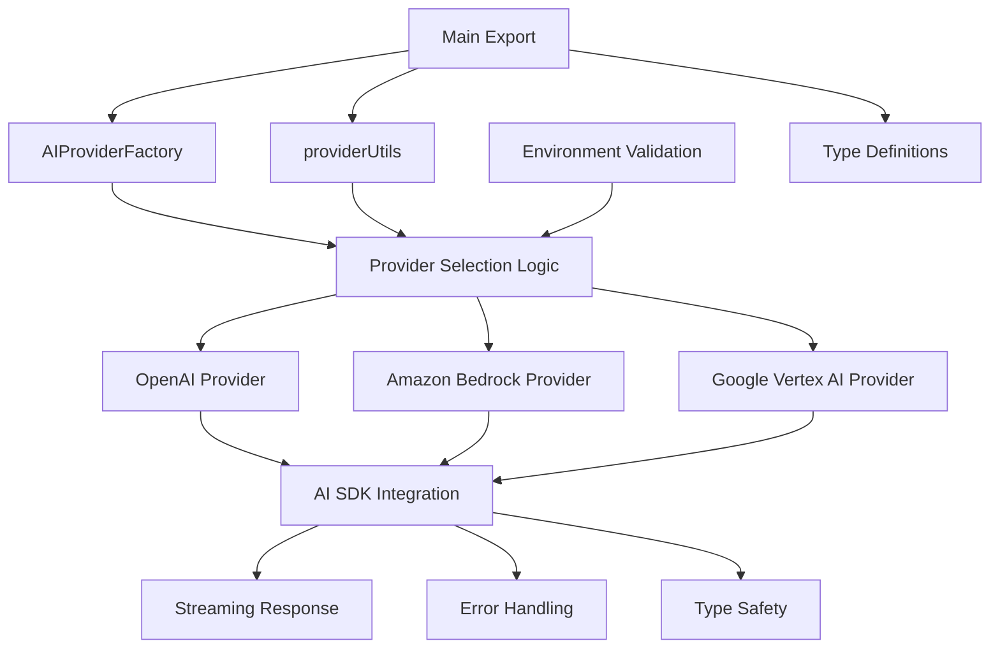
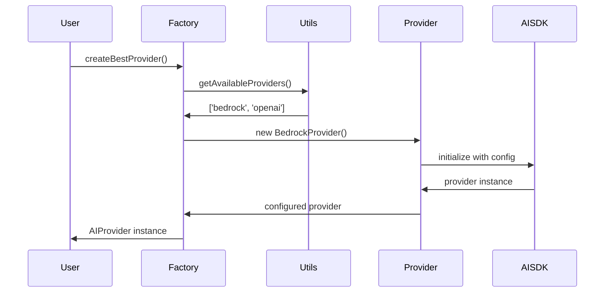

# SYSTEM PATTERNS: Zephyr-Mind AI Toolkit

## Architecture Overview

**Source Origin**: Extracted from `/Users/sachinsharma/Developer/Official/lighthouse/src/lib/services/server/ai/`
**Extraction Date**: May 31, 2025
**Original Components**: Orchestrator, Factory, Provider implementations, Utilities, Tools


## Core Design Patterns

### 1. Factory Pattern
**Implementation**: `AIProviderFactory` class
**Purpose**: Centralized provider creation with intelligent selection
**Key Benefits**:
- Single entry point for all provider creation
- Environment-based automatic selection
- Consistent initialization across providers

```typescript
// Pattern Usage
const provider = AIProviderFactory.createBestProvider();
const { primary, fallback } = AIProviderFactory.createProviderWithFallback('bedrock', 'openai');
```

### 2. Provider Abstraction Pattern
**Implementation**: Common `AIProvider` interface
**Purpose**: Unified API across different AI services
**Key Components**:
- Consistent method signatures
- Standardized error handling
- Uniform streaming support

### 3. Environment-Driven Configuration
**Pattern**: Configuration via environment variables
**Files**: `.env.example` template
**Validation**: Runtime checks in provider utils
**Fallback**: Graceful degradation when providers unavailable

### 4. Error Boundary Pattern
**Implementation**: Comprehensive error handling in factory
**Features**:
- Provider availability checking
- Clear error messages with suggestions
- Graceful fallback between providers

## Component Relationships

### Core Components
1. **Factory Layer**: `src/lib/core/factory.ts`
   - Provider creation and selection
   - Environment validation
   - Error handling and fallback

2. **Type Layer**: `src/lib/core/types.ts`
   - TypeScript interfaces and types
   - Model definitions and enums
   - Configuration schemas

3. **Provider Layer**: `src/lib/providers/`
   - Individual provider implementations
   - AI SDK integrations
   - Provider-specific error handling

4. **Utility Layer**: `src/lib/utils/`
   - Provider selection logic
   - Environment validation
   - Helper functions

### Data Flow


## Critical Implementation Paths

### 1. Provider Selection Algorithm
**Location**: `src/lib/utils/providerUtils.ts`
**Logic**:
1. Check environment variables for each provider
2. Validate credentials are present
3. Return prioritized list of available providers
4. Default order: Bedrock → OpenAI → Vertex AI

### 2. Streaming Implementation
**Pattern**: Consistent streaming across all providers
**Key Files**:
- Each provider implements streaming via AI SDK
- Unified streaming interface in types
- Error handling for stream failures

### 3. Type Safety Strategy
**Approach**: Full TypeScript coverage
**Components**:
- Strict interfaces for all providers
- Model name enums for type safety
- Configuration type validation

## Build and Distribution Patterns

### Package Structure
```
zephyr-mind/
├── src/lib/               # Source code
│   ├── core/             # Core abstractions
│   ├── providers/        # Provider implementations
│   ├── utils/           # Utility functions
│   └── index.ts         # Main exports
├── dist/                # Compiled JavaScript
├── tests/               # Test suite
└── memory-bank/         # Documentation (Jarvis)
```

### Export Strategy
**Main Export**: Clean, minimal API surface
**Pattern**: Named exports with type exports
**Convenience Functions**: Quick-start helpers

### Dependency Management
**Peer Dependencies**: AI SDKs (user provides)
**Dev Dependencies**: Build tools, testing, linting
**Runtime**: Zero runtime dependencies beyond peer deps

## Performance Considerations

### Lazy Loading
- Providers only initialized when needed
- Environment checks cached
- Minimal startup overhead

### Memory Management
- No persistent state in providers
- Clean error boundaries
- Proper resource cleanup

### Error Resilience
- Network failure handling
- Provider fallback mechanisms
- Clear error messages with recovery guidance

## Security Patterns

### Credential Management
- Environment-based configuration
- No hardcoded secrets
- User-provided API keys

### Validation
- Input sanitization
- Environment variable validation
- Provider availability checks

## Testing Strategy

### Test Structure
**Location**: `src/test/providers.test.ts`
**Coverage**: 10 comprehensive tests
**Approach**: Unit tests for core functionality

### Test Patterns
- Provider creation testing
- Error condition simulation
- Environment validation testing
- Factory method verification
